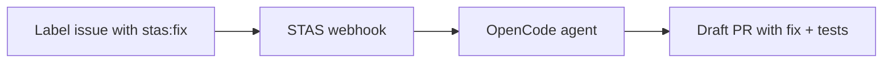

# STAS — Solving Tickets As A Service


[](LICENSE)

[](https://discord.gg/aimino)
[](https://rapidapi.com/aimino/api/stas-api?utm_source=github&utm_medium=readme&utm_campaign=aim-2090)
[](https://smithery.ai/server/@aimino/stas-mcp?utm_source=github&utm_medium=readme&utm_campaign=aim-2090)
[](https://opencode.ai/skills/stas?utm_source=github&utm_medium=readme&utm_campaign=aim-2090)
[](https://github.com/marketplace/actions/stas-eval?utm_source=github&utm_medium=readme&utm_campaign=aim-2090)
[](https://star-history.com/#Aimino-Tech/solving_tickets_as_a_service&Date)

**Label a GitHub issue. Get a pull request.**

STAS is an open-source GitHub bot that takes a labeled issue, investigates your codebase, writes a fix, runs your tests, and opens a PR. Backed by [OpenCode](https://opencode.ai) — the 162K ★ open-source coding agent.



> **⭐ If you find STAS useful, [star the repo](https://github.com/Aimino-Tech/solving_tickets_as_a_service) — it helps others discover the project!**


## Quick Start — First Fix in <15 Minutes

Choose your install path:

### GitHub Action (zero config, ~3 minutes)

Add this workflow file to your repo at `.github/workflows/stas.yml`:

```yaml
name: STAS Auto-Fix
on:
  issues:
    types: [labeled]
jobs:
  fix:
    if: github.event.label.name == 'stas:fix'
    runs-on: ubuntu-latest
    permissions:
      issues: write
      contents: write
      pull-requests: write
    steps:
      - uses: actions/create-github-app-token@v1
        id: app-token
        with:
          app-id: ${{ secrets.STAS_BOT_APP_ID }}
          private-key: ${{ secrets.STAS_BOT_PRIVATE_KEY }}
      - uses: actions/checkout@v4
        with:
          token: ${{ steps.app-token.outputs.token }}
          fetch-depth: 0
      - name: Run STAS fix agent
        run: npx -y @aimino/stas-fix-action
        env:
          GITHUB_TOKEN: ${{ steps.app-token.outputs.token }}
          ISSUE_NUMBER: ${{ github.event.issue.number }}
          REPO_OWNER: ${{ github.repository_owner }}
          REPO_NAME: ${{ github.event.repository.name }}
          ISSUE_TITLE: ${{ github.event.issue.title }}
          ISSUE_BODY: ${{ github.event.issue.body }}
```

**3 steps**: Add workflow file → Set 2 secrets (`STAS_BOT_APP_ID`, `STAS_BOT_PRIVATE_KEY`) → Label an issue. Done.

### Cloud (one-click, ~2 minutes)

Visit [stas.aimino.io](https://stas.aimino.io), install the GitHub App, label an issue. No servers to manage.

### Self-hosted (Docker, ~10 minutes)

```bash
git clone https://github.com/Aimino-Tech/solving_tickets_as_a_service
cd solving_tickets_as_a_service
cp .env.example .env
docker compose up -d
```

### Try it without installing anything

```bash
curl -X POST https://api.stas.aimino.io/api/v1/preview \
  -H "Content-Type: application/json" \
  -d '{"repoUrl": "https://github.com/owner/repo"}'
```

Returns the top 5 fixable issues in any public repo — no auth required.

## OpenCode Plugin

For development, STAS ships with an OpenCode plugin. Install it to get dev tools:

```json
{
  "plugin": ["@tarquinen/stas-plugin"]
}
```

### Plugin tools

| Tool | Description |
|---|---|
| `stas-dev` | Start local dev environment (opencode serve + bot) |
| `stas-webhook-test` | Simulate a GitHub webhook locally |
| `stas-config` | Validate or init `.env` configuration |
| `stas-status` | Check bot and OpenCode health |

```bash
# Start full dev environment
bash plugin/tools/stas-dev.sh

# Send a test webhook
bash plugin/tools/stas-webhook-test.sh issues.labeled

# Validate config
bash plugin/tools/stas-config.sh check

# Check status
bash plugin/tools/stas-status.sh
```

### OpenCode integration

STAS is built on top of OpenCode. The `WORKFLOW.md` at the project root defines how the OpenCode agent (Sisyphus) autonomously works on tickets — from `Backlog` → `Todo` → `In Progress` → `Human Review` → `Done`, with mandatory anti-mockup scans at every gate.

For OpenCode users: add `@tarquinen/stas-plugin` to your opencode.json `plugin` array, and the agent can invoke dev tools via slash commands during development.

## Business Model

STAS follows an **open-core model** with three paths, all pointing to paid plans for full features:

| | Self-Hosted (OSS) | Cloud Free | Cloud Paid |
|---|---|---|---|
| **Fixes/mo** | Unlimited (your API key) | 10 fixes/mo | 100–500+/mo |
| **AI model** | Your API key, your model | Our AGI | Our AGI |
| **Setup** | Manual — you run it | One-click install | One-click install |
| **Infrastructure** | You manage | We manage | We manage |
| **Dashboard** | — | Limited analytics | Full analytics, audit log |
| **Support** | GitHub issues (community) | Community | Slack, email, SLA |
| **Cost** | Your API usage | Free | $49–$199/mo |

**Conversion funnel**: Self-Hosted → Cloud Paid (when infra ops hurt), Cloud Free → Cloud Paid (when 10 fixes/mo isn't enough), Cloud Paid → Enterprise (when team needs SSO, VPC, SLAs).

See [Pricing Model](docs/pricing-model.md) for detailed plan breakdown and economics.

## Architecture

```
GitHub Issue (labeled)
       │
       ▼
   Webhook Server (Express)
       │
       ├── Verify signature
       ├── Post "working on it" comment
       ├── Build prompt from issue context
       │
       ▼
  OpenCode Serve (:4096)
       │
       ├── Clone repo
       ├── Investigate root cause
       ├── Write fix + regression test
       ├── Run test suite
       ├── Commit & push branch
       │
       ▼
  GitHub API
       │
       ├── Open draft PR
       └── Post result comment
```

## Configuration

All config via environment variables:

| Variable | Default | Description |
|---|---|---|
| `GITHUB_APP_ID` | — | GitHub App ID |
| `GITHUB_PRIVATE_KEY` | — | App private key (PEM) |
| `GITHUB_WEBHOOK_SECRET` | — | Webhook secret |
| `OPENCODE_URL` | `http://localhost:4096` | OpenCode serve endpoint |
| `OPENCODE_MODEL` | `anthropic/claude-sonnet-4-20250514` | Model to use |
| `STAS_LABEL` | `stas:fix` | Issue label to trigger on |
| `STAS_MAX_CONCURRENT` | `3` | Max concurrent fix runs |
| `STAS_PORT` | `3000` | Webhook server port |


## RapidAPI Marketplace

STAS is also available as a payable API on the [RapidAPI Marketplace](https://rapidapi.com/).
Subscribe to a plan and get instant access to STAS's fix capabilities without hosting anything yourself.

### Features

- **Fix Submission** — Submit a GitHub issue URL and get a fix PR created automatically
- **Job Polling** — Poll for status and results with a simple job ID
- **Public Eval Results** — See STAS benchmark performance before subscribing
- **Tiered Plans** — Free (10 req/day), Pro (100 req/day), Enterprise (1000 req/day)

### Quickstart

```bash
# 1. Subscribe at RapidAPI Marketplace (link below)
# 2. Get your API key and proxy secret

# 3. Submit a fix job
curl -X POST https://stas-rapidapi.p.rapidapi.com/api/fix \
  -H "Content-Type: application/json" \
  -H "X-RapidAPI-Key: your-rapidapi-key" \
  -H "X-RapidAPI-Proxy-Secret: your-proxy-secret" \
  -d '{
    "repoUrl": "https://github.com/owner/repo",
    "issueTitle": "Fix login validation bug",
    "issueBody": "The login endpoint returns 500 when the email contains special characters like + or &."
  }'

# 4. Poll for results
curl https://stas-rapidapi.p.rapidapi.com/api/fix/<jobId> \
  -H "X-RapidAPI-Key: your-rapidapi-key" \
  -H "X-RapidAPI-Proxy-Secret: your-proxy-secret"

# 5. Check public eval results (no auth needed)
curl https://stas-rapidapi.p.rapidapi.com/api/eval/results
```

### Endpoints

| Method | Path | Auth | Description |
|---|---|---|---|
| POST | `/api/fix` | RapidAPI Key + Proxy Secret | Submit a fix job |
| GET | `/api/fix/{jobId}` | RapidAPI Key + Proxy Secret | Poll job status |
| GET | `/api/eval/results` | None | Aggregate eval results |
| GET | `/api/eval/latest` | None | Latest full eval run |
| GET | `/api/health` | None | Service health check |

### Deployment

To deploy your own RapidAPI endpoint:

```bash
# 1. Set RapidAPI env vars
export RAPIDAPI_PROXY_SECRET="your-secret"
export RAPIDAPI_PROVIDER_KEY="your-provider-key"

# 2. Deploy STAS as usual (see Deployment section above)
# 3. Sync OpenAPI spec to RapidAPI
bash scripts/rapidapi-sync.sh
```

## Deployment

See [`DEVELOPMENT.md`](DEVELOPMENT.md) for a comprehensive deployment guide covering local dev, Railway, Fly.io, and Kubernetes.
For day-2 operations (scaling, monitoring, incident response), see the [Production Runbook](ops/runbook.md) and [Alert Playbook](ops/playbook.md).

### One-Click Deploy

[](https://railway.app/new/template?template=https://github.com/Aimino-Tech/solving_tickets_as_a_service/blob/main/railway.json)

### Railway

```bash
railway login
railway init
railway up
railway secrets set GITHUB_APP_ID=... GITHUB_WEBHOOK_SECRET=...
```

Railway auto-provisions Redis via the `railway.json` template. Health check at `/health`.

### Fly.io

```bash
fly launch --copy-config
fly secrets set GITHUB_APP_ID=... GITHUB_WEBHOOK_SECRET=...
fly redis create && fly redis attach <name>
fly deploy
```

### Docker

```bash
docker build -t stas-bot .
docker run -p 3000:3000 --env-file .env stas-bot
```

### Docker Compose

#### Development
```bash
# Start Redis + bot with hot-reload
docker compose up
```

#### Production Stack
```bash
# Start full production stack (Redis, RabbitMQ, PostgreSQL, webhook, workers, Nginx)
docker compose -f docker-compose.prod.yml up -d

# Scale workers horizontally (e.g., 4 worker replicas)
docker compose -f docker-compose.prod.yml up -d --scale stas-worker=4
```

The production stack includes:
- **PostgreSQL 16** — primary database
- **Redis 7** — Celery result backend + caching
- **RabbitMQ 4** — message broker for Celery
- **stas-webhook** — Express.js API server (horizontally scalable)
- **stas-worker** — Celery worker pool (horizontally scalable via `--scale`)
- **celery-beat** — periodic task scheduler
- **Flower** — Celery monitoring dashboard (port 5555)
- **Nginx** — reverse proxy with TLS termination and load balancing

See `DEVELOPMENT.md` for details on all deployment options.

### Kubernetes

See `k8s/` for example manifests.


## Documentation

STAS ships with comprehensive documentation:

| Document | Description |
|---|---|---|
| [ARCHITECTURE.md](docs/ARCHITECTURE.md) | Deep-dive into the pipeline: webhooks, queue, agent, sandbox, security |
| [SECURITY.md](docs/SECURITY.md) | Security model: webhook verification, sandbox isolation, prompt injection protection |
| [SELF_HOSTING.md](docs/SELF_HOSTING.md) | Step-by-step self-hosting guide: Docker, Kubernetes, Railway, Fly.io |
| [CUSTOMIZATION.md](docs/CUSTOMIZATION.md) | Customizing labels, models, tools, PR templates, and environment |
| [FAQ.md](docs/FAQ.md) | Frequently asked questions about STAS, alternatives, and troubleshooting |
| [LAUNCH_PLAYBOOK.md](docs/launch-playbook.md) | Launch strategy playbook — 48-hour multi-channel ignition |
| [CONTRIBUTING.md](CONTRIBUTING.md) | Development setup, testing, PR process, code style |
| [CODE_OF_CONDUCT.md](CODE_OF_CONDUCT.md) | Community guidelines |
| [DEVELOPMENT.md](DEVELOPMENT.md) | Local development and deployment guide |
| [ops/runbook.md](ops/runbook.md) | Production deployment runbook — service mgmt, scaling, monitoring, failures |
| [ops/playbook.md](ops/playbook.md) | Alert response playbooks for common incidents |

## Multi-Platform

STAS now supports multiple Git hosting platforms. See the [Platforms documentation](docs/platforms/README.md) for setup guides:

- **GitHub** — Live, fully supported
- **GitLab** — Beta (self-hosted and GitLab.com)
- **Bitbucket** — Beta (Bitbucket Cloud)

Each platform has its own webhook integration, agent pipeline, CI configuration, and eval test strategy. Platform-specific setup guides are in [`docs/platforms/`](docs/platforms/README.md).


## AI Trust & Anti-Slop

The OSS community is rightfully cautious about AI-generated PRs — "slop" (hallucinated changes, phantom files, meaningless noise) erodes trust in automation. STAS is built differently.

### Verified by 6 Quality Gates, not "Generated by AI"

Every STAS PR passes **6 deterministic OSS quality gates** before reaching your reviewers:

| Gate | What It Checks | Tool |
|------|---------------|------|
| **Reality Check** | Every referenced file actually exists | `git ls-files`, `fs.stat` |
| **Compile Check** | `tsc --noEmit` passes | TypeScript compiler |
| **Test Integrity** | Tests have real assertions (no vacuous tests) | vitest + pattern grep |
| **Hallucination Scan** | No TODO stubs, placeholders, fake imports | grep, npm registry scan |
| **Dead Code Check** | No orphaned files or unused exports | knip + ts-prune |
| **MCI Verification** | PR description matches the actual diff (no phantom claims) | Keyword + file-path heuristic scorer |

### Transparency, not opacity

- **AI attribution** — Every PR body clearly states: "This fix was generated by STAS AI."
- **DCO sign-off** — All commits include `Signed-off-by: STAS Bot` for full chain-of-custody.
- **Audit trail** — Every gate result is collapsible in the PR body; raw JSON evidence is persisted.
- **PR-MCI scoring** — A message-code inconsistency score (0–100) tells you if the description actually matches the diff.

### Our commitment

We do not ship "probably fine." If any gate fails, the PR is **blocked** — no exception, no skip flag. The agent retries up to 3 times before escalating to a human.

> "The best AI-generated PR is one you can trust without re-reading everything."

## Roadmap

- [x] Webhook receiver & GitHub App integration
- [x] OpenCode agent dispatch
- [x] PR creation with fix
- [x] Two-phase triage (cheap model classifies → expensive model fixes)
- [x] Sandbox isolation (E2B — 10+ language runtimes)
- [x] Regression test verification gate
- [x] Real-time status streaming to issue comments
- [ ] Dashboard for run history
- [ ] Cloud hosted version

## Contributing

Contributions are welcome! See [`CONTRIBUTING.md`](CONTRIBUTING.md) for development setup, running tests, style guide, and the PR workflow.

## License

MIT — use it, modify it, ship it.
