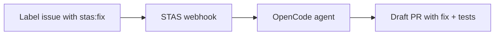

# STAS — Solving Tickets As A Service


[](LICENSE)


**Label a GitHub issue. Get a pull request.**

STAS is an open-source GitHub bot that takes a labeled issue, investigates your codebase, writes a fix, runs your tests, and opens a PR. Backed by [OpenCode](https://opencode.ai) — the 162K ★ open-source coding agent.



## How It Works

1. Install the GitHub App on your repo
2. Label any issue with `stas:fix`
3. STAS acknowledges, investigates, fixes, verifies
4. A draft PR appears with the fix and regression tests
5. You review and merge

Every fix runs in an isolated sandbox. Your code is never stored. Full audit trail in every PR.

## Quick Start

### One-command setup (recommended)

```bash
# Clone and set up everything automatically
git clone https://github.com/tamnguyen08/solving_tickets_as_a_service
cd solving_tickets_as_a_service
npm run setup
```

Then start the bot:

```bash
# Start OpenCode (agent backend, in another terminal)
opencode serve --port 4096

# Start the bot
npm run dev

# Verify it's running
curl http://localhost:3000/health
```

### Manual setup

```bash
# 1. Clone and install
git clone https://github.com/tamnguyen08/solving_tickets_as_a_service
cd solving_tickets_as_a_service
npm install

# 2. Start OpenCode (in another terminal)
opencode serve --port 4096

# 3. Configure
cp .env.example .env
# Fill in GITHUB_APP_ID, GITHUB_PRIVATE_KEY, GITHUB_WEBHOOK_SECRET

# 4. Run
npm run dev
```

## OpenCode Plugin

For development, STAS ships with an OpenCode plugin. Install it to get dev tools:

```json
{
  "plugin": ["@tarquinen/stas-plugin"]
}
```

### Plugin tools

| Tool | Description |
|---|---|
| `stas-dev` | Start local dev environment (opencode serve + bot) |
| `stas-webhook-test` | Simulate a GitHub webhook locally |
| `stas-config` | Validate or init `.env` configuration |
| `stas-status` | Check bot and OpenCode health |

```bash
# Start full dev environment
bash plugin/tools/stas-dev.sh

# Send a test webhook
bash plugin/tools/stas-webhook-test.sh issues.labeled

# Validate config
bash plugin/tools/stas-config.sh check

# Check status
bash plugin/tools/stas-status.sh
```

### OpenCode integration

STAS is built on top of OpenCode. The `WORKFLOW.md` at the project root defines how the OpenCode agent (Sisyphus) autonomously works on tickets — from `Backlog` → `Todo` → `In Progress` → `Human Review` → `Done`, with mandatory anti-mockup scans at every gate.

For OpenCode users: add `@tarquinen/stas-plugin` to your opencode.json `plugin` array, and the agent can invoke dev tools via slash commands during development.

## Self-Hosted vs Cloud

| Feature | Self-Hosted (OSS) | Cloud (Coming Soon) |
|---|---|---|
| Setup | You run it | One-click install |
| AI model | Your API key, your choice | Our AGI (50% better than GPT-5.5) |
| Infrastructure | You manage | We manage |
| Cost | Your API usage | $49/mo flat |
| Limits | Unlimited (your keys) | 100 fixes/mo then usage-based |
| Dashboard | — | Analytics, audit log, config |
| Support | GitHub issues | Slack, email, SLA |

## Architecture

```
GitHub Issue (labeled)
       │
       ▼
   Webhook Server (Express)
       │
       ├── Verify signature
       ├── Post "working on it" comment
       ├── Build prompt from issue context
       │
       ▼
  OpenCode Serve (:4096)
       │
       ├── Clone repo
       ├── Investigate root cause
       ├── Write fix + regression test
       ├── Run test suite
       ├── Commit & push branch
       │
       ▼
  GitHub API
       │
       ├── Open draft PR
       └── Post result comment
```

## Configuration

All config via environment variables:

| Variable | Default | Description |
|---|---|---|
| `GITHUB_APP_ID` | — | GitHub App ID |
| `GITHUB_PRIVATE_KEY` | — | App private key (PEM) |
| `GITHUB_WEBHOOK_SECRET` | — | Webhook secret |
| `OPENCODE_URL` | `http://localhost:4096` | OpenCode serve endpoint |
| `OPENCODE_MODEL` | `anthropic/claude-sonnet-4-20250514` | Model to use |
| `STAS_LABEL` | `stas:fix` | Issue label to trigger on |
| `STAS_MAX_CONCURRENT` | `3` | Max concurrent fix runs |
| `STAS_PORT` | `3000` | Webhook server port |

## Deployment

See [`DEVELOPMENT.md`](DEVELOPMENT.md) for a comprehensive deployment guide covering local dev, Railway, Fly.io, and Kubernetes.

### One-Click Deploy

[](https://railway.app/new/template?template=https://github.com/Aimino-Tech/solving_tickets_as_a_service/blob/main/railway.json)

### Railway

```bash
railway login
railway init
railway up
railway secrets set GITHUB_APP_ID=... GITHUB_WEBHOOK_SECRET=...
```

Railway auto-provisions Redis via the `railway.json` template. Health check at `/health`.

### Fly.io

```bash
fly launch --copy-config
fly secrets set GITHUB_APP_ID=... GITHUB_WEBHOOK_SECRET=...
fly redis create && fly redis attach <name>
fly deploy
```

### Docker

```bash
docker build -t stas-bot .
docker run -p 3000:3000 --env-file .env stas-bot
```

### Docker Compose

#### Development
```bash
# Start Redis + bot with hot-reload
docker compose up
```

#### Production Stack
```bash
# Start full production stack (Redis, RabbitMQ, PostgreSQL, webhook, workers, Nginx)
docker compose -f docker-compose.prod.yml up -d

# Scale workers horizontally (e.g., 4 worker replicas)
docker compose -f docker-compose.prod.yml up -d --scale stas-worker=4
```

The production stack includes:
- **PostgreSQL 16** — primary database
- **Redis 7** — Celery result backend + caching
- **RabbitMQ 4** — message broker for Celery
- **stas-webhook** — Express.js API server (horizontally scalable)
- **stas-worker** — Celery worker pool (horizontally scalable via `--scale`)
- **celery-beat** — periodic task scheduler
- **Flower** — Celery monitoring dashboard (port 5555)
- **Nginx** — reverse proxy with TLS termination and load balancing

See `DEVELOPMENT.md` for details on all deployment options.

### Kubernetes

See `k8s/` for example manifests.


## Documentation

STAS ships with comprehensive documentation:

| Document | Description |
|---|---|
| [ARCHITECTURE.md](docs/ARCHITECTURE.md) | Deep-dive into the pipeline: webhooks, queue, agent, sandbox, security |
| [SECURITY.md](docs/SECURITY.md) | Security model: webhook verification, sandbox isolation, prompt injection protection |
| [SELF_HOSTING.md](docs/SELF_HOSTING.md) | Step-by-step self-hosting guide: Docker, Kubernetes, Railway, Fly.io |
| [CUSTOMIZATION.md](docs/CUSTOMIZATION.md) | Customizing labels, models, tools, PR templates, and environment |
| [FAQ.md](docs/FAQ.md) | Frequently asked questions about STAS, alternatives, and troubleshooting |
| [CONTRIBUTING.md](CONTRIBUTING.md) | Development setup, testing, PR process, code style |
| [CODE_OF_CONDUCT.md](CODE_OF_CONDUCT.md) | Community guidelines |
| [DEVELOPMENT.md](DEVELOPMENT.md) | Local development and deployment guide |


## Roadmap

- [x] Webhook receiver & GitHub App integration
- [x] OpenCode agent dispatch
- [x] PR creation with fix
- [x] Two-phase triage (cheap model classifies → expensive model fixes)
- [x] Sandbox isolation (E2B — 10+ language runtimes)
- [x] Regression test verification gate
- [x] Real-time status streaming to issue comments
- [ ] Dashboard for run history
- [ ] Cloud hosted version

## License

MIT — use it, modify it, ship it.
