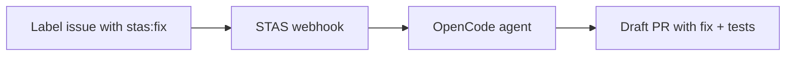

# STAS — Solving Tickets As A Service

**Label a GitHub issue. Get a pull request.**

STAS is an open-source GitHub bot that takes a labeled issue, investigates your codebase, writes a fix, runs your tests, and opens a PR. Backed by [OpenCode](https://opencode.ai) — the 162K ★ open-source coding agent.



## How It Works

1. Install the GitHub App on your repo
2. Label any issue with `stas:fix`
3. STAS acknowledges, investigates, fixes, verifies
4. A draft PR appears with the fix and regression tests
5. You review and merge

Every fix runs in an isolated sandbox. Your code is never stored. Full audit trail in every PR.

## Quick Start

```bash
# 1. Clone and install
git clone https://github.com/tamnguyen08/solving_tickets_as_a_service
cd solving_tickets_as_a_service
npm install

# 2. Start OpenCode (in another terminal)
opencode serve --port 4096

# 3. Configure
cp .env.example .env
# Fill in GITHUB_APP_ID, GITHUB_PRIVATE_KEY, GITHUB_WEBHOOK_SECRET

# 4. Run
npm run dev
```

## Self-Hosted vs Cloud

| Feature | Self-Hosted (OSS) | Cloud (Coming Soon) |
|---|---|---|
| Setup | You run it | One-click install |
| AI model | Your API key, your choice | Our AGI (50% better than GPT-5.5) |
| Infrastructure | You manage | We manage |
| Cost | Your API usage | $49/mo flat |
| Limits | Unlimited (your keys) | 100 fixes/mo then usage-based |
| Dashboard | — | Analytics, audit log, config |
| Support | GitHub issues | Slack, email, SLA |

## Architecture

```
GitHub Issue (labeled)
       │
       ▼
  Webhook Server (Fastify)
       │
       ├── Verify signature
       ├── Post "working on it" comment
       ├── Build prompt from issue context
       │
       ▼
  OpenCode Serve (:4096)
       │
       ├── Clone repo
       ├── Investigate root cause
       ├── Write fix + regression test
       ├── Run test suite
       ├── Commit & push branch
       │
       ▼
  GitHub API
       │
       ├── Open draft PR
       └── Post result comment
```

## Configuration

All config via environment variables:

| Variable | Default | Description |
|---|---|---|
| `GITHUB_APP_ID` | — | GitHub App ID |
| `GITHUB_PRIVATE_KEY` | — | App private key (PEM) |
| `GITHUB_WEBHOOK_SECRET` | — | Webhook secret |
| `OPENCODE_URL` | `http://localhost:4096` | OpenCode serve endpoint |
| `OPENCODE_MODEL` | `anthropic/claude-sonnet-4-20250514` | Model to use |
| `STAS_LABEL` | `stas:fix` | Issue label to trigger on |
| `STAS_MAX_CONCURRENT` | `3` | Max concurrent fix runs |
| `STAS_PORT` | `3000` | Webhook server port |

## Deployment

### Railway / Fly.io

```bash
# Deploy the webhook server
railway up

# Deploy OpenCode alongside it
# (separate container)
```

### Docker

```bash
docker build -t stas-bot .
docker run -p 3000:3000 --env-file .env stas-bot
```

### Kubernetes

See `k8s/` for example manifests.

## Roadmap

- [x] Webhook receiver & GitHub App integration
- [x] OpenCode agent dispatch
- [x] PR creation with fix
- [ ] Two-phase triage (Haiku cheap analysis → Sonnet/Opus fix)
- [ ] Sandbox isolation (Docker/E2B)
- [ ] Regression test verification gate
- [ ] Real-time status streaming to issue comments
- [ ] Dashboard for run history
- [ ] Cloud hosted version

## License

MIT — use it, modify it, ship it.
