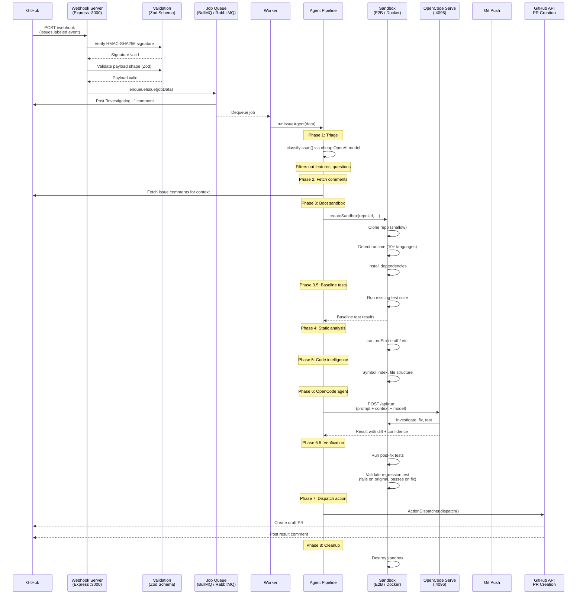
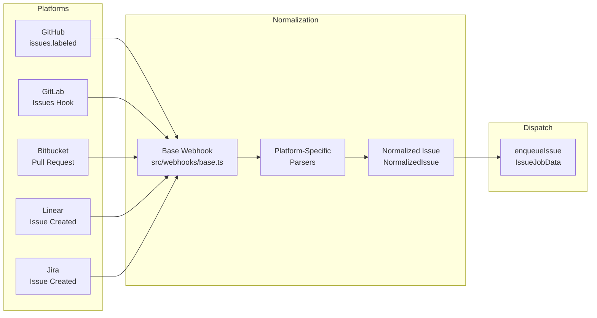
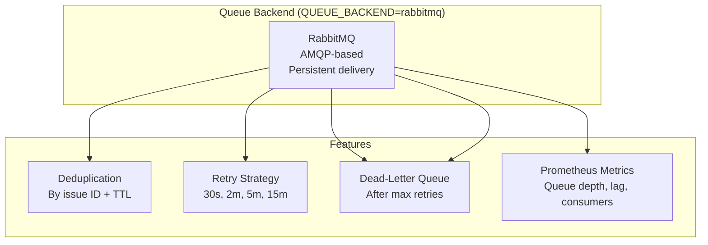
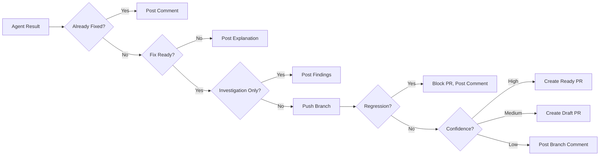

# SYNTARO Architecture

> **A deep-dive into the pipeline that turns GitHub issues into pull requests.**

---

## Table of Contents

- [Overview](#overview)
- [Pipeline Flow](#pipeline-flow)
- [Module Breakdown](#module-breakdown)
  - [Webhook Layer (`src/webhooks/`)](#1-webhook-layer-srcwebhooks)
  - [Validation Layer (`src/validation.ts`)](#2-validation-layer-srcvalidationts)
  - [Queue Layer (`src/queue/`)](#3-queue-layer-srcqueue)
  - [Agent Layer (`src/agent/`)](#4-agent-layer-srcagent)
  - [Sandbox Layer (`src/sandbox/`)](#5-sandbox-layer-srcsandbox)
  - [GitHub Integration (`src/github/`)](#6-github-integration-srcgithub)
  - [Security Layer (`src/security/`)](#7-security-layer-srcsecurity)
  - [Services Layer (`src/services/`)](#8-services-layer-srcservices)
- [Design Decisions](#design-decisions)
- [Deployment Topologies](#deployment-topologies)

---

## Overview

SYNTARO is an open-source GitHub bot that automatically fixes labeled issues. It receives webhooks from GitHub, classifies issues via a cheap LLM, dispatches a full OpenCode agent in an isolated sandbox to investigate and fix the bug, runs verification, and opens a pull request — all without human intervention.

The architecture follows a **modular pipeline** design inspired by [KintsugiBot](https://github.com/kintsugi-bot) with significant extensions for production readiness: multi-backend queues, dual sandbox providers, a full verification gate, and multi-platform webhook support (GitHub, GitLab, Bitbucket, Linear, Jira).

---

## Pipeline Flow

### Core Pipeline



### Webhook-to-PR End-to-End

```mermaid
flowchart TB
    subgraph Triggers
        IL[Issue Labeled<br/>syntaro:fix]
        IE[Issue Edited<br/>(has label)]
        MO[Marketplace Purchase]
        GL[GitLab Webhook]
        BB[Bitbucket Webhook]
        LN[Linear Webhook]
        JR[Jira Webhook]
    end

    subgraph WebhookLayer
        EX[Express Server<br/>src/server.ts]
        RT[Rate Limiter<br/>express-rate-limit]
        GW[GitHub Webhooks<br/>@octokit/webhooks]
        RAW[Raw Body Capture<br/>for signature verification]
    end

    subgraph Validation
        ZV[Zod Schema<br/>config.ts]
        PV[Payload Validation<br/>validation.ts]
    end

    subgraph Queueing
        BQ[BullMQ<br/>Queue + Worker]
        RQ[RabbitMQ<br/>Producers]
        DLQ[Dead-Letter Queue]
        GLock[Repo Concurrency Lock]
    end

    subgraph AgentPipeline
        TRIAGE[Triage Phase<br/>Cheap LLM]
        FETCH[Fetch Comments]
        BOOT[Boot Sandbox<br/>E2B or Docker]
        BASELINE[Baseline Tests]
        STATIC[Static Analysis]
        INTEL[Code Intelligence]
        OPENCODE[OpenCode Agent<br/>POST /api/run]
        FALLBACK[Basic Fix Fallback]
        VERIFY[Verification Gate]
    end

    subgraph Sandbox
        E2B[E2B Cloud Sandbox]
        DOCKER[Docker Local Sandbox]
        RUNTIME[Runtime Detection<br/>10+ languages]
        DEPS[Dependency Install]
        TEST[Test Execution]
    end

    subgraph Output
        PR_CREATE[Action Dispatcher]
        GH_COMMENT[Issue Comments]
        GH_PR[Draft/Ready PR]
    end

    IL --> EX
    IE --> EX
    MO --> EX
    GL --> EX
    BB --> EX
    LN --> EX
    JR --> EX

    EX --> RAW
    EX --> RT
    RAW --> GW
    GW --> ZV
    ZV --> PV
    PV --> BQ
    BQ --> DLQ
    BQ --> GLock
    BQ --> TRIAGE

    TRIAGE --> FETCH
    FETCH --> BOOT
    BOOT --> E2B
    BOOT --> DOCKER
    DOCKER --> RUNTIME
    E2B --> RUNTIME
    RUNTIME --> DEPS
    DEPS --> BASELINE
    BASELINE --> STATIC
    STATIC --> INTEL
    INTEL --> OPENCODE
    OPENCODE --> VERIFY
    VERIFY --> PR_CREATE
    PR_CREATE --> GH_PR
    PR_CREATE --> GH_COMMENT

    OPENCODE -.->|Fallback| FALLBACK
    FALLBACK --> VERIFY
```

### Multi-Platform Webhook Flow



---

## Module Breakdown

### 1. Webhook Layer (`src/webhooks/`)

#### `src/webhooks/github.ts`
Handles GitHub webhook events via `@octokit/webhooks`:

| Event | Listener | Action |
|---|---|---|
| `issues.opened` | No-op | Waits for label event |
| `issues.labeled` | **Primary trigger** | Checks label matches `SYNTARO_LABEL`, enqueues job |
| `issues.edited` | Re-enqueue | If issue has `syntaro:fix` label, re-processes |
| `marketplace_purchase` | Billing update | Maps GitHub Marketplace plan names to internal tiers |

The handler extracts `IssueJobData` from the payload, runs rate limit checks (per-account and per-repo), saves a pending `RunRecord` to storage, and calls `enqueueIssue()`.

#### `src/webhooks/base.ts`
Abstract base layer that normalizes webhooks from any platform. Defines:
- `WebhookPlatform` — union type: `"github" | "gitlab" | "bitbucket"`
- `NormalizedIssue` — platform-agnostic issue shape
- `verifyHmacSha256()` — constant-time HMAC verification
- `verifyToken()` — constant-time token comparison

All platform webhooks (GitHub, GitLab, Bitbucket) implement the `PlatformWebhook` interface, providing `verify()` and `parse()` methods. This allows multi-platform support without duplicating queue and dispatch logic.

#### `src/webhooks/gitlab.ts` and `src/webhooks/bitbucket.ts`
Platform-specific webhook handlers that implement the same pattern as GitHub:
- Verify webhook token/signature
- Parse and normalize the payload
- Map to `IssueJobData`
- Enqueue via the same queue

#### `src/webhooks/retryWorker.ts`
Polls for stale/unprocessed webhook events and re-processes them with exponential backoff (1 min, 5 min, 30 min). Reports metrics to Prometheus and Sentry.

#### `src/webhooks/eventLogger.ts` and `src/webhooks/healthMonitor.ts`
- **eventLogger**: Records webhook delivery events with timestamps, platform, event type, and outcome.
- **healthMonitor**: Tracks webhook delivery health (success rates, latency percentiles, backlog depth) for the `/health` endpoint.

---

### 2. Validation Layer (`src/validation.ts`)

Ensures incoming data matches expected schemas before any processing:

```typescript
// Key function:
validateWebhookPayload(event: string, payload: unknown): { success: boolean; errors?: string[] }
```

- Validates webhook event type is supported
- Validates payload structure (installation, repo, issue fields present)
- Returns structured error messages for debugging
- Adds Sentry breadcrumbs for failed validations

The `config.ts` module uses **Zod** for environment variable validation at startup — all required vars are checked eagerly with grouped error messages.

---

### 3. Queue Layer (`src/queue/`)

The queue decouples webhook reception from agent execution, providing reliability, retries, and concurrency control.

#### Backend Architecture



#### Key Components

| Component | File | Responsibility |
|---|---|---|
| `createIssueQueue()` | `issueQueue.ts` | Creates BullMQ queue with Redis connection, deduplication, and priority |
| `enqueueIssue()` | `issueQueue.ts` | Dual-write enqueue (BullMQ + optional RabbitMQ) with dedup key |
| `createIssueWorker()` | `issueQueue.ts` | Processes jobs: acquires repo concurrency slot, runs agent, handles retries |
| `createDeadLetterQueue()` | `issueQueue.ts` | Stores jobs that exceeded max retries (default 4) |
| `scheduleRetry()` | `issueQueue.ts` | Re-queues with exact delay (30s, 2m, 5m, 15m) |
| `publishFixJob()` | `producers.ts` | RabbitMQ message producer |
| RabbitMQ consumer | `rabbitmq.ts` | AMQP connection management with reconnection |

#### Retry Strategy

| Attempt | Delay | Action on Failure |
|---|---|---|
| 1 | — | Run agent; on failure, schedule retry |
| 2 | 30s | Re-enqueue with `retryCount=1` |
| 3 | 2 min | Re-enqueue with `retryCount=2` |
| 4 | 5 min | Re-enqueue with `retryCount=3` |
| 5 | 15 min | On failure, move to dead-letter queue |

#### Concurrency Controls

- **Per-repo concurrency**: Redis SET tracks active job IDs per `owner/repo`. Configurable via `SYNTARO_MAX_CONCURRENT` (default: 3).
- **Per-repo rate limiting**: Token bucket per repo via `rateLimiter`.
- **Account-level rate limiting**: Based on billing tier (free/pro/enterprise).

---

### 4. Agent Layer (`src/agent/`)

The agent layer orchestrates the entire fix pipeline — from triage to PR creation. This is the heart of SYNTARO.

#### `src/agent/issueAgent.ts` — The Main Pipeline

```mermaid
flowchart TB
    START([Issue Job Dequeued])
    --> TRIAGE[Phase 1: Triage<br/>classifyIssue()]
    --> CHECK{Type?}
    CHECK -->|Feature/Question| SKIP[Return no-fix]
    CHECK -->|Bug| COMMENTS[Phase 2: Fetch Comments<br/>fetchIssueComments()]
    --> BOOT[Phase 3: Boot Sandbox<br/>createSandbox()]
    --> BASELINE[Phase 3.5: Baseline Tests<br/>sandbox.runTests()]
    --> STATIC[Phase 4: Static Analysis<br/>tsc --noEmit / ruff]
    --> INTEL[Phase 5: Code Intelligence<br/>buildCodeIntelligence()]
    --> OPENCODE[Phase 6: OpenCode Agent<br/>dispatchToOpenCode()]
    --> VERIFY{Success?}
    VERIFY -->|Yes| VERIFY_PHASE[Phase 6.5: Verification<br/>runVerification()]
    VERIFY -->|No| FALLBACK[Fallback: attemptBasicFix()]
    VERIFY_PHASE --> DISPATCH[Phase 7: Dispatch Action<br/>ActionDispatcher.dispatch()]
    DISPATCH --> CLEANUP[Phase 8: Cleanup<br/>sandbox.destroy()]
    CLEANUP --> DONE([Done])
    FALLBACK --> DISPATCH
```

#### Phase Details

**Phase 1 — Triage (`classifyIssue`)**
- Uses a cheap OpenAI model (`gpt-4o-mini` or configured `OPENAI_CHEAP_MODEL`)
- Classifies as `bug`, `feature`, `question`, or `unknown`
- Estimates difficulty: `easy`, `medium`, `hard`
- Suggests relevant files
- **Cost saving**: Feature requests and questions are filtered out before costly agent runs (~60% savings)

**Phase 2 — Fetch Comments**
- Retrieves up to `MAX_ISSUE_COMMENTS` (default 15) issue comments
- Formats as `@user: comment text` for agent context
- Non-fatal on failure (returns empty array)

**Phase 3 — Boot Sandbox**
- Factory pattern via `createSandbox()` in `src/sandbox/index.ts`
- Priority: E2B (cloud) → Docker (local) → Error
- Shallow clones repo with auth token
- Auto-detects runtime (10+ languages)
- Installs dependencies

**Phase 3.5 — Baseline Tests**
- Runs existing test suite before any changes
- Records results as baseline for comparison
- Detects no-test-suite case (marks as "unverified")

**Phase 4 — Static Analysis**
- Runs `tsc --noEmit` for TypeScript, `ruff` for Python, etc.
- Results included in the OpenCode prompt

**Phase 5 — Code Intelligence**
- Gathers file structure, symbol list, import trace
- Provides codebase context to the agent

**Phase 6 — OpenCode Dispatch (`dispatchToOpenCode`)**
- Builds a comprehensive prompt with all context (issue, comments, triage, analysis, code intel)
- **Model chain**: Primary model → fallback models (tried in order)
- Each model gets `FIX_TIMEOUT_MS` (default 10 min)
- Posts status updates to the issue for each fallback attempt
- Sanitizes prompts against injection (`sanitizeUserContent`)

**Phase 6.5 — Verification (`runVerification`)**
- Runs post-fix test suite
- Compares with baseline for regression detection
- For each new test file:
  1. Temporarily removes the test file (simulating original code)
  2. Runs the test — expects failure
  3. Restores the test file
  4. Runs the test — expects pass
- Result adjusts agent confidence:
  - Regression found → `low` confidence
  - Invalid regression test → cap at `medium`

**Phase 7 — Action Dispatch (`ActionDispatcher`)**
- **High confidence** → Create regular PR
- **Medium confidence** → Create draft PR
- **Low confidence** → Post comment with branch info, no PR
- **Regression detected** → Block PR, post explanation comment

**Phase 8 — Cleanup**
- Always runs in `finally` block
- Destroys sandbox (E2B kill or Docker stop+remove)
- Cleans up temp directories

#### `src/agent/tools.ts`
Defines the tool interface for the basic fix fallback agent:
- `readFile`, `writeFile`, `patchFile`, `replaceLines`
- `searchCodebase`, `findFiles`, `runCommand`
- `runTests`, `getDiff`, `formatCode`
- `listDirectory`, `findSymbol`, `traceImports`
- `submitFix`

#### `src/agent/types.ts`
Type definitions for:
- `TriageResult` — issue classification output
- `VerificationResult` — pre/post test comparison
- `AgentResult` — final agent output (summary, confidence, fixReady, prUrl, errors)
- `TestBaseline` — test run snapshot

---

### 5. Sandbox Layer (`src/sandbox/`)

Provides isolated execution environments for fix attempts. Every fix runs in a disposable sandbox that is destroyed after the run.

#### Factory Selection

```typescript
// src/sandbox/index.ts
export function createSandbox(...): SandboxExecutor {
  // Priority 1: E2B cloud sandbox (if E2B_API_KEY is set)
  if (config.e2b.apiKey) return new E2BSandboxExecutor(...);

  // Priority 2: Docker local sandbox (if Docker is available)
  if (isDockerAvailable()) return new DockerSandbox(...);

  // No sandbox available
  throw new Error('No sandbox available');
}
```

#### E2B Sandbox (`src/sandbox/executor.ts`)

Used in production. Creates disposable cloud sandboxes via the E2B SDK:

| Operation | Implementation |
|---|---|
| Create | `Sandbox.create()` with template ID |
| Command execution | `sandbox.commands.run()` |
| File read/write | `sandbox.files.read()/write()` |
| Destroy | `sandbox.kill()` |
| Path protection | Validates no `..` traversal |

#### Docker Sandbox (`src/sandbox/docker.ts`)

Fallback for local development. Runs a Docker container with:

| Security Feature | Detail |
|---|---|
| Read-only root | `--read-only` with tmpfs for writable paths |
| Capability drop | `--cap-drop=ALL`, only `NET_ADMIN` + `NET_RAW` for iptables |
| No new privileges | `--security-opt=no-new-privileges:true` |
| Memory limit | Configurable (default 4g for container) |
| CPU limit | Configurable (default 2 cores) |
| Network restriction | iptables whitelist for GitHub API, LLM providers, package registries |
| Ephemeral storage | Temp directory deleted on destroy |

Both sandbox implementations share the `SandboxExecutor` interface:

```typescript
interface SandboxExecutor {
  boot(): Promise<void>;
  exec(command: string, timeoutMs?: number): Promise<ExecResult>;
  readFile(filePath: string): Promise<string>;
  writeFile(filePath: string, content: string): Promise<void>;
  removeFile(filePath: string): Promise<void>;
  pushBranch(branchName: string): Promise<void>;
  hasTestSuite(): boolean;
  runSpecificTest(testPath: string): Promise<TestRunResult>;
  runTests(): Promise<TestRunResult>;
  formatCode(): Promise<void>;
  analyzeCode(): Promise<string>;
  detectRuntime(): Promise<RuntimeInfo>;
  installDeps(): Promise<void>;
  destroy(): Promise<void>;
}
```

#### Runtime Detection

The sandbox automatically detects the project's runtime by checking for manifest files:

| Language | Indicator | Test Command |
|---|---|---|
| Node.js | `package.json` | `npm test`, `npx turbo run test`, `npx nx run-many` |
| Python | `requirements.txt`, `setup.py`, `pyproject.toml`, `Pipfile` | `pytest`, `unittest` |
| Go | `go.mod` | `go test ./...` |
| Rust | `Cargo.toml` | `cargo test` |
| Ruby | `Gemfile` | `bundle exec rspec` |
| Java | `pom.xml`, `build.gradle` | `mvn test`, `./gradlew test` |
| PHP | `composer.json` | `vendor/bin/phpunit` |
| Swift | `Package.swift` | `swift test` |
| Dart/Flutter | `pubspec.yaml` | `flutter test`, `dart test` |
| Elixir | `mix.exs` | `mix test` |
| C++ | `CMakeLists.txt` | `ctest` |
| .NET/C# | `*.csproj`, `*.sln` | `dotnet test` |

---

### 6. GitHub Integration (`src/github/`)

#### `src/github/auth.ts`
GitHub App authentication with key management:
- Supports PEM file path `(GITHUB_APP_PRIVATE_KEY_PATH)` or inline string `(GITHUB_APP_PRIVATE_KEY)`
- Auto-converts PKCS#1 → PKCS#8 format (Node 20 / OpenSSL 3 compatibility)
- Lazy `Octokit` instance creation per installation
- `getOctokit(installationId)` — authenticated client for a specific installation
- `getInstallationToken(installationId)` — raw token for sandbox git operations

#### `src/github/messages.ts`
Centralized message templates for all GitHub comments:

| Template | Used When |
|---|---|
| `investigatingComment` | Initial acknowledgment |
| `featureSkipComment` | Issue classified as feature request |
| `questionSkipComment` | Issue classified as question |
| `timeoutComment` | Phase timeout exceeded |
| `errorComment` | Pipeline error |
| `retryComment` | Fallback model is being tried |
| `modelFallbackComment` | Primary model failed, using fallback |
| `regressionBlockComment` | Regression tests detected |
| `highConfidenceIssueComment` | PR created with high confidence |
| `draftIssueComment` | Draft PR created with medium confidence |
| `lowConfidenceComment` | No PR, branch only |
| `buildPRBody` | Full PR description with changed files |

#### `src/github/actionDispatcher.ts`
Decision engine after agent completion:



---

### 7. Security Layer (`src/security/`)

| Module | File | Purpose |
|---|---|---|
| Admin auth | `adminAuth.ts` | Bearer token verification for admin endpoints |
| Audit trail | `audit.ts` | Structured audit log entries (console + optional DB persistence) |
| IP allowlist | `ipAllowlist.ts` | Restrict webhook endpoints to known IP ranges (GitHub, GitLab, Stripe) |
| Sandbox security | `sandboxSecurity.ts` | Default secure sandbox config, validation, Docker options |

The security module enforces:
- No `--privileged` mode in sandboxes (hard error)
- Read-only root filesystem (warning if writable)
- Resource limits (CPU, memory, disk, pids)
- Network isolation (internal IP ranges blocked, outbound whitelisted)
- Constant-time HMAC comparison for webhook signatures

---

### 8. Services Layer (`src/services/`)

| Service | File | Purpose |
|---|---|---|
| Feature Flags | `featureFlags.ts` | Runtime-configurable feature toggles with TTL and auto-disable |

Additional service directories:

| Directory | Purpose |
|---|---|
| `src/db/` | PostgreSQL connection, migrations (Drizzle ORM) |
| `src/storage/` | Run history persistence (SQLite local, Postgres production) |
| `src/metering/` | Usage metering, credit tracking |
| `src/ratelimit/` | Per-account and per-repo rate limiting (token bucket) |
| `src/monitoring/` | Sentry integration, structured logging (pino) |
| `src/notifications/` | Slack webhook and Bolt SDK notifications |
| `src/trackers/` | Linear and Jira issue tracker integration |
| `src/stripe/` | Stripe webhook handling for credit purchases |
| `src/audit/` | Audit logging |

---

## Design Decisions

### 0. Business Model Gating (Open-Core with Dual Path)

**Decision**: Offer both an unlimited self-hosted OSS version (with caveats) and a cloud SaaS with a free tier (10 fixes/mo) — both pointing to paid plans.

**Rationale**: A single "self-host is capped" model alienates power users who want full control. A single "cloud is the only paid option" misses developers who prefer to BYO infra. Option 1 resolves this:

1. **Self-host** — unlimited but no dashboard, manual setup, community support only. Ideal for devs who want control.
2. **Cloud Free** (10 fixes/mo) — hosted trial with frontier models. No infra, no API key setup.
3. **Cloud Paid** ($49–$149/mo) — full dashboard, analytics, audit log, support.

The metering layer (`src/metering/`) enforces per-account fix limits on the cloud path. Self-hosted instances bypass metering entirely — the feature flag `SYNTARO_CLOUD_MODE=false` (default) disables all billing gates. See [docs/FAQ.md](../docs/FAQ.md) and [STRATEGY.md](../STRATEGY.md) for details.

### 1. Two-Phase Triage (Cost Optimization)

**Decision**: Use a cheap model (gpt-4o-mini) for issue classification before the expensive agent run.

**Rationale**: ~60% of labeled issues are feature requests, questions, or non-actionable. Filtering these out before the agent runs saves significant costs. The triage model costs ~$0.001 per call vs. $3-5 per agent run.

**Inspiration**: KintsugiBot uses a similar two-phase approach, but SYNTARO makes the triage phase configurable and adds difficulty estimation.

### 2. OpenCode Serve as Agent Backend

**Decision**: Delegate the main fix loop to OpenCode serve instead of calling LLM SDKs directly.

**Rationale**: OpenCode is the 162K-star open-source coding agent. It handles tool calling, code investigation, diff generation, and git operations out of the box. Building this ourselves would be thousands of lines of brittle agent orchestration.

**Trade-off**: Requires running OpenCode serve alongside the bot. Adds operational complexity but dramatically improves fix quality.

### 3. Dual Sandbox Providers (E2B + Docker)

**Decision**: Support both E2B (cloud) and Docker (local) sandboxes.

**Rationale**: E2B provides zero-setup cloud sandboxes for production with 10+ language runtimes. Docker provides a free fallback for local development. The `SandboxExecutor` interface makes the two implementations interchangeable.

### 4. Dual Queue Backends (BullMQ + RabbitMQ)

**Decision**: Use RabbitMQ as the sole queue backend. BullMQ was used initially but has been fully migrated to RabbitMQ + Celery.

**Rationale**: BullMQ provides a rich feature set (deduplication, priority, delayed jobs) but ties you to Redis. RabbitMQ provides persistent delivery and cross-service bridging (e.g., to Python Celery workers). The `both` mode allows zero-downtime migration between backends.

### 5. Verification Gate with Baseline Comparison

**Decision**: Require before/after test comparison with regression test validation.

**Rationale**: Prevents the agent from introducing regressions. The regression test must fail on original code (proving it tests the bug) and pass on the fix (proving the fix works). This is a stronger signal than just "tests pass."

### 6. Prompt Injection Protection

**Decision**: Sanitize all user-provided content before passing to the agent.

**Rationale**: GitHub issue bodies can contain prompt injection attempts. The `sanitizeUserContent()` function in `issueAgent.ts` strips known injection patterns (ignore instructions, role overrides, system override attempts).

---

## Deployment Topologies

> 🔧 For operational details on running these topologies in production (startup, scaling, monitoring, upgrades, failure recovery), see the [Production Runbook](../ops/runbook.md). For incident-specific response procedures, see the [Alert Playbook](../ops/playbook.md).

### Development (Single Container)

```
┌─────────────┐  ┌──────────────┐  ┌──────────┐
│  SYNTARO Bot   │  │  OpenCode    │  │  Redis   │
│  :3000      │  │  :4096       │  │  :6379   │
│  both mode  │  │              │  │          │
└─────────────┘  └──────────────┘  └──────────┘
```

### Production (Scaled)

```
                  ┌──────────┐
                  │  Nginx   │
                  │  TLS     │
                  └────┬─────┘
                       │
              ┌────────┴────────┐
              ▼                 ▼
       ┌──────────────┐  ┌──────────────┐
       │  SYNTARO API    │  │  SYNTARO API    │
       │  (readiness) │  │  (scalable)  │
       └──────┬───────┘  └──────┬───────┘
              │                 │
              └────────┬────────┘
                       ▼
                ┌──────────────┐
                │  Redis       │
                │  (BullMQ)    │
                └──────────────┘
                       │
              ┌────────┴────────┐
              ▼                 ▼
       ┌──────────────┐  ┌──────────────┐
       │  SYNTARO Worker  │  │  SYNTARO Worker  │
       │  (processes)  │  │  (scalable)   │
       └──────┬───────┘  └──────┬───────┘
              │                 │
              └────────┬────────┘
                       ▼
                ┌──────────────┐
                │  OpenCode    │
                │  :4096       │
                └──────┬───────┘
                       │
              ┌────────┴────────┐
              ▼                 ▼
       ┌──────────────┐  ┌──────────────┐
       │  E2B Sandbox  │  │  Docker      │
       │  (cloud)      │  │  (local)     │
       └──────────────┘  └──────────────┘


---

## Performance Baseline & Capacity Planning

> **NOTE**: This section documents the load testing infrastructure and projected capacity limits.
> Baseline metrics must be established by running the k6 scenarios against a production-like stack
> and recording results in `tests/load/results/`.

### Load Test Scenarios

Located in `tests/load/`, four k6 scenarios model production traffic:

| Scenario | File | Endpoints | Metrics |
|---|---|---|---|
| Webhook Throughput | `webhook-load-test.js` | `POST /webhook` | Throughput (req/s), latency (p50/p95/p99), error rate, rate-limited count |
| DB Connection Pool | `db-connection-pool-test.js` | `GET /health`, `GET /health/ready` | Connection acquisition latency, pool exhaustion behavior |
| Queue Throughput | `queue-throughput-test.js` | `POST /webhook`, `GET /health/queue` | Enqueue latency, queue depth, worker active jobs |
| Mixed Production | `mixed-workload-test.js` | `POST /webhook`, `GET /health`, `GET /health/queue`, `GET /metrics` | Per-endpoint latency under mixed traffic |

Run all scenarios:
```bash
npm run test:load:all
# or with custom target:
TARGET_URL=https://staging.syntaro.dev npm run test:load:all
```

### Estimated Capacity Bounds (to be validated)

| Resource | Projected Limit | Bottleneck Likelihood |
|---|---|---|
| Webhooks/sec (single instance) | ~200 req/s | Medium — rate limiter, CPU |
| Concurrent agent runs (single worker) | ~5-10 | High — OpenCode process memory |
| DB connection pool | ~25 connections | Medium — PostgreSQL `max_connections` |
| Redis/BullMQ throughput | ~1000 jobs/s | Low — Redis is typically not the bottleneck |
| RabbitMQ message throughput | ~500 msg/s | Low — RabbitMQ handles higher throughput |

### Top 3 Likely Bottlenecks

1. **OpenCode agent memory** — each agent run spawns a Node.js process that can consume 500MB-2GB RAM. Worker count is the primary scaling lever.
2. **Webhook rate limiter** — `express-rate-limit` is configured per-instance. Under burst traffic (200+ VUs), rate limiting will trigger HTTP 429, reducing effective throughput.
3. **Database connection pool** — PostgreSQL `max_connections` defaults to 100. With 25 connections reserved for webhook + worker pools, connection starvation occurs under simultaneous health-check storms.

### Autoscaling Recommendations

| Component | Metric | Scale Trigger | Min | Max |
|---|---|---|---|---|
| Webhook API | CPU > 70% for 2m | req/s per instance | 2 | 10 |
| Worker | Queue depth > 50 for 1m | pending jobs | 1 | 20 |
| DB pool | Connection utilization > 80% | active connections | 10 | 50 |

### Future Work

- [ ] Establish baseline metrics by running `npm run test:load:all` against staging
- [ ] Record results as JSON artifacts in CI (daily cron via `.github/workflows/bench.yml`)
- [ ] Document actual bottleneck analysis after first production run
- [ ] Implement CI regression gate: fail if p95 latency regresses >10%
