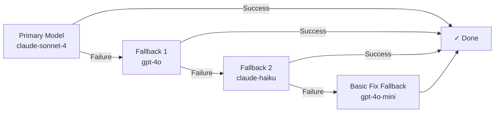

# Customization Guide

> **How to adapt SYNTARO to your workflow.**

---

## Table of Contents

- [Changing the Trigger Label](#changing-the-trigger-label)
- [Changing the Model](#changing-the-model)
- [Adding Custom Tools](#adding-custom-tools)
- [Customizing PR Templates](#customizing-pr-templates)
- [Configuring Sandbox Timeout](#configuring-sandbox-timeout)
- [Customizing Issue Comments](#customizing-issue-comments)
- [Configuring Queue Behavior](#configuring-queue-behavior)
- [Configuring Webhook Sources](#configuring-webhook-sources)
- [Configuring Rate Limits](#configuring-rate-limits)
- [Configuring Billing Tiers](#configuring-billing-tiers)
- [Configuring Notifications](#configuring-notifications)

---

## Changing the Trigger Label

By default, SYNTARO reacts to the `syntaro:fix` label. You can change this to any label name:

### Via Environment Variable

```bash
# .env
SYNTARO_LABEL=ai:fix
# or
SYNTARO_LABEL=🤖:fix
# or
SYNTARO_LABEL=bot-fix-this
```

### Via OpenCode Plugin

```bash
bash plugin/tools/syntaro-config.sh set SYNTARO_LABEL=ai:fix
```

### How it works

When a GitHub issue receives a label, the webhook handler checks:

```typescript
// src/webhooks/github.ts
const label = payload.label?.name;
if (label !== config.syntaro.label) {
  return; // Ignore non-target labels
}
```

Only labels that exactly match `SYNTARO_LABEL` trigger a fix run. This prevents conflicts with other bots.

---

## Changing the Model

SYNTARO uses two separate models for different phases:

### 1. Triage Model (Classification)

Controls which issues are routed to the fix agent:

```bash
# .env — OpenCode Go direct LLM (triage + fallback fix)
OPENCODE_API_KEY=sk-...  # Required for triage and fallback fixes
OPENCODE_CHEAP_MODEL=deepseek-v4-flash
OPENCODE_FIX_MODEL=deepseek-v4-pro
```

Other options:
- `gpt-4o-mini` (default, ~$0.15/1M tokens)
- `deepseek-chat` (~$0.14/1M tokens)
- `claude-3-haiku` (~$0.25/1M tokens)
- `gpt-4o` (more accurate but more expensive)

### 2. Fix Agent Model (Main Agent)

Controls fix quality and capability:

```bash
# .env — Fix agent model
OPENCODE_MODEL=anthropic/claude-sonnet-4-20250514
```

The model name format is `<provider>/<model-name>`. OpenCode supports:

| Provider | Model Examples | Best For |
|---|---|---|
| `anthropic/` | `claude-sonnet-4-20250514`, `claude-opus-4` | Code generation quality |
| `openai/` | `gpt-4o`, `gpt-4o-mini` | Speed, availability |
| `deepseek/` | `deepseek-coder` | Code, cost efficiency |
| `google/` | `gemini-1.5-pro`, `gemini-2.0-flash` | Large context, speed |

### Fallback Models

If the primary model fails (timeout, rate limit, error), SYNTARO tries fallbacks:

```bash
FALLBACK_MODELS=gpt-4o,claude-haiku
```

The models are tried in order. Each model gets the full `FIX_TIMEOUT_MS` duration. If all models fail, the basic fix fallback (`attemptBasicFix`) runs using the triage model.

### Model Chain Configuration



---

## Adding Custom Tools

The basic fix fallback agent (`src/agent/tools.ts`) uses a set of predefined tools. You can extend these by editing `src/agent/tools.ts`:

```typescript
// src/agent/tools.ts — Add custom tools here
export function buildTools(sandbox: SandboxTools): Tool[] {
  return [
    // ... existing tools ...

    // Add your custom tool:
    {
      name: 'deploy_preview',
      description: 'Deploy a preview environment to verify the fix',
      inputSchema: {
        type: 'object',
        properties: {
          branch: { type: 'string', description: 'Branch to deploy' },
        },
        required: ['branch'],
      },
      handler: async (args) => {
        // Your custom logic here
        return 'Preview deployed at https://preview.example.com';
      },
    },
  ];
}
```

For the main OpenCode agent, tools are configured in OpenCode Serve, not in SYNTARO. OpenCode has its own tool system that includes:
- `read_file`, `write_file`, `patch_file`, `replace_lines`
- `search_codebase`, `find_files`, `run_command`
- `run_tests`, `get_diff`, `format_code`
- `list_directory`, `find_symbol`, `trace_imports`
- `submit_fix`

---

## Customizing PR Templates

PR body templates are defined in `src/github/messages.ts`. The `buildPRBody` function constructs the PR description:

```typescript
// src/github/messages.ts
export function buildPRBody(params: {
  issueNumber: number;
  result: AgentResult;
  fileLinks: string[];
  isDraft: boolean;
  branchName: string;
}): string {
  // You can customize this to match your team's PR template
  return [
    `## Fixes #${params.issueNumber}`,
    '',
    params.result.summary,
    '',
    '### Changes Made',
    ...params.fileLinks.map((f) => `- \`${f}\``),
    '',
    '### Verification',
    params.result.verification?.preExistingTestsRegressed
      ? '- ⚠️ Regression detected in pre-existing tests'
      : '- ✅ Existing tests continue to pass',
    params.result.verification?.regressionTestPassedOnOriginal
      ? '- ✅ Regression test fails on original code (valid)'
      : '- ⚠️ Regression test may not properly validate the fix',
    '',
    '---',
    '',
    '_This PR was automatically generated by [SYNTARO](https://github.com/tamnguyen08/solving_tickets_as_a_service)._',
  ].join('\n');
}
```

### Customizing Bot Name and Comments

```bash
# .env
BOT_NAME=MyFixBot    # Changes the name used in all comments
```

The bot name is used in:
- Issue status comments: `> 🤖 **SYNTARO:** Investigating...`
- PR descriptions: `_This PR was automatically generated by [SYNTARO](...)_`
- Commit author: `SYNTARO Bot <syntaro-bot@users.noreply.github.com>`

### Customizing Status Messages

Status messages during the pipeline phases are defined in `src/github/messages.ts`. You can edit the templates there:

```typescript
// Example: Customize the investigating message
// Before:
const investigatingMsg = `### 🔍 SYNTARO Investigating\n\nIssue classified as **${triage.type}** (difficulty: ${triage.difficulty}).\n\nI'll investigate and work on a fix.\n\n`;

// After:
const investigatingMsg = `### 🔍 MyFixBot Investigating\n\nI've looked at this issue and classified it as a **${triage.type}** (difficulty: ${triage.difficulty}).\n\nLet me dig into the code and find a fix.\n\n`;
```

---

## Configuring Sandbox Timeout

Control how long the sandbox and agent can run before timing out:

```bash
# .env
FIX_TIMEOUT_MS=600000                  # Total fix timeout (default: 10 min)
PHASE_TIMEOUT_TRIAGE_MS=30000          # Triage phase timeout (default: 30s)
PHASE_TIMEOUT_SANDBOX_MS=300000        # Sandbox boot timeout (default: 5 min)
PHASE_TIMEOUT_PRCREATION_MS=30000      # PR creation timeout (default: 30s)
```

Individual sandbox timeouts:

```bash
# E2B sandbox
E2B_SANDBOX_TIMEOUT_MS=300000          # Default: 5 min

# Docker sandbox
DOCKER_SANDBOX_TIMEOUT_MS=300000       # Default: 5 min
```

### Sandbox Resource Limits

```bash
# Docker sandbox resources
DOCKER_CONTAINER_MEMORY=4g             # Container memory limit
DOCKER_CONTAINER_CPU=2                 # Container CPU limit
DOCKER_NETWORK_RESTRICT=true           # Enable iptables restrictions
DOCKER_ALLOWED_HOSTS=api.github.com,... # Allowed outbound hosts

# E2B sandbox resources (configured in E2B template)
E2B_TEMPLATE_ID=syntaro-default            # E2B template ID
```

### Sandbox Security Overrides

```bash
# === Security (handle with care) ===
SANDBOX_PRIVILEGED=false               # Never set to true (hard-blocked in code)
SANDBOX_READONLY_ROOT=true             # Read-only root filesystem
SANDBOX_MEMORY_LIMIT=512m              # Per-sandbox memory limit
SANDBOX_CPU_LIMIT=0.5                  # Per-sandbox CPU limit
SANDBOX_PIDS_LIMIT=256                 # Max processes (anti fork-bomb)
SANDBOX_DISK_LIMIT=2gb                 # Disk space limit
SANDBOX_NETWORK_ENABLED=false          # Network isolation
```

---

## Configuring Queue Behavior

### Queue Backend

Choose the queue backend:

```bash
QUEUE_BACKEND=rabbitmq      # RabbitMQ — persistent delivery (default, only option)
```

### Retry Strategy

```bash
QUEUE_MAX_RETRIES=4                       # Max retry attempts
QUEUE_RETRY_DELAYS=30000,120000,300000,900000  # Delays: 30s, 2m, 5m, 15m
```

### Concurrency

```bash
SYNTARO_MAX_CONCURRENT=3          # Max concurrent fixes per repo
WORKER_CONCURRENCY=2            # Jobs processed simultaneously per worker
QUEUE_DEDUP_TTL_SECONDS=120     # Deduplication window for same issue
QUEUE_KEEP_COMPLETED=200        # Keep last N completed jobs
QUEUE_KEEP_FAILED=100           # Keep last N failed jobs
```

---

## Configuring Webhook Sources

SYNTARO supports multiple webhook sources beyond GitHub:

### GitLab

```bash
GITLAB_URL=https://gitlab.com
GITLAB_TOKEN=glpat-...           # GitLab personal access token
GITLAB_WEBHOOK_SECRET=...        # GitLab webhook secret
```

### Bitbucket

```bash
BITBUCKET_USERNAME=your-username
BITBUCKET_APP_PASSWORD=...       # Bitbucket app password
BITBUCKET_WEBHOOK_SECRET=...     # Bitbucket webhook secret
```

### Linear

```bash
LINEAR_API_KEY=lin-api-...       # Linear API key
LINEAR_WEBHOOK_SECRET=...        # Linear webhook verification secret
```

### Jira

```bash
JIRA_URL=https://your-domain.atlassian.net
JIRA_EMAIL=user@example.com
JIRA_API_TOKEN=...               # Jira API token
JIRA_WEBHOOK_SECRET=...          # Jira webhook secret
JIRA_PROJECT_KEY=PROJ            # Default project key
```

### Tracker-to-GitHub Mapping

When tickets arrive from Linear or Jira, SYNTARO needs to know which GitHub repo to use:

```bash
TRACKER_DEFAULT_REPO_OWNER=my-org
TRACKER_DEFAULT_REPO_NAME=my-repo
TRACKER_INSTALLATION_ID=12345678
```

---

## Configuring Rate Limits

### HTTP Rate Limiting

```bash
SYNTARO_RATE_LIMIT_WINDOW_MS=60000    # Window (default: 1 min)
SYNTARO_RATE_LIMIT_MAX=30              # Max requests per window
```

### Account-Level Limits

Tier-based limits:

| Tier | Daily Fix Limit | Concurrent Runs |
|---|---|---|
| `free` | 10 | 1 |
| `pro` | 100 | 3 |
| `enterprise` | Unlimited | 10 |

Override the default tier:
```bash
SYNTARO_DEFAULT_TIER=free          # Options: free, pro, enterprise
SYNTARO_MONTHLY_QUOTA_ENABLED=true # Enable/disable quota enforcement
```

### Per-Repo Limits

```bash
# Environment variable for per-repo overrides (comma-separated)
SYNTARO_CONCURRENCY_OVERRIDES=my-org/my-repo=5,my-org/important-repo=10
```

---

## Configuring Notifications

### Slack

Simple webhook notifications:
```bash
SLACK_WEBHOOK_URL=https://hooks.slack.com/services/T0000/B0000/xxxxx
SLACK_CHANNEL=#syntaro-alerts
```

Interactive Slack messages (with buttons and modals):
```bash
SLACK_BOT_TOKEN=xoxb-...          # Slack Bot Token
SLACK_SIGNING_SECRET=...          # Slack signing secret
```

### Alert Thresholds

```bash
ALERT_SLACK_CHANNEL=#syntaro-alerts
ALERT_WARN_QUEUE_DEPTH=50
ALERT_CRIT_QUEUE_DEPTH=200
ALERT_WARN_ERROR_RATE_PERCENT=10
ALERT_CRIT_ERROR_RATE_PERCENT=30
```

---

## Full Environment Reference

| Variable | Default | Description |
|---|---|---|
| `SYNTARO_LABEL` | `syntaro:fix` | Trigger label |
| `BOT_NAME` | `SYNTARO` | Bot display name |
| `OPENCODE_MODEL` | `anthropic/claude-sonnet-4-20250514` | Primary model |
| `FALLBACK_MODELS` | `gpt-4o,claude-haiku` | Fallback models |
| `OPENAI_CHEAP_MODEL` | `gpt-4o-mini` | Triage model |
| `FIX_TIMEOUT_MS` | `600000` | Fix timeout (10 min) |
| `PHASE_TIMEOUT_TRIAGE_MS` | `30000` | Triage timeout (30s) |
| `PHASE_TIMEOUT_SANDBOX_MS` | `300000` | Sandbox boot timeout (5 min) |
| `MAX_AGENT_ITERATIONS` | `40` | Max agent tool calls |
| `MAX_ISSUE_COMMENTS` | `15` | Max issue comments per run |
| `QUEUE_BACKEND` | `rabbitmq` | Queue backend (RabbitMQ only, BullMQ removed) |
| `QUEUE_MAX_RETRIES` | `4` | Max retry attempts |
| `QUEUE_DEDUP_TTL_SECONDS` | `120` | Dedup window |
| `SYNTARO_MAX_CONCURRENT` | `3` | Per-repo concurrency |
| `WORKER_CONCURRENCY` | `2` | Per-worker concurrency |
| `SYNTARO_DEFAULT_TIER` | `free` | Default billing tier |
| `E2B_SANDBOX_TIMEOUT_MS` | `300000` | E2B sandbox timeout |
| `DOCKER_SANDBOX_TIMEOUT_MS` | `300000` | Docker sandbox timeout |
| `DOCKER_CONTAINER_MEMORY` | `4g` | Docker memory limit |
| `DOCKER_CONTAINER_CPU` | `2` | Docker CPU limit |
| `E2B_TEMPLATE_ID` | `syntaro-default` | E2B template |

For the complete list, see the `.env.example` file or `src/config.ts`.
