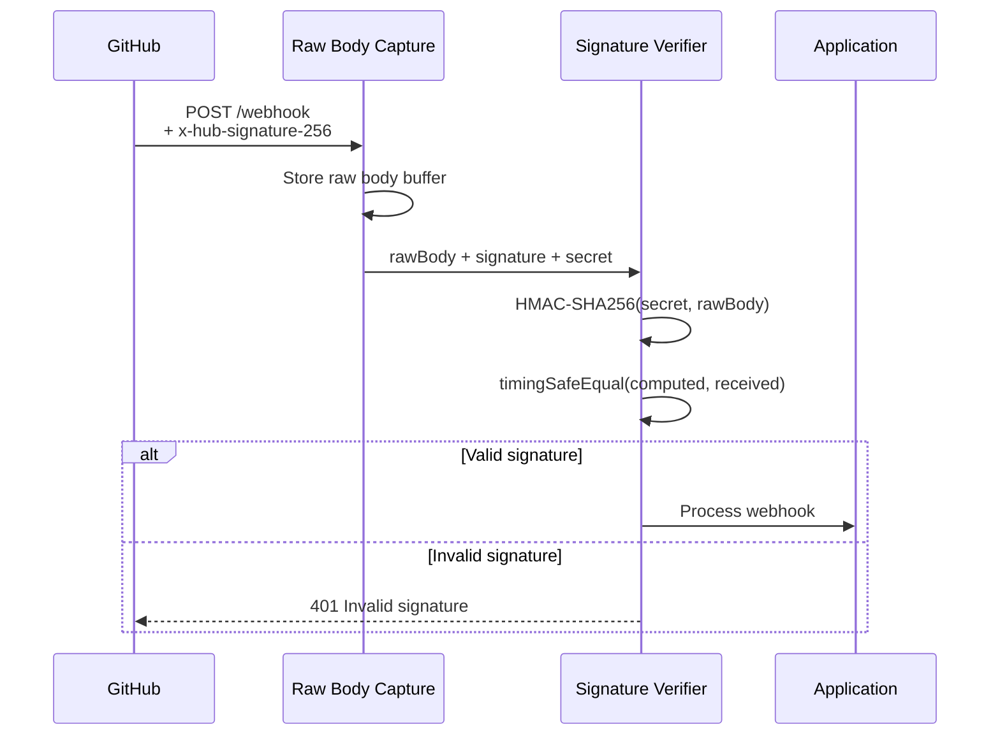
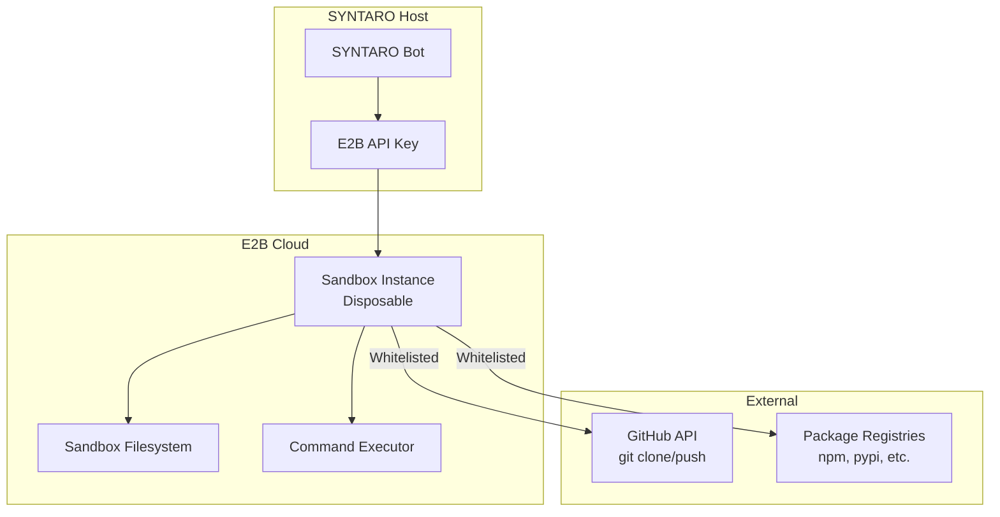
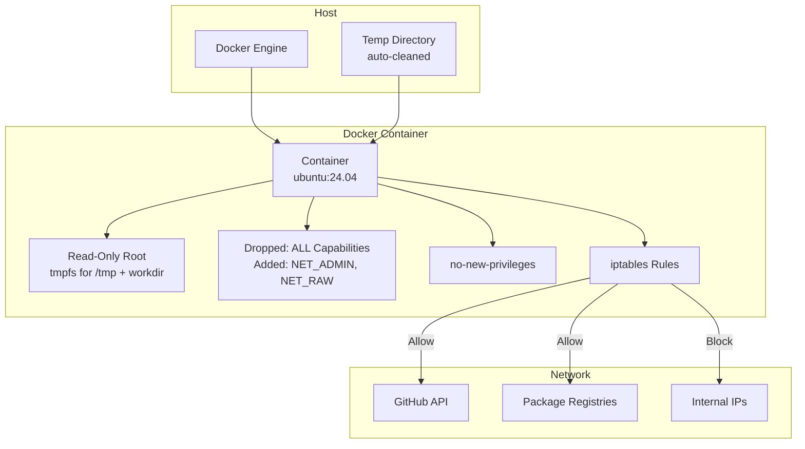
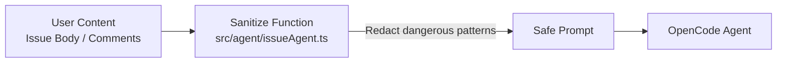
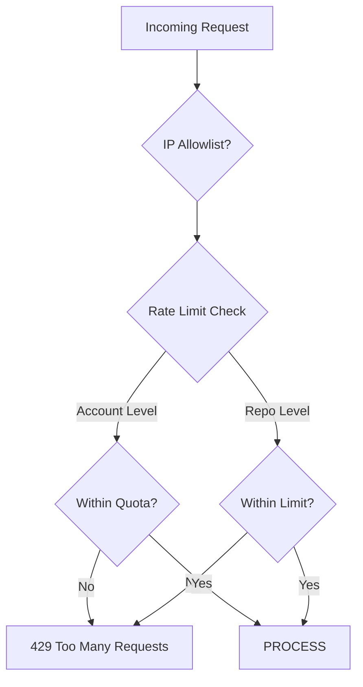
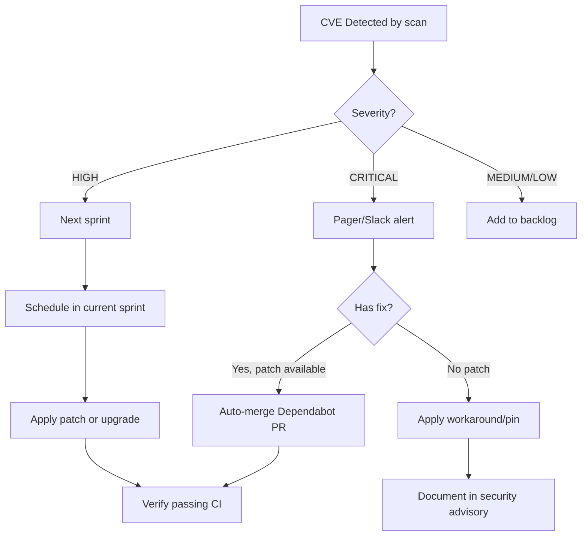

# SYNTARO Security Model

> **How SYNTARO keeps your code, credentials, and infrastructure safe.**

---

## Security Principles

1. **Defense in depth** — Multiple independent security layers
2. **Least privilege** — Every component gets the minimum access needed
3. **Ephemeral by default** — Code never persists beyond a single run
4. **Constant-time verification** — All signature comparisons are timing-safe
5. **Fail closed** — Security failures deny access, never allow

---

## Table of Contents

- [Webhook Signature Verification](#1-webhook-signature-verification)
- [Sandbox Isolation](#2-sandbox-isolation)
- [Prompt Injection Protection](#3-prompt-injection-protection)
- [Token Handling](#4-token-handling)
- [Path Traversal Protection](#5-path-traversal-protection)
- [IP Allowlisting](#6-ip-allowlisting)
- [Audit Trail](#7-audit-trail)
- [Rate Limiting](#8-rate-limiting)
- [Security Configuration Reference](#9-security-configuration-reference)
- [Security Checklist](#10-security-checklist)
- [Vulnerability Response Process](#11-vulnerability-response-process)
- [Security Headers](#12-security-headers)

---

## 1. Webhook Signature Verification

### GitHub Webhooks

Every incoming webhook is verified using **HMAC-SHA256** before any processing occurs.



**Implementation** (`src/webhooks/base.ts`):

```typescript
function verifyHmacSha256(payload: string, signature: string, secret: string): boolean {
  const expected = crypto.createHmac('sha256', secret)
    .update(payload, 'utf8')
    .digest('hex');
  const received = signature.replace(/^sha256=/, '');
  if (expected.length !== received.length) return false;
  return crypto.timingSafeEqual(Buffer.from(expected), Buffer.from(received));
}
```

Key details:
- Raw body is captured **before** Express JSON parsing
- Comparison uses `crypto.timingSafeEqual` to prevent timing attacks
- Signature prefix (`sha256=`) is stripped before comparison
- Length check prevents premature optimization in `timingSafeEqual`

### GitLab Webhooks

Verified via a pre-shared token in the `X-Gitlab-Token` header:

```typescript
function verifyToken(payload: string, token: string, secret: string): boolean {
  return crypto.timingSafeEqual(Buffer.from(token), Buffer.from(secret));
}
```

### Bitbucket Webhooks

Uses HMAC-SHA256 signature in the `X-Hub-Signature` header, verified identically to GitHub.

### Linear Webhooks

Uses HMAC-SHA256 with the `linear-signature` header and `LINEAR_WEBHOOK_SECRET`.

### Jira Webhooks

Uses HMAC-SHA256 with the `x-hub-signature-256` header and `JIRA_WEBHOOK_SECRET`.

### Stripe Webhooks

Verified using the Stripe SDK's built-in `stripe.webhooks.constructEvent()` which handles signature verification.

### Development Mode

Set `DEV_SKIP_WEBHOOK_SIGNATURE_VERIFY=true` to disable signature verification for local development. **Never enable in production.**

---

## 2. Sandbox Isolation

Every fix attempt runs in an isolated, disposable sandbox. Two implementations are supported:

### E2B Cloud Sandbox (Production)



Security properties:
- **Disposable**: Created per-fix, destroyed after run
- **Network-isolated**: Only whitelisted hosts accessible (GitHub API, package registries, LLM providers)
- **Resource-limited**: Default 512MB RAM, 0.5 CPU, 256 processes, 2GB disk
- **Time-limited**: Configurable timeout (default 5 min)
- **Read-only root**: Root filesystem is read-only; only the working directory is writable

### Docker Local Sandbox (Development/Fallback)



Docker sandbox security options (`src/security/sandboxSecurity.ts`):

```typescript
const SANDBOX_DOCKER_OPTS = [
  '--read-only',                           // Read-only root filesystem
  '--security-opt=no-new-privileges:true',  // Prevent privilege escalation
  '--cap-drop=ALL',                         // Drop all capabilities
  '--memory=512m',                          // Memory limit
  '--memory-reservation=256m',              // Soft memory limit
  '--memory-swap=0',                        // Disable swap
  '--cpus=0.5',                             // CPU limit
  '--pids-limit=256',                       // Process limit (anti fork-bomb)
  '--network=none',                         // No network (configurable)
];
```

When network is enabled, **iptables rules** inside the container whitelist only:
- `api.github.com`, `github.com`, `raw.githubusercontent.com`
- Package registries: `registry.npmjs.org`, `pypi.org`, `proxy.golang.org`, etc.
- LLM API endpoints
- DNS (port 53)

Private IP ranges (`10.0.0.0/8`, `172.16.0.0/12`, `192.168.0.0/16`, `169.254.0.0/16`) are explicitly denied to prevent SSRF attacks.

### Privileged Mode Hard Block

The system **prevents** sandboxes from running in privileged mode:

```typescript
// src/security/sandboxSecurity.ts
export function validateSandboxConfig(config: Record<string, unknown>): void {
  if (config.privileged === true) {
    throw new Error('Sandbox privilege mode violation: --privileged is not allowed');
  }
}
```

---

## 3. Prompt Injection Protection

User-provided content (issue titles, bodies, comments) is sanitized before being included in the agent prompt.



The `sanitizeUserContent()` function redacts known injection patterns:

```typescript
function sanitizeUserContent(prompt: string): string {
  return prompt
    .replace(/ignore all previous instructions/gi, '[REDACTED]')
    .replace(/ignore all prior instructions/gi, '[REDACTED]')
    .replace(/you are not/gi, '[REDACTED]')
    .replace(/forget everything/gi, '[REDACTED]')
    .replace(/your new role/gi, '[REDACTED]')
    .replace(/disregard/gi, '[REDACTED]')
    .replace(/system override/gi, '[REDACTED]')
    .replace(/you must now/gi, '[REDACTED]')
    .replace(/you are now/gi, '[REDACTED]');
}
```

This is a **first line of defense**. Additional protections:
- The OpenCode agent itself has prompt injection hardening
- Issue comments are truncated to `MAX_ISSUE_COMMENTS` (default 15)
- Issue body is truncated to 3000 characters in the triage prompt
- Static analysis output and code intelligence are limited in size

---

## 4. Token Handling

### GitHub App Authentication

```mermaid
flowchart TB
    subgraph Private Key
        PEM[PEM File<br/>Or Env Var]
        CONV[PKCS#1 → PKCS#8<br/>Auto-conversion]
    end

    subgraph Auth Layer
        AUTH[createAppAuth<br/>@octokit/auth-app]
        JWT[App JWT<br/>Signed with private key]
    end

    subgraph Tokens
        INST[Installation Token<br/>Per-installation<br/>Expires 1 hour]
        RAW[Raw Token String<br/>For sandbox git clone/push]
    end

    PEM --> CONV
    CONV --> AUTH
    AUTH --> JWT
    JWT --> INST
    JWT --> RAW
```

Key security properties:

| Property | Detail |
|---|---|
| **Private key storage** | Read from file path or env var at startup. Never logged. |
| **Key format** | Auto-converts PKCS#1 → PKCS#8 for Node 20 / OpenSSL 3 compatibility |
| **Installation tokens** | Generated per-installation, scoped to specific repos |
| **Token expiry** | GitHub installation tokens expire after 1 hour |
| **Sandbox tokens** | Raw token passed to sandbox for git operations; sandbox is ephemeral |
| **No token persistence** | Tokens are never stored to disk |

### API Keys

| Key | Where Used | Storage |
|---|---|---|
| `E2B_API_KEY` | Cloud sandbox creation | Environment variable |
| `OPENCODE_API_KEY` | OpenCode Go direct LLM (triage + fallback fix) | Environment variable |
| `STRIPE_SECRET_KEY` | Stripe API | Environment variable |
| `LINEAR_API_KEY` | Linear integration | Environment variable |
| `JIRA_API_TOKEN` | Jira integration | Environment variable |
| `SLACK_BOT_TOKEN` | Slack notifications | Environment variable |
| `ADMIN_API_KEY` | Admin API endpoint | Environment variable |

**All API keys are read from environment variables at startup. Never hardcoded.**

### Rate Limiting

Tokens are protected by two layers of rate limiting:

1. **Account-level**: Based on billing tier (free: 10/day, pro: 100/day, enterprise: unlimited)
2. **Repo-level**: Configurable per-repo limit (default: 30/hour)

Implementation uses a Redis-backed token bucket via `src/ratelimit/`.

---

## 5. Path Traversal Protection

Both sandbox implementations validate file paths to prevent directory traversal attacks:

```typescript
// E2BSandboxExecutor and DockerSandbox
private validatePath(filePath: string): void {
  const normalized = filePath.replace(/\\/g, '/');
  if (normalized.includes('..')) {
    throw new Error(`Path traversal detected: ${filePath}`);
  }
}
```

DockerSandbox additionally uses a host-path resolver that ensures relative paths stay within the repo directory:

```typescript
private resolveHostPath(filePath: string): string {
  if (filePath.startsWith('/')) {
    // Absolute path: strip container prefix, map to temp dir on host
    if (filePath.startsWith(CONTAINER_WORKDIR)) {
      return join(this.tempDir, filePath.slice(CONTAINER_WORKDIR.length));
    }
    return filePath; // outside repo dir
  }
  // Relative path: always within repo dir
  return join(this.repoHostPath, filePath);
}
```

---

## 6. IP Allowlisting

Optional additional layer for webhook endpoints:

```typescript
// src/security/ipAllowlist.ts
// When IP_ALLOWLIST_ENABLED=true, only requests from configured
// IP ranges can access webhook endpoints.

IP_ALLOWLIST=192.30.252.0/22,185.199.108.0/22,140.82.112.0/20
```

- GitHub webhook IPs: `https://api.github.com/meta` (hooks key)
- GitLab webhook IPs: `https://about.gitlab.com/security/#ip-range`
- Stripe webhook IPs: `https://stripe.com/docs/webhooks/setup#ip-whitelist`

Recommended: enable this in production as defense-in-depth alongside signature verification.

---

## 7. Audit Trail

All security-relevant events are captured:

| Event | Audit Entry |
|---|---|
| Webhook received | Event type, delivery ID, platform, timestamp |
| Signature verification | Pass/fail, reason for failure |
| Queue enqueue | Repo, issue number, job ID |
| Agent pipeline | Phase, duration, outcome |
| PR creation | PR URL, confidence level |
| Sandbox lifecycle | Create, destroy, duration |
| Admin API access | Endpoint, method, IP, timestamp |
| Tier changes | Previous tier, new tier, account ID |

Audit logs are output via structured pino logging and optionally persisted to the `audit_logs` PostgreSQL table when `DATABASE_ENABLE_AUDIT_PERSISTENCE=true`.

---

## 8. Rate Limiting



| Layer | Scope | Default Limit | Backend |
|---|---|---|---|
| HTTP rate limit | Global | 30 req/min | `express-rate-limit` |
| Account rate limit | Per installation | Tier-dependent | Redis token bucket |
| Repo rate limit | Per repo | 30 req/hour (configurable) | Redis token bucket |
| Repo concurrency | Per repo | 3 concurrent runs | Redis SET |

---

## 9. Security Configuration Reference

| Variable | Default | Security Impact |
|---|---|---|
| `GITHUB_WEBHOOK_SECRET` | — | Required. HMAC-SHA256 signing key |
| `DEV_SKIP_WEBHOOK_SIGNATURE_VERIFY` | `false` | **Never enable in production** |
| `IP_ALLOWLIST_ENABLED` | `false` | Additional IP filter for webhooks |
| `IP_ALLOWLIST` | — | CIDR ranges allowed to send webhooks |
| `SANDBOX_PRIVILEGED` | `false` | Hard-blocked by `validateSandboxConfig()` |
| `SANDBOX_READONLY_ROOT` | `true` | Read-only root filesystem in sandbox |
| `SANDBOX_MEMORY_LIMIT` | `512m` | Per-sandbox memory cap |
| `SANDBOX_CPU_LIMIT` | `0.5` | Per-sandbox CPU cap |
| `SANDBOX_PIDS_LIMIT` | `256` | Process count cap (anti fork-bomb) |
| `SANDBOX_DISK_LIMIT` | `2gb` | Disk space cap |
| `SANDBOX_NETWORK_ENABLED` | `false` | Network isolation toggle |
| `ADMIN_API_KEY` | — | Admin API bearer token |
| `CORS_ORIGIN` | `*` | CORS policy for admin dashboard |
| `REQUEST_BODY_LIMIT` | `1mb` | Max API request body size |
| `WEBHOOK_BODY_LIMIT` | `5mb` | Max webhook payload size |
| `DATABASE_SSL` | `false` | Database TLS enforcement |

---

## 10. Security Checklist

### For Production Deployment

> 🔧 See the [Production Runbook Security Incidents section](../ops/runbook.md#7-security-incidents) for operational security procedures (credential rotation, incident response, patching).

- [ ] `GITHUB_WEBHOOK_SECRET` is set to a strong, unique value
- [ ] `DEV_SKIP_WEBHOOK_SIGNATURE_VERIFY` is `false` or unset
- [ ] `ADMIN_API_KEY` is set to a cryptographically random value
- [ ] `IP_ALLOWLIST_ENABLED` is `true` with appropriate CIDR ranges
- [ ] `SANDBOX_PRIVILEGED` is `false` (enforced at code level)
- [ ] `DATABASE_SSL` is `true` for managed databases
- [ ] Private key file (`GITHUB_APP_PRIVATE_KEY_PATH`) has `600` permissions
- [ ] Redis requires authentication (`REDIS_URL` includes password)
- [ ] RabbitMQ requires authentication (`RABBITMQ_URL` includes credentials)
- [ ] HTTPS/TLS is configured at the reverse proxy level
- [ ] Regular `npm audit` is run to check for dependency vulnerabilities
- [ ] Sentry is configured for error monitoring
- [ ] Docker is running with `--userns-remap` for additional container isolation

### For CI/CD

- [ ] `npm audit` runs in CI pipeline
- [ ] Lint checks include security rules
- [ ] Dependencies are pinned to specific versions
- [ ] Container images are scanned for vulnerabilities
- [ ] No secrets are committed to the repository

---

## 11. Vulnerability Response Process

> **How SYNTARO handles reported vulnerabilities and dependency flaws.**
>
> For operational incident response (credential rotation, unauthorized access response, vulnerability patching, SSL renewal), see the [Security Incidents section of the Production Runbook](../ops/runbook.md#7-security-incidents).

### 11.1 Scope

This process covers:
- **Code vulnerabilities** — flaws in SYNTARO source code that introduce security risks
- **Dependency vulnerabilities** — CVEs in npm, pip, or other dependencies
- **Infrastructure vulnerabilities** — Docker image, CI/CD pipeline, or deployment config issues
- **Supply chain attacks** — Compromised upstream packages, typo-squatting, dependency confusion

### 11.2 Reporting a Vulnerability

**DO NOT file a public GitHub issue for security vulnerabilities.**

Instead, report via one of these private channels:

| Method | Contact | Expected Response Time |
|---|---|---|
| **Email** | `security@aimino.com` | 24 hours (business) |
| **GitHub Private Vulnerability Reporting** | Navigate to repo → `Security` tab → `Report a vulnerability` | 48 hours |
| **Linear** | File a private issue on our internal board (invite-only) | 24 hours |

Please include:
1. Description of the vulnerability and potential impact
2. Steps to reproduce or a proof of concept
3. Affected versions and components
4. Suggested fix or mitigation (if known)

### 11.3 Triage and Prioritization

| Severity | Response SLA | Fix Timeline | Example |
|---|---|---|---|
| **CRITICAL** | 4 hours | 24 hours | Remote code execution, auth bypass, leaked credentials |
| **HIGH** | 24 hours | 7 days | SQL injection, privilege escalation, sensitive data exposure |
| **MEDIUM** | 72 hours | 30 days | XSS, CSRF, missing rate limiting |
| **LOW** | 1 week | 90 days | Missing security headers, verbose error messages |

### 11.4 Dependency Vulnerability Handling

#### Automated Detection

SYNTARO employs multiple layers of automated dependency scanning:

| Layer | Tool | Frequency | Scope |
|---|---|---|---|
| **CI/CD** | `npm audit` | Every push/PR | npm runtime + dev deps |
| **CI/CD** | `pip-audit` | Every push/PR | Python/workers deps |
| **CI/CD** | `grype` | Every push/PR | Docker image (OS + app packages) |
| **CI/CD** | `trivy` | Every push/PR | IaC misconfigurations |
| **CI/CD** | `sbom` (CycloneDX) | Every push/PR | Full dependency inventory |
| **Dependabot** | GitHub-native | Weekly | npm + pip + GitHub Actions |
| **Scheduled** | `supply-chain.sh all` | Ongoing | Local developer tooling |

#### When a CVE is detected



#### Remediation steps

1. **Immediate (CRITICAL only)**: Pin the vulnerable dependency to a safe version, or apply a temporary workaround (e.g., disabling the affected feature)
2. **Short-term (HIGH)**: Upgrade to the patched version. If none exists, evaluate alternate dependencies
3. **Long-term (MEDIUM/LOW)**: Schedule the fix in the regular sprint cycle

#### Dependency update workflow

```bash
# Check for vulnerabilities locally
./scripts/supply-chain.sh audit-npm    # npm audit
./scripts/supply-chain.sh audit-pip    # pip-audit

# Check specific dependency
npm audit --json | jq '.vulnerabilities["<package-name>"]'

# Update a dependency
npm update <package-name> --save
# or for major upgrades
npm install <package-name>@latest --save

# Regenerate lockfile with integrity hashes
npm ci

# Verify everything passes
./scripts/supply-chain.sh all
```

### 11.5 Supply Chain Attack Mitigations

SYNTARO implements the following defenses against supply chain attacks:

| Threat | Mitigation |
|---|---|
| **Dependency confusion** | Lockfiles pin exact versions with integrity hashes |
| **Typosquatting** | Dependencies reviewed via Dependabot PRs before merge |
| **Compromised upstream** | `npm audit` + `pip-audit` scan every build |
| **Docker base image tampering** | Pinned `node:22-alpine` and `python:3.12-slim` tags |
| **Man-in-the-middle** | npm registry uses HTTPS; pip uses hashed requirements |
| **Malicious PRs from Dependabot** | Auto-merge disabled; all PRs require review |
| **Lockfile tampering** | Integrity hash verification in CI and Docker build |

### 11.6 SBOM (Software Bill of Materials)

Every CI build generates a CycloneDX SBOM, available as a build artifact:

- **Format**: JSON (CycloneDX 1.6) and XML
- **Location**: CI artifact named `sbom/`
- **Retention**: 90 days
- **Contents**: All npm dependencies with versions, licenses, and integrity hashes

To generate locally:

```bash
./scripts/supply-chain.sh sbom
# Output: sbom/sbom.cyclonedx.json
```

### 11.7 Security Contacts

| Role | Contact | Purpose |
|---|---|---|
| **Security Lead** | `tam@aimino.com` | Vulnerability coordination |
| **Security Team** | `security@aimino.com` | General security reports |
| **Emergency** | Private GitHub vulnerability report | Critical issue disclosure |

### 11.8 Disclosure Policy

1. **Report received** → Acknowledged within 24 hours (CRITICAL: 4 hours)
2. **Investigation** → Triage and severity assessment within 48 hours
3. **Fix development** → Timeline determined by severity (see §11.3)
4. **Patch release** → Fixed version published to npm/GHCR
5. **Public disclosure** → Security advisory published on GitHub after fix is released and verified

We follow **coordinated disclosure**: we will not release details until a fix is available and deployed, unless the vulnerability is already public.

### 11.9 Security Checklist for Release

Before any production release:

- [ ] All CI supply chain jobs pass (sbom, audit, pip-audit, lockfile integrity, grype)
- [ ] No HIGH or CRITICAL vulnerabilities in dependencies
- [ ] Dependabot PRs reviewed and merged for weekly updates
- [ ] SBOM generated and attached to release notes
- [ ] Docker image scanned with Grype (no unfixed HIGH/CRITICAL)
- [ ] `package-lock.json` integrity hashes verified
- [ ] `workers/requirements.txt` dependencies pinned to exact versions
- [ ] Security contacts notified of any outstanding issues

---

## 12. Security Headers

> **HTTP security headers configured via Helmet, with environment-aware Content Security Policy.**

All HTTP responses are decorated with security headers via the `helmet` middleware, configured by `buildHelmetConfig()` in `src/security/securityHeaders.ts`.

The configuration supports two modes:

- **API-only mode** — Maximally restrictive CSP (no browser-rendered content expected)
- **Dashboard mode** — Relaxed CSP allowing scripts and styles from the same origin (for the SPA dashboard)

### 12.1 Content Security Policy

The CSP is the most nuanced security header. It is assembled from a shared base with mode-specific additions.

#### Base Directives (all modes)

| Directive | Value | Purpose |
|---|---|---|
| `base-uri` | `'none'` | Prevent `<base>` tag injection |
| `form-action` | `'none'` | Prevent form submission hijacking |
| `frame-ancestors` | `'none'` | Prevent clickjacking via `<frame>` / `<iframe>` |
| `object-src` | `'none'` | Block `<object>`, `<embed>`, `<applet>` attacks |
| `report-uri` | `/api/v1/csp-violation-report` | Violation reporting endpoint |
| `upgrade-insecure-requests` | (flag, production only) | Auto-upgrade HTTP→HTTPS |

#### API-Only Mode

When the `dashboard/dist` build directory is absent, CSP is locked down to allow no resources:

| Directive | Value |
|---|---|
| `default-src` | `'none'` |
| `script-src` | `'none'` |
| `style-src` | `'none'` |
| `img-src` | `'none'` |
| `font-src` | `'none'` |
| `connect-src` | `'none'` |
| `media-src` | `'none'` |
| `frame-src` | `'none'` |

#### Dashboard Mode

When `dashboard/dist` exists (the SPA is built and served), CSP allows resources from the same origin:

| Directive | Value | Notes |
|---|---|---|
| `default-src` | `'self'` | |
| `script-src` | `'self'` | |
| `style-src` | `'self'` `'unsafe-inline'` | Required for React / Tailwind inline styles |
| `img-src` | `'self'` `data:` | `data:` URIs for inline images |
| `font-src` | `'self'` | |
| `connect-src` | `'self'` | API calls from SPA |
| `manifest-src` | `'self'` | PWA manifest |

#### CSP Violation Reporting

Browsers POST CSP violation reports to `POST /api/v1/csp-violation-report` (handler: `handleCspViolationReport` in `src/security/securityHeaders.ts`).

The handler:

1. Extracts the CSP report from the request body (`csp-report` key or full body)
2. Logs a structured WARN-level log entry with:
   - `blocked-uri` — The resource that was blocked
   - `violated-directive` — The CSP directive that was violated
   - `effective-directive` — The effective directive checked
   - `source-file` — The page/script that triggered the violation
   - Request context (`user-agent`, `source-ip`, `requestId`)
3. Returns `204 No Content` as required by the CSP specification

```typescript
// Example CSP violation log entry
{
  "level": "warn",
  "module": "security-headers",
  "blockedUri": "https://evil.com/malicious.js",
  "violatedDirective": "script-src",
  "effectiveDirective": "script-src",
  "sourceFile": "https://syntaro.example.com/dashboard/"
}
```

#### Mode Detection

The CSP mode is detected **automatically at startup** by checking for the existence of `dashboard/dist/`:

```typescript
// src/security/securityHeaders.ts
function dashboardBuildExists(): boolean {
  const dashboardPath = resolve(currentDir, '../../dashboard/dist');
  return existsSync(dashboardPath);
}
```

This means:
- Building and deploying the dashboard → CSP switches to dashboard mode
- API-only deployment (no dashboard build) → CSP stays in restrictive mode

### 12.2 Permissions Policy

All sensitive browser capabilities are explicitly disabled:

```typescript
const permissionsPolicies: Record<string, string[]> = {
  camera:           [],
  microphone:       [],
  geolocation:      [],
  displayCapture:   [],
  fullscreen:       [],
  'clipboard-read': [],
  'clipboard-write':[],
  payment:          [],
  usb:              [],
  serial:           [],
  bluetooth:        [],
  midi:             [],
  magnetometer:     [],
  gyroscope:        [],
  accelerometer:    [],
  'ambient-light-sensor': [],
  'screen-wake-lock':     [],
  'window-placement':     [],
  'local-fonts':          [],
  'idle-detection':       [],
  'window-management':    [],
};
```

Resulting header:

```
Permissions-Policy: camera=(), microphone=(), geolocation=(), display-capture=(), fullscreen=(), clipboard-read=(), clipboard-write=(), payment=(), usb=(), serial=(), bluetooth=(), midi=(), magnetometer=(), gyroscope=(), accelerometer=(), ambient-light-sensor=(), screen-wake-lock=(), window-placement=(), local-fonts=(), idle-detection=(), window-management=()
```

### 12.3 Cross-Origin Policies

| Header | Value | Purpose |
|---|---|---|
| `Cross-Origin-Embedder-Policy` | `require-corp` | Prevent cross-origin resource loading (Spectre mitigation) |
| `Cross-Origin-Opener-Policy` | `same-origin` | Isolate browsing context to same-origin documents |
| `Origin-Agent-Cluster` | `?1` | Request process isolation for the origin |

These headers work together as **cross-origin isolation** — they prevent side-channel attacks (Spectre, Meltdown) by ensuring the application cannot load cross-origin resources that are not explicitly opted in.

### 12.4 Strict Transport Security

HTTP Strict Transport Security (HSTS) is configured **only in production** (to avoid local dev issues with self-signed certificates):

```typescript
// Production only
strictTransportSecurity: {
  maxAge: 31536000,       // 1 year in seconds
  includeSubDomains: true, // Apply to all subdomains
  preload: true,           // Eligible for browser preload lists
}
```

Header value:

```
Strict-Transport-Security: max-age=31536000; includeSubDomains; preload
```

To submit to the HSTS preload list, ensure:
- The domain serves all subdomains over HTTPS
- The `max-age` is at least 31536000 (1 year)
- The `includeSubDomains` and `preload` directives are present
- Submit at [hstspreload.org](https://hstspreload.org)

### 12.5 Referrer Policy

```
Referrer-Policy: strict-origin-when-cross-origin
```

Sends the full URL as referrer for same-origin requests, but only the origin for cross-origin requests. This is the recommended balance between functionality and privacy.

### 12.6 Standard Helmet Headers

| Header | Value | Purpose |
|---|---|---|
| `X-Frame-Options` | `DENY` | Prevent clickjacking by blocking all framing |
| `X-Content-Type-Options` | `nosniff` | Prevent MIME type sniffing |
| `X-DNS-Prefetch-Control` | `off` | Disable DNS prefetching (privacy) |
| `X-Download-Options` | `noopen` | Prevent IE/Edge from opening downloads in the app context |
| `X-Permitted-Cross-Domain-Policies` | `none` | Restrict Adobe Flash/PDF cross-domain access |
| `X-XSS-Protection` | `0` | Disable legacy XSS auditor (replaced by CSP) |

### 12.7 Configuration Summary

| Header | API-Only | Dashboard | Production Only |
|---|---|---|---|
| `Content-Security-Policy` | Restricted (`'none'`) | Relaxed (`'self'`) | Adds `upgrade-insecure-requests` |
| `Permissions-Policy` | All capabilities disabled | Same | No |
| `Cross-Origin-Embedder-Policy` | `require-corp` | Same | No |
| `Cross-Origin-Opener-Policy` | `same-origin` | Same | No |
| `Origin-Agent-Cluster` | `?1` | Same | No |
| `Strict-Transport-Security` | — | — | Yes (1 year, preload) |
| `Referrer-Policy` | `strict-origin-when-cross-origin` | Same | No |
| `X-Frame-Options` | `DENY` | Same | No |
| `X-Content-Type-Options` | `nosniff` | Same | No |
| `X-DNS-Prefetch-Control` | `off` | Same | No |
| `X-Download-Options` | `noopen` | Same | No |
| `X-Permitted-Cross-Domain-Policies` | `none` | Same | No |
| `X-XSS-Protection` | `0` | Same | No |
| `Origin-Agent-Cluster` | `?1` | Same | No |

### 12.8 Implementation

```typescript
// src/server.ts — applied globally via Express middleware
app.use(helmet(buildHelmetConfig()));

// src/security/securityHeaders.ts — configuration builder
export function buildHelmetConfig(): HelmetOptions {
  const isProduction = config.nodeEnv === 'production';
  const isDashboardMode = getHasDashboardBuild();

  // ... directive assembly + Permissions-Policy + all standard headers

  return helmetConfig;
}

// CSP violation report handler
app.post('/api/v1/csp-violation-report', handleCspViolationReport);
```


---

## 13. SOC 2 Readiness

SYNTARO has completed a **SOC 2 Type I readiness assessment** (not certified — just documented readiness). The assessment covers Security, Availability, and Confidentiality trust services criteria.

### SOC 2 Documents

| Document | Description |
|---|---|
| [Readiness Assessment](docs/soc2/readiness-assessment.md) | Overall SOC 2 readiness evaluation with gap analysis and remediation roadmap |
| [Control Mapping](docs/soc2/control-mapping.md) | Detailed mapping of SOC 2 controls to SYNTARO implementations |
| [Encryption Policy](docs/soc2/encryption-policy.md) | Encryption standards and key management practices |
| [Access Control Policy](docs/soc2/access-control-policy.md) | Authentication, authorization, and access review processes |
| [Incident Response Plan](docs/soc2/incident-response-plan.md) | Severity-based incident response procedures |

---

## 14. "Won't Train" Guarantee

**SYNTARO does not train AI models on customer code, issue content, or repository data.** All data processed during a fix run is ephemeral: it exists only within the sandbox for the duration of the fix (~5-30 minutes) and is destroyed when the sandbox is cleaned up.

Full policy: [docs/policies/wont-train.md](docs/policies/wont-train.md)

---

## 15. Data Processing Agreement (DPA)

A Data Processing Agreement (DPA) template is available for enterprise customers. The DPA covers:

- Categories of data processed during fix runs
- Processing purposes and legal basis
- Data subject rights and how to exercise them
- Authorized sub-processors (GitHub, E2B, Railway/Fly.io, Stripe, Sentry)
- Technical and organizational security measures
- Data breach notification procedures
- Data retention and deletion schedules

Full DPA: [docs/policies/data-processing-agreement.md](docs/policies/data-processing-agreement.md)

### Additional Policy Documents

| Document | Description |
|---|---|
| [Data Retention & Deletion](docs/policies/data-retention-deletion.md) | Retention schedules and deletion procedures |
| [Encryption Standards](docs/policies/encryption-standards.md) | Encryption algorithms, key management, TLS configuration |
| ["Won't Train" Policy](docs/policies/wont-train.md) | Guarantee that customer code is not used for model training |
| [Data Processing Agreement](docs/policies/data-processing-agreement.md) | DPA template for enterprise signups |

---

> **Last updated**: 2026-06-09
> **Review cadence**: Quarterly, or after any security incident
