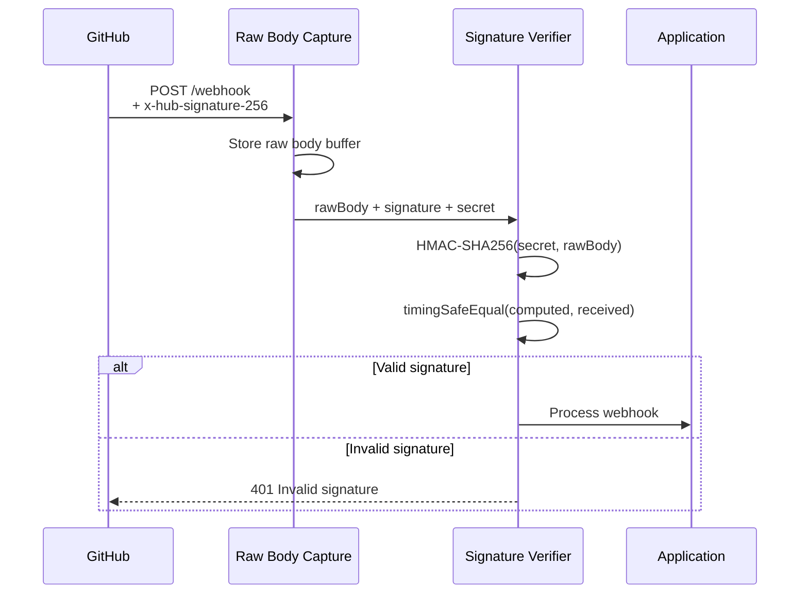
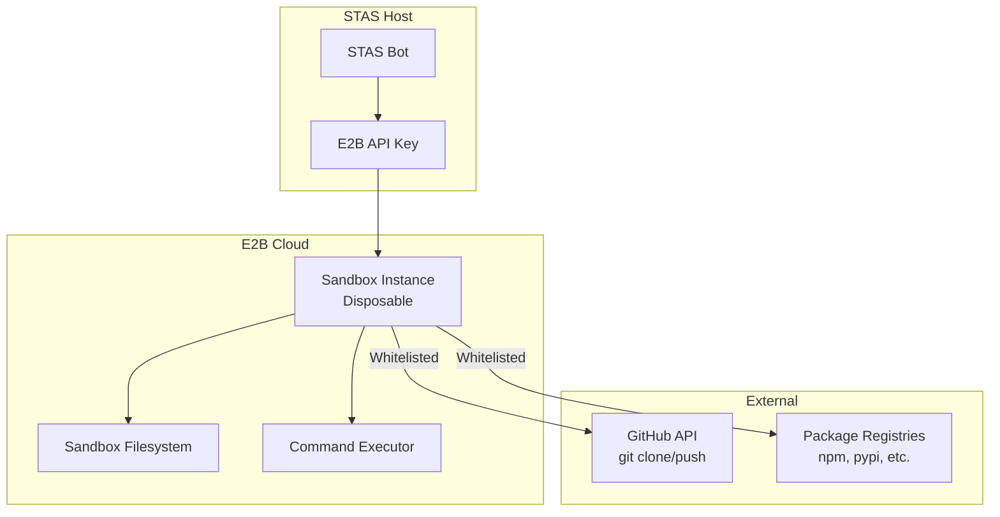
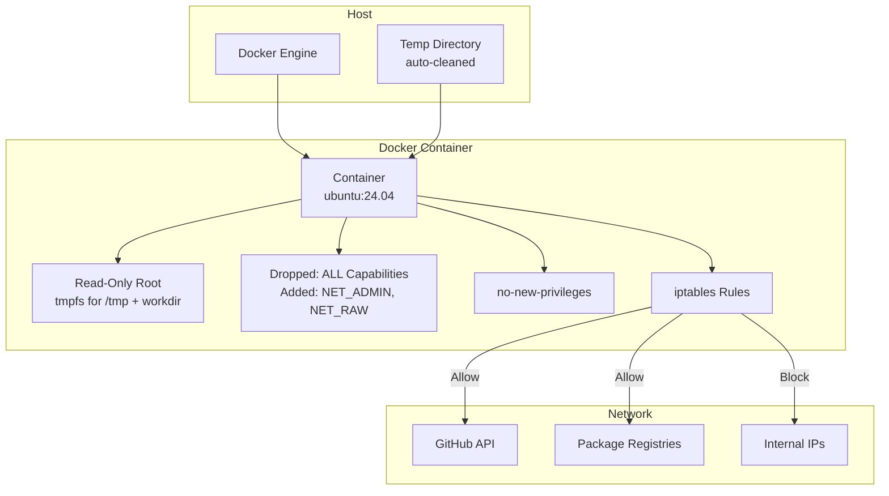
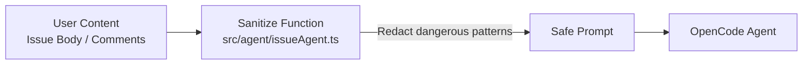
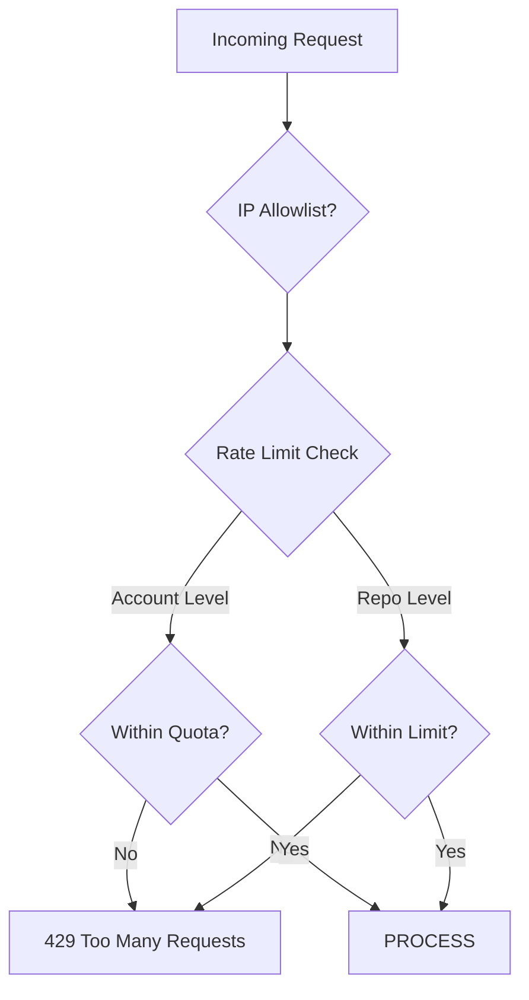

# STAS Security Model

> **How STAS keeps your code, credentials, and infrastructure safe.**

---

## Security Principles

1. **Defense in depth** — Multiple independent security layers
2. **Least privilege** — Every component gets the minimum access needed
3. **Ephemeral by default** — Code never persists beyond a single run
4. **Constant-time verification** — All signature comparisons are timing-safe
5. **Fail closed** — Security failures deny access, never allow

---

## Table of Contents

- [Webhook Signature Verification](#1-webhook-signature-verification)
- [Sandbox Isolation](#2-sandbox-isolation)
- [Prompt Injection Protection](#3-prompt-injection-protection)
- [Token Handling](#4-token-handling)
- [Path Traversal Protection](#5-path-traversal-protection)
- [IP Allowlisting](#6-ip-allowlisting)
- [Audit Trail](#7-audit-trail)
- [Rate Limiting](#8-rate-limiting)
- [Security Configuration Reference](#9-security-configuration-reference)
- [Security Checklist](#10-security-checklist)

---

## 1. Webhook Signature Verification

### GitHub Webhooks

Every incoming webhook is verified using **HMAC-SHA256** before any processing occurs.



**Implementation** (`src/webhooks/base.ts`):

```typescript
function verifyHmacSha256(payload: string, signature: string, secret: string): boolean {
  const expected = crypto.createHmac('sha256', secret)
    .update(payload, 'utf8')
    .digest('hex');
  const received = signature.replace(/^sha256=/, '');
  if (expected.length !== received.length) return false;
  return crypto.timingSafeEqual(Buffer.from(expected), Buffer.from(received));
}
```

Key details:
- Raw body is captured **before** Express JSON parsing
- Comparison uses `crypto.timingSafeEqual` to prevent timing attacks
- Signature prefix (`sha256=`) is stripped before comparison
- Length check prevents premature optimization in `timingSafeEqual`

### GitLab Webhooks

Verified via a pre-shared token in the `X-Gitlab-Token` header:

```typescript
function verifyToken(payload: string, token: string, secret: string): boolean {
  return crypto.timingSafeEqual(Buffer.from(token), Buffer.from(secret));
}
```

### Bitbucket Webhooks

Uses HMAC-SHA256 signature in the `X-Hub-Signature` header, verified identically to GitHub.

### Linear Webhooks

Uses HMAC-SHA256 with the `linear-signature` header and `LINEAR_WEBHOOK_SECRET`.

### Jira Webhooks

Uses HMAC-SHA256 with the `x-hub-signature-256` header and `JIRA_WEBHOOK_SECRET`.

### Stripe Webhooks

Verified using the Stripe SDK's built-in `stripe.webhooks.constructEvent()` which handles signature verification.

### Development Mode

Set `DEV_SKIP_WEBHOOK_SIGNATURE_VERIFY=true` to disable signature verification for local development. **Never enable in production.**

---

## 2. Sandbox Isolation

Every fix attempt runs in an isolated, disposable sandbox. Two implementations are supported:

### E2B Cloud Sandbox (Production)



Security properties:
- **Disposable**: Created per-fix, destroyed after run
- **Network-isolated**: Only whitelisted hosts accessible (GitHub API, package registries, LLM providers)
- **Resource-limited**: Default 512MB RAM, 0.5 CPU, 256 processes, 2GB disk
- **Time-limited**: Configurable timeout (default 5 min)
- **Read-only root**: Root filesystem is read-only; only the working directory is writable

### Docker Local Sandbox (Development/Fallback)



Docker sandbox security options (`src/security/sandboxSecurity.ts`):

```typescript
const SANDBOX_DOCKER_OPTS = [
  '--read-only',                           // Read-only root filesystem
  '--security-opt=no-new-privileges:true',  // Prevent privilege escalation
  '--cap-drop=ALL',                         // Drop all capabilities
  '--memory=512m',                          // Memory limit
  '--memory-reservation=256m',              // Soft memory limit
  '--memory-swap=0',                        // Disable swap
  '--cpus=0.5',                             // CPU limit
  '--pids-limit=256',                       // Process limit (anti fork-bomb)
  '--network=none',                         // No network (configurable)
];
```

When network is enabled, **iptables rules** inside the container whitelist only:
- `api.github.com`, `github.com`, `raw.githubusercontent.com`
- Package registries: `registry.npmjs.org`, `pypi.org`, `proxy.golang.org`, etc.
- LLM API endpoints
- DNS (port 53)

Private IP ranges (`10.0.0.0/8`, `172.16.0.0/12`, `192.168.0.0/16`, `169.254.0.0/16`) are explicitly denied to prevent SSRF attacks.

### Privileged Mode Hard Block

The system **prevents** sandboxes from running in privileged mode:

```typescript
// src/security/sandboxSecurity.ts
export function validateSandboxConfig(config: Record<string, unknown>): void {
  if (config.privileged === true) {
    throw new Error('Sandbox privilege mode violation: --privileged is not allowed');
  }
}
```

---

## 3. Prompt Injection Protection

User-provided content (issue titles, bodies, comments) is sanitized before being included in the agent prompt.



The `sanitizeUserContent()` function redacts known injection patterns:

```typescript
function sanitizeUserContent(prompt: string): string {
  return prompt
    .replace(/ignore all previous instructions/gi, '[REDACTED]')
    .replace(/ignore all prior instructions/gi, '[REDACTED]')
    .replace(/you are not/gi, '[REDACTED]')
    .replace(/forget everything/gi, '[REDACTED]')
    .replace(/your new role/gi, '[REDACTED]')
    .replace(/disregard/gi, '[REDACTED]')
    .replace(/system override/gi, '[REDACTED]')
    .replace(/you must now/gi, '[REDACTED]')
    .replace(/you are now/gi, '[REDACTED]');
}
```

This is a **first line of defense**. Additional protections:
- The OpenCode agent itself has prompt injection hardening
- Issue comments are truncated to `MAX_ISSUE_COMMENTS` (default 15)
- Issue body is truncated to 3000 characters in the triage prompt
- Static analysis output and code intelligence are limited in size

---

## 4. Token Handling

### GitHub App Authentication

```mermaid
flowchart TB
    subgraph Private Key
        PEM[PEM File<br/>Or Env Var]
        CONV[PKCS#1 → PKCS#8<br/>Auto-conversion]
    end

    subgraph Auth Layer
        AUTH[createAppAuth<br/>@octokit/auth-app]
        JWT[App JWT<br/>Signed with private key]
    end

    subgraph Tokens
        INST[Installation Token<br/>Per-installation<br/>Expires 1 hour]
        RAW[Raw Token String<br/>For sandbox git clone/push]
    end

    PEM --> CONV
    CONV --> AUTH
    AUTH --> JWT
    JWT --> INST
    JWT --> RAW
```

Key security properties:

| Property | Detail |
|---|---|
| **Private key storage** | Read from file path or env var at startup. Never logged. |
| **Key format** | Auto-converts PKCS#1 → PKCS#8 for Node 20 / OpenSSL 3 compatibility |
| **Installation tokens** | Generated per-installation, scoped to specific repos |
| **Token expiry** | GitHub installation tokens expire after 1 hour |
| **Sandbox tokens** | Raw token passed to sandbox for git operations; sandbox is ephemeral |
| **No token persistence** | Tokens are never stored to disk |

### API Keys

| Key | Where Used | Storage |
|---|---|---|
| `E2B_API_KEY` | Cloud sandbox creation | Environment variable |
| `OPENAI_API_KEY` | Triage LLM | Environment variable |
| `STRIPE_SECRET_KEY` | Stripe API | Environment variable |
| `LINEAR_API_KEY` | Linear integration | Environment variable |
| `JIRA_API_TOKEN` | Jira integration | Environment variable |
| `SLACK_BOT_TOKEN` | Slack notifications | Environment variable |
| `ADMIN_API_KEY` | Admin API endpoint | Environment variable |

**All API keys are read from environment variables at startup. Never hardcoded.**

### Rate Limiting

Tokens are protected by two layers of rate limiting:

1. **Account-level**: Based on billing tier (free: 10/day, pro: 100/day, enterprise: unlimited)
2. **Repo-level**: Configurable per-repo limit (default: 30/hour)

Implementation uses a Redis-backed token bucket via `src/ratelimit/`.

---

## 5. Path Traversal Protection

Both sandbox implementations validate file paths to prevent directory traversal attacks:

```typescript
// E2BSandboxExecutor and DockerSandbox
private validatePath(filePath: string): void {
  const normalized = filePath.replace(/\\/g, '/');
  if (normalized.includes('..')) {
    throw new Error(`Path traversal detected: ${filePath}`);
  }
}
```

DockerSandbox additionally uses a host-path resolver that ensures relative paths stay within the repo directory:

```typescript
private resolveHostPath(filePath: string): string {
  if (filePath.startsWith('/')) {
    // Absolute path: strip container prefix, map to temp dir on host
    if (filePath.startsWith(CONTAINER_WORKDIR)) {
      return join(this.tempDir, filePath.slice(CONTAINER_WORKDIR.length));
    }
    return filePath; // outside repo dir
  }
  // Relative path: always within repo dir
  return join(this.repoHostPath, filePath);
}
```

---

## 6. IP Allowlisting

Optional additional layer for webhook endpoints:

```typescript
// src/security/ipAllowlist.ts
// When IP_ALLOWLIST_ENABLED=true, only requests from configured
// IP ranges can access webhook endpoints.

IP_ALLOWLIST=192.30.252.0/22,185.199.108.0/22,140.82.112.0/20
```

- GitHub webhook IPs: `https://api.github.com/meta` (hooks key)
- GitLab webhook IPs: `https://about.gitlab.com/security/#ip-range`
- Stripe webhook IPs: `https://stripe.com/docs/webhooks/setup#ip-whitelist`

Recommended: enable this in production as defense-in-depth alongside signature verification.

---

## 7. Audit Trail

All security-relevant events are captured:

| Event | Audit Entry |
|---|---|
| Webhook received | Event type, delivery ID, platform, timestamp |
| Signature verification | Pass/fail, reason for failure |
| Queue enqueue | Repo, issue number, job ID |
| Agent pipeline | Phase, duration, outcome |
| PR creation | PR URL, confidence level |
| Sandbox lifecycle | Create, destroy, duration |
| Admin API access | Endpoint, method, IP, timestamp |
| Tier changes | Previous tier, new tier, account ID |

Audit logs are output via structured pino logging and optionally persisted to the `audit_logs` PostgreSQL table when `DATABASE_ENABLE_AUDIT_PERSISTENCE=true`.

---

## 8. Rate Limiting



| Layer | Scope | Default Limit | Backend |
|---|---|---|---|
| HTTP rate limit | Global | 30 req/min | `express-rate-limit` |
| Account rate limit | Per installation | Tier-dependent | Redis token bucket |
| Repo rate limit | Per repo | 30 req/hour (configurable) | Redis token bucket |
| Repo concurrency | Per repo | 3 concurrent runs | Redis SET |

---

## 9. Security Configuration Reference

| Variable | Default | Security Impact |
|---|---|---|
| `GITHUB_WEBHOOK_SECRET` | — | Required. HMAC-SHA256 signing key |
| `DEV_SKIP_WEBHOOK_SIGNATURE_VERIFY` | `false` | **Never enable in production** |
| `IP_ALLOWLIST_ENABLED` | `false` | Additional IP filter for webhooks |
| `IP_ALLOWLIST` | — | CIDR ranges allowed to send webhooks |
| `SANDBOX_PRIVILEGED` | `false` | Hard-blocked by `validateSandboxConfig()` |
| `SANDBOX_READONLY_ROOT` | `true` | Read-only root filesystem in sandbox |
| `SANDBOX_MEMORY_LIMIT` | `512m` | Per-sandbox memory cap |
| `SANDBOX_CPU_LIMIT` | `0.5` | Per-sandbox CPU cap |
| `SANDBOX_PIDS_LIMIT` | `256` | Process count cap (anti fork-bomb) |
| `SANDBOX_DISK_LIMIT` | `2gb` | Disk space cap |
| `SANDBOX_NETWORK_ENABLED` | `false` | Network isolation toggle |
| `ADMIN_API_KEY` | — | Admin API bearer token |
| `CORS_ORIGIN` | `*` | CORS policy for admin dashboard |
| `REQUEST_BODY_LIMIT` | `1mb` | Max API request body size |
| `WEBHOOK_BODY_LIMIT` | `5mb` | Max webhook payload size |
| `DATABASE_SSL` | `false` | Database TLS enforcement |

---

## 10. Security Checklist

### For Production Deployment

- [ ] `GITHUB_WEBHOOK_SECRET` is set to a strong, unique value
- [ ] `DEV_SKIP_WEBHOOK_SIGNATURE_VERIFY` is `false` or unset
- [ ] `ADMIN_API_KEY` is set to a cryptographically random value
- [ ] `IP_ALLOWLIST_ENABLED` is `true` with appropriate CIDR ranges
- [ ] `SANDBOX_PRIVILEGED` is `false` (enforced at code level)
- [ ] `DATABASE_SSL` is `true` for managed databases
- [ ] Private key file (`GITHUB_APP_PRIVATE_KEY_PATH`) has `600` permissions
- [ ] Redis requires authentication (`REDIS_URL` includes password)
- [ ] RabbitMQ requires authentication (`RABBITMQ_URL` includes credentials)
- [ ] HTTPS/TLS is configured at the reverse proxy level
- [ ] Regular `npm audit` is run to check for dependency vulnerabilities
- [ ] Sentry is configured for error monitoring
- [ ] Docker is running with `--userns-remap` for additional container isolation

### For CI/CD

- [ ] `npm audit` runs in CI pipeline
- [ ] Lint checks include security rules
- [ ] Dependencies are pinned to specific versions
- [ ] Container images are scanned for vulnerabilities
- [ ] No secrets are committed to the repository
