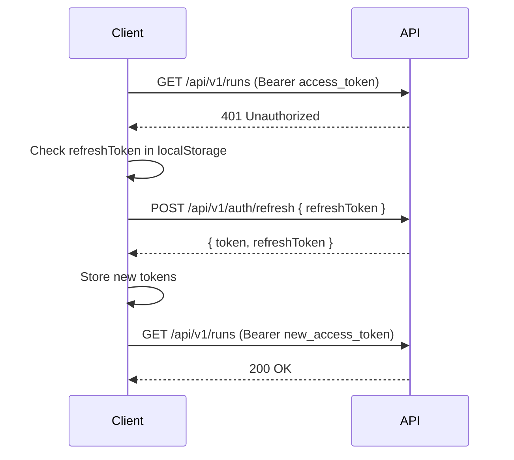

# STAS Auth — UX Flow Documentation

> Last updated: 2026-07-29
> Auth backend: `src/auth/` · Auth dashboard: `dashboard/src/context/AuthContext.tsx` · Login page: `dashboard/src/pages/Login.tsx`

---

## Table of Contents

1. [User Flow Overview](#1-user-flow-overview)
2. [UI Pages & States](#2-ui-pages--states)
3. [API Endpoint Reference](#3-api-endpoint-reference)
4. [Token Lifecycle](#4-token-lifecycle)
5. [Rate Limiting](#5-rate-limiting)
6. [GitHub OAuth Flow](#6-github-oauth-flow)
7. [Component Architecture](#7-component-architecture)

---

## 1. User Flow Overview

```
                        ┌─────────────────────┐
                        │   /login             │
                        │  (Sign In / Register)│
                        └──────┬─────────┬─────┘
                               │         │
                  ┌────────────┘         └────────────┐
                  ▼                                     ▼
        ┌──────────────────┐                 ┌──────────────────┐
        │  Sign In         │                 │  Register        │
        │  POST /auth/login│                 │  POST /auth/     │
        │                  │                 │  register        │
        └────────┬─────────┘                 └────────┬─────────┘
                 │                                    │
                 ▼                                    ▼
        ┌──────────────────┐                 ┌──────────────────┐
        │  2FA / Error     │                 │  Email Verify    │
        │  (rate-limited)  │                 │  Sent Notice     │
        └────────┬─────────┘                 └────────┬─────────┘
                 │                                    │
                 ▼                                    ▼
        ┌───────────────────────────────────────────────────────┐
        │  Email Verification                                  │
        │  POST /auth/verify-email (from email link)            │
        └───────────────────────┬───────────────────────────────┘
                                │
                                ▼
        ┌───────────────────────────────────────────────────────┐
        │  Authenticated Dashboard (/)                          │
        │  - ProtectedRoute checks AuthContext                  │
        │  - Token refreshed automatically on 401              │
        │  - Sidebar with user avatar + logout                 │
        └───────────────────────────────────────────────────────┘
```

### Flow Steps

| Step | Action | Endpoint | Auth Required |
|------|--------|----------|---------------|
| 1 | Navigate to `/login` | — | No |
| 2a | **Sign In**: enter email + password | `POST /api/v1/auth/login` | No |
| 2b | **Register**: enter name + email + password | `POST /api/v1/auth/register` | No |
| 3 | Verify email (click link from email) | `POST /api/v1/auth/verify-email` | No |
| 4 | Access dashboard at `/` | — | Yes (Bearer token) |
| 5 | Token refresh on 401 | `POST /api/v1/auth/refresh` | Refresh token |
| 6 | Logout | `POST /api/v1/auth/logout` | No |

---

## 2. UI Pages & States

### 2.1 Login Page (`/login`)

**File**: `dashboard/src/pages/Login.tsx`

The login page uses a **split layout**: left panel (brand/features) + right panel (auth form).

#### Layout Structure

```
┌─────────────────────────────────────────────────────┐
│  ┌────────────────────────┐  ┌────────────────────┐ │
│  │  Brand Panel (50%)     │  │  Form Panel (50%)  │ │
│  │                        │  │                    │ │
│  │  STAS                  │  │  [Sign In|Register]│ │
│  │  "Solving Tickets..."  │  │  ────────toggle─── │ │
│  │                        │  │                    │ │
│  │  ✓ We Never Train...   │  │  Name*             │ │
│  │                        │  │  [____________]    │ │
│  │  ✓ Real-time monitoring│  │                    │ │
│  │  ✓ Repo management     │  │  Email*            │ │
│  │  ✓ Analytics           │  │  [____________]    │ │
│  │  ✓ Audit log           │  │                    │ │
│  │  ✓ Team collaboration  │  │  Password*         │ │
│  │                        │  │  [____________]    │ │
│  │  © 2026 STAS           │  │                    │ │
│  │                        │  │  [Sign In]         │ │
│  │                        │  │  ✗ Error message   │ │
│  │                        │  │                    │ │
│  │                        │  │  New? Learn more → │ │
│  └────────────────────────┘  └────────────────────┘ │
└─────────────────────────────────────────────────────┘
```

#### UI States

| State | Condition | Visual Indicators |
|-------|-----------|------------------|
| **Empty** | Initial load, no input | Both fields empty, form ready |
| **Filled** | User has entered data | Name (register mode only), email, password fields populated |
| **Validating** | Client-side validation | Email `type="email"` validates format, password `minLength={8}` |
| **Submitting** | Form submitted, awaiting response | Button shows "Please wait...", `disabled` |
| **Error** | API returns error | Red text error message below form fields (`err instanceof Error ? err.message : 'Authentication failed'`) |
| **Success** | Auth successful | Redirect to `/` (dashboard) via `navigate('/', { replace: true })` |

#### Login State Error Messages

| Scenario | HTTP Code | Message |
|----------|-----------|---------|
| Invalid credentials | 401 | "Invalid email or password" |
| Email not found | 401 | "Invalid email or password" |
| Rate limited | 429 | "Too many requests" |
| Network error | — | "Authentication failed" |

#### Register State Error Messages

| Scenario | HTTP Code | Message |
|----------|-----------|---------|
| Email already exists | 409 | "Email already registered" |
| Password too short | 400 | "Password must be at least 8 characters" |
| Invalid email format | 400 | "Invalid email" |
| Rate limited | 429 | "Too many requests" |

### 2.2 Email Verification Sent Notice

When a user registers successfully, the backend returns a `verificationToken`. The UI does not currently display a dedicated verification-sent screen — the user is redirected to the dashboard. Email verification is handled server-side via the verification token.

**Verification flow:**

```
User clicks email link ──► POST /api/v1/auth/verify-email { token }
                                │
                                ▼
                              ┌───────────────────┐
                              │  Token valid?     │
                              │  ├─ Yes: confirm  │
                              │  └─ No: 400 error │
                              └───────────────────┘
```

### 2.3 Authenticated Dashboard

**File**: `dashboard/src/App.tsx` · `dashboard/src/components/ProtectedRoute.tsx`

When authenticated, the app loads `Layout.tsx` which shows:

```
┌─────────────────────────────────────────────────────┐
│  ┌──────────┐  ┌──────────────────────────────────┐│
│  │ Sidebar  │  │  Top Bar                         ││
│  │          │  │  [≡] STAS Premium Dashboard  🔔  ││
│  │ ⚡ STAS  │  ├──────────────────────────────────┤│
│  │          │  │                                  ││
│  │ ◉ Dash   │  │  Page Content (Outlet)           ││
│  │ ↻ Runs   │  │                                  ││
│  │ ⊞ Repos  │  │                                  ││
│  │ ▦ Anal.. │  │                                  ││
│  │ 📊 KPIs  │  │                                  ││
│  │ ☰ Audit  │  │                                  ││
│  │ 🔧 Config│  │                                  ││
│  │ ⚙ Setting│  │                                  ││
│  │ 📡 Monit │  │                                  ││
│  │ ⚡ Admin │  │                                  ││
│  │          │  │                                  ││
│  │ ─────── │  │                                  ││
│  │ [Avatar] │  │                                  ││
│  │ UserName │  │                                  ││
│  │ [⇥ logout]│  │                                  ││
│  │ EN DE FR │  │                                  ││
│  └──────────┘  └──────────────────────────────────┘│
└─────────────────────────────────────────────────────┘
```

**Key behaviors:**
- **Loading state**: Spinner shown while `AuthContext.isLoading === true` (initial token check)
- **Unauthenticated**: `ProtectedRoute` redirects to `/login`
- **Authenticated**: Renders children (layout + page content)
- **Session expiry**: `request()` catches 401 → attempts refresh → on failure clears token → redirects to `/login`
- **Logout**: `logout()` calls `POST /api/v1/auth/logout`, clears local storage tokens, sets `user` to `null`

---

## 3. API Endpoint Reference

### 3.1 Auth Endpoints

Base path: `/api/v1/auth`

| Method | Path | Auth | Description | Request Body | Response |
|--------|------|------|-------------|-------------|----------|
| `POST` | `/register` | No | Create account | `{ email, password, name? }` | `{ token, refreshToken, user }` |
| `POST` | `/login` | No | Sign in | `{ email, password }` | `{ token, refreshToken, user }` |
| `POST` | `/refresh` | No | Rotate tokens | `{ refreshToken }` | `{ token, refreshToken, user }` |
| `POST` | `/verify-email` | No | Verify email | `{ token }` | `{ message, email }` |
| `POST` | `/resend-verification` | No | Resend verification | `{ email }` | `{ message, verificationToken }` |
| `POST` | `/logout` | No | End session | — | `{ message }` |
| `GET` | `/me` | Bearer | Get current user | — | `{ id, email, name, createdAt }` |

### 3.2 GitHub OAuth Endpoints

Base path: `/api/v1/auth/github`

| Method | Path | Auth | Description |
|--------|------|------|-------------|
| `POST` | `/url` | No | Generate GitHub OAuth URL |
| `POST` | `/callback` | Optional | Exchange OAuth code for tokens |
| `GET` | `/status` | Bearer | Check GitHub connection status |
| `GET` | `/profile` | Bearer | Get GitHub OAuth profile |
| `DELETE` | `/disconnect` | Bearer | Disconnect GitHub account |

### 3.3 Sample Requests

#### Register
```json
POST /api/v1/auth/register
{
  "email": "user@example.com",
  "password": "securepassword123",
  "name": "Jane Doe"
}
```

Response `201`:
```json
{
  "token": "eyJhbGciOiJIUzI1NiIs...",
  "refreshToken": "eyJhbGciOiJIUzI1NiIs...",
  "user": { "id": "uuid", "email": "user@example.com", "emailVerified": false, "name": "Jane Doe" },
  "verificationToken": "eyJhbGciOiJIUzI1NiIs..."
}
```

#### Login
```json
POST /api/v1/auth/login
{
  "email": "user@example.com",
  "password": "securepassword123"
}
```

Response `200`:
```json
{
  "token": "eyJhbGciOiJIUzI1NiIs...",
  "refreshToken": "eyJhbGciOiJIUzI1NiIs...",
  "user": { "id": "uuid", "email": "user@example.com", "emailVerified": true, "name": "Jane Doe" }
}
```

#### Verify Email
```json
POST /api/v1/auth/verify-email
{
  "token": "eyJhbGciOiJIUzI1NiIs..."
}
```

Response `200`:
```json
{ "message": "Email verified successfully", "email": "user@example.com" }
```

---

## 4. Token Lifecycle

```
┌─────────────────────────────────────────────────────────────┐
│                    Token Lifecycle                           │
├─────────────────────────────────────────────────────────────┤
│                                                             │
│  Register / Login                                            │
│       │                                                     │
│       ▼                                                     │
│  ┌─────────────────────────────────────┐                     │
│  │  Issue Access Token + Refresh Token │                     │
│  │  Access:  expiresIn (config)        │                     │
│  │  Refresh: expiresIn (config, longer)│                     │
│  └──────────────┬──────────────────────┘                     │
│                 │                                            │
│         ┌───────┴──────────┐                                 │
│         ▼                  ▼                                 │
│  ┌─────────────┐   ┌──────────────┐                          │
│  │ API Request  │   │ Token Expired│                         │
│  │ (Bearer)     │   │ (401)       │                          │
│  └──────┬──────┘   └──────┬───────┘                          │
│         │                 │                                   │
│         ▼                 ▼                                   │
│  ┌─────────────┐   ┌──────────────┐                          │
│  │ Middleware   │   │ Auto-refresh  │                         │
│  │ verifyToken()│   │ POST /refresh │                         │
│  └──────┬──────┘   └──────┬───────┘                          │
│         │                 │                                   │
│         ▼                 ▼                                   │
│  ┌─────────────┐   ┌──────────────┐                          │
│  │ Route handler│   │ New tokens   │                          │
│  └─────────────┘   │ issued +     │                          │
│                    │ retry request│                          │
│                    └──────┬───────┘                          │
│                           │                                   │
│                     ┌─────┴─────┐                             │
│                     ▼           ▼                             │
│              ┌──────────┐ ┌──────────┐                        │
│              │ Success  │ │ Fail →   │                        │
│              │ (continue)│ │ clear    │                        │
│              └──────────┘ │ tokens +  │                        │
│                           │ redirect  │                        │
│                           │ /login    │                        │
│                           └──────────┘                        │
│                                                             │
└─────────────────────────────────────────────────────────────┘
```

### Implementation Details

**Token generation** (`src/auth/service.ts:191`):

| Token | Payload | Expiry (configurable) | Purpose |
|-------|---------|----------------------|---------|
| Access Token | `{ sub: userId, email }` | `auth.jwtExpiresIn` (e.g., 15min) | Authenticate API requests |
| Refresh Token | `{ sub: userId, email }` | `auth.jwtRefreshExpiresIn` (e.g., 7d) | Obtain new access tokens |

**Token storage** (`dashboard/src/api/client.ts`):

| Token | Storage | Key |
|-------|---------|-----|
| Access Token | `localStorage` | `stas_token` |
| Refresh Token | `localStorage` | `stas_refresh_token` |

**Auto-refresh flow** (`dashboard/src/api/client.ts:64`):



---

## 5. Rate Limiting

Rate limiting is applied per-endpoint using `express-rate-limit`.

**File**: `src/auth/rateLimit.ts`

| Endpoint | Config Key | Default Window | Default Max |
|----------|-----------|----------------|-------------|
| `POST /login` | `loginRateLimitMax` | `rateLimitWindowMs` | Configurable |
| `POST /register` | `registerRateLimitMax` | `rateLimitWindowMs` | Configurable |
| `POST /refresh` | `refreshRateLimitMax` | `rateLimitWindowMs` | Configurable |

**Behavior on limit**: Returns `429 Too Many Requests` with JSON body `{ "error": "Too many requests" }`.

Auth middleware (`src/auth/middleware.ts`) validates `Authorization: Bearer <token>` header. Returns `401` with `{ "error": "Authentication required" }` or `{ "error": "Invalid or expired token" }`.

---

## 6. GitHub OAuth Flow

```
┌──────────┐     ┌──────────┐     ┌──────────┐     ┌──────────┐
│ Dashboard │     │  STAS    │     │  GitHub  │     │ Supabase │
│ (Browser) │     │  Backend │     │          │     │ (Auth)   │
└─────┬─────┘     └─────┬────┘     └─────┬────┘     └─────┬────┘
      │                  │                │                │
      │  1. POST /url    │                │                │
      │◄─── { url }──────│                │                │
      │                  │                │                │
      │  2. Redirect to  │                │                │
      │  GitHub auth page│                │                │
      │──────────────────────────────────►│                │
      │                  │                │                │
      │  3. User authorizes               │                │
      │◄──── code ────────────────────────│                │
      │                  │                │                │
      │  4. POST /callback { code }       │                │
      │──────────────────►│                │                │
      │                  │  5. Exchange    │                │
      │                  │  code for token │                │
      │                  │────────────────►│                │
      │                  │◄─── access_token│                │
      │                  │                │                │
      │                  │  6. Fetch user  │                │
      │                  │────────────────►│                │
      │                  │◄─ user profile  │                │
      │                  │                │                │
      │                  │  7. Create user │                │
      │                  │  (if new)      │                │
      │                  │──────────────────────────────►│
      │                  │◄─ user created  │                │
      │                  │                │                │
      │                  │  8. Store OAuth token           │
      │                  │  (encrypted)   │                │
      │                  │                │                │
      │  ◄─── { token, refreshToken,     │                │
      │         github } ────────────────│                │
      │                  │                │                │
```

**Files**: `src/routes/githubOAuth.ts` · `src/db/repositories/GitHubOAuthRepository.ts`

---

## 7. Component Architecture

```
src/auth/                    # Auth backend
├── service.ts               # AuthService: register, login, verifyEmail, refreshToken, passwordReset
├── routes.ts                # Express router: /register, /login, /refresh, /verify-email, /logout, /me
├── middleware.ts             # requireAuth, optionalAuth middleware
├── rateLimit.ts              # Rate limiters: loginLimiter, registerLimiter, refreshLimiter
├── supabase.ts               # Supabase admin + anon clients
└── index.ts                  # Barrel exports

src/routes/githubOAuth.ts    # GitHub OAuth: /url, /callback, /status, /profile, /disconnect

dashboard/src/
├── api/client.ts            # API client with auth helpers (setToken, getRefreshToken, auto-refresh)
├── context/AuthContext.tsx    # AuthProvider + useAuth hook (login, register, logout, user state)
├── pages/Login.tsx           # Login/Register form with toggle
├── components/
│   ├── ProtectedRoute.tsx   # Route guard: redirects to /login if unauthenticated
│   └── Layout.tsx           # Authenticated layout with sidebar, top bar, locale switcher, logout
└── App.tsx                  # Route definitions with ProtectedRoute wrappers
```

---

## Appendix: Security Considerations

| Concern | Implementation |
|---------|---------------|
| Password storage | Supabase Auth (bcrypt, server-side) |
| Token signing | HS256 JWT with configurable secret |
| Refresh token rotation | New refresh token issued on each refresh call |
| Token storage | localStorage (client-side) — vulnerable to XSS |
| Rate limiting | `express-rate-limit` with per-endpoint config |
| Email verification | JWT-based verification token, 24h expiry |
| Password reset | JWT-based reset token, 15min expiry |
| GitHub OAuth | Encrypted access token storage via `encrypt()` |
