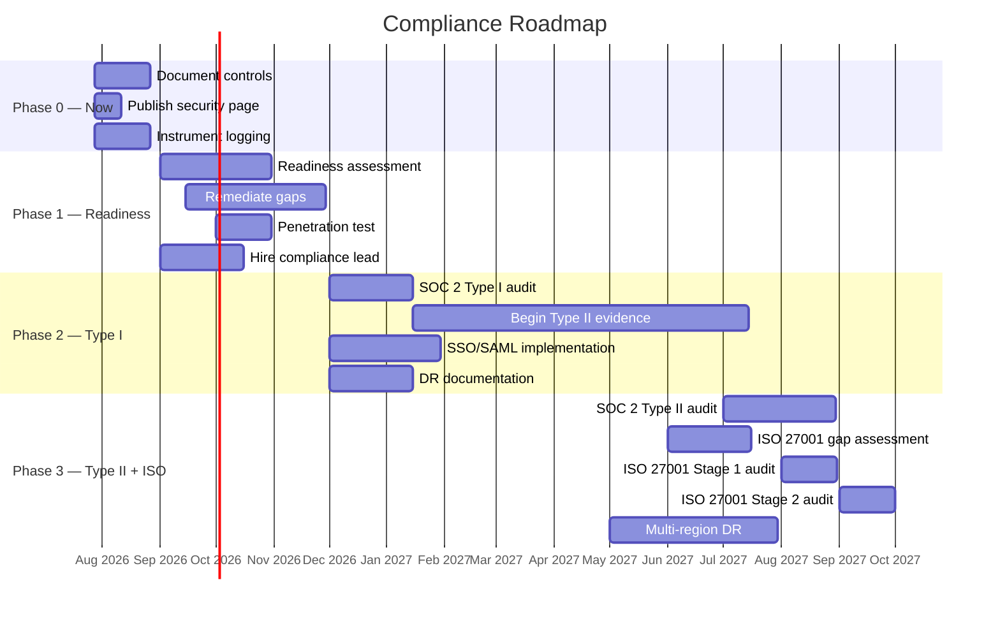

# Compliance Roadmap — SYNTARO

> **Phased plan for SOC 2 and ISO 27001 certification, with estimated costs and milestones.**

---

## Overview

SYNTARO is pursuing SOC 2 certification (Type I and Type II) followed by ISO 27001 certification. This roadmap outlines the timeline, key activities, deliverables, and estimated costs for each phase. The approach is pragmatic: build on existing security controls, address gaps identified in the [readiness assessment](soc2/readiness-assessment.md), and engage third-party auditors at the appropriate stage.

### Guiding Principles

1. **Controls first, certification second** — All security controls are already implemented or in progress. Certification validates existing practices.
2. **Phased investment** — Costs increase as the program matures. Initial phases require minimal external spend.
3. **Customer-driven timing** — Certification timeline is driven by enterprise customer demand. All phases can be accelerated if required.
4. **Self-hosted coverage** — Controls apply to both cloud-hosted and self-hosted deployments where applicable.

---

## Phase 0: Now (Months 0–1)

**Theme: Document, publish, and instrument**

| Activity | Deliverable | Owner | Cost |
|----------|------------|-------|------|
| Document all security controls | Security Overview, Architecture Data Flow | Engineering | $0 (engineering time) |
| Publish security page on marketing site | `/security` or `/trust` page | Engineering + Design | $0 |
| Implement structured audit logging | pino JSON logging with correlation IDs | Engineering | $0 |
| Implement webhook signature verification | HMAC-SHA256 constant-time comparison | Engineering | $0 |
| Document data classification | Data classification matrix in Architecture Data Flow | Engineering | $0 |
| Document subprocessor list | Subprocessor table with due diligence | Engineering | $0 |
| Add `/health` endpoint | Health check for monitoring | Engineering | $0 |
| Configure Sentry error tracking | Error alerting thresholds | Engineering | $0 |
| Set up automated dependency scanning | Dependabot + npm audit + Trivy in CI | Engineering | $0 |
| Document incident response plan | Incident Response Plan (existing) | Engineering | $0 |
| Implement rate limiting | HTTP + per-installation + per-repository | Engineering | $0 |

**Phase 0 Total Cost: $0** (all engineering time, no external vendors)

**Status**: ⬤ Mostly complete. Remaining items: formalize audit logging, publish security page.

---

## Phase 1: 3 Months (Months 2–4)

**Theme: Readiness assessment, gaps remediation, compliance infrastructure**

| Activity | Deliverable | Owner | Estimated Cost |
|----------|------------|-------|---------------|
| SOC 2 Type I readiness assessment | Gap analysis report | External auditor | $8,000–$15,000 |
| Remediate readiness gaps | Remediation tracker | Engineering | $5,000–$10,000 (engineering time) |
| Hire compliance lead / security engineer | Full-time or fractional | Operations | $15,000–$25,000 (3-month fractional) |
| Implement formal access review process | Quarterly access review policy | Compliance lead | $0 |
| Implement backup verification | Monthly restore test automation | Engineering | $2,000–$5,000 |
| Implement change management documentation | Change log, approval gates | Engineering | $0 |
| Formalize employee security training | Training materials + onboarding checklist | Compliance lead | $1,000–$3,000 |
| Vulnerability disclosure program setup | SECURITY.md, security@ email, Tidelift or similar | Compliance lead | $0–$2,000 |
| Third-party penetration test | Pen test report | External firm | $15,000–$30,000 |
| Data Processing Agreement (DPA) template | Customer-ready DPA | Legal (external) | $3,000–$8,000 |
| Implement immutable audit log storage | WORM-compliant log storage | Engineering | $2,000–$5,000 (infra) |
| SSO/SAML scoping and design | Requirements document, vendor evaluation | Engineering | $0 |

**Phase 1 Total Cost: $51,000–$103,000**

**Key Milestone**: SOC 2 Type I readiness assessment completed. All gaps documented with remediation plans. Third-party pen test completed.

---

## Phase 2: 6 Months (Months 5–7)

**Theme: SOC 2 Type I audit, begin Type II evidence collection**

| Activity | Deliverable | Owner | Estimated Cost |
|----------|------------|-------|---------------|
| SOC 2 Type I audit | Type I report (point-in-time) | External auditor | $25,000–$40,000 |
| Address Type I findings | Remediation plan + implementation | Engineering | $10,000–$20,000 (engineering time) |
| Begin Type II evidence collection | Automated evidence gathering pipeline | Engineering + Compliance | $5,000–$10,000 |
| Implement continuous monitoring dashboards | Grafana / Prometheus security dashboards | Engineering | $2,000–$5,000 |
| Formalize vendor risk management program | Vendor assessment templates, review cadence | Compliance lead | $0 |
| Implement SSO/SAML (MVP) | Basic SAML integration for admin API | Engineering | $10,000–$20,000 |
| Implement formal change advisory board (CAB) | Change management process + documentation | Compliance lead | $0 |
| Business continuity plan (BCP) documentation | BCP document with RPO/RTO | Compliance lead | $3,000–$5,000 (consultant) |
| Disaster recovery drill | Documented DR test | Engineering | $2,000–$5,000 |
| Customer security questionnaire automation | Vendor risk portal or automated responses | Engineering | $5,000–$10,000 |

**Phase 2 Total Cost: $62,000–$115,000**

**Key Milestone**: SOC 2 Type I report issued. Type II evidence collection period begins (3–6 months of continuous evidence).

---

## Phase 3: 12 Months (Months 8–14)

**Theme: SOC 2 Type II report, ISO 27001 certification**

| Activity | Deliverable | Owner | Estimated Cost |
|----------|------------|-------|---------------|
| SOC 2 Type II audit | Type II report (6-month evidence period) | External auditor | $30,000–$50,000 |
| ISO 27001 gap assessment | Gap analysis against ISO 27001:2022 | External auditor | $10,000–$20,000 |
| ISO 27001 Stage 1 audit | Documentation review | External auditor | $8,000–$15,000 |
| ISO 27001 Stage 2 audit | Certification audit | External auditor | $12,000–$25,000 |
| Address audit findings | Remediation plan + implementation | Engineering + Compliance | $10,000–$20,000 |
| Multi-region DR implementation | Active-passive multi-region deployment | Engineering | $20,000–$40,000 (infra) |
| Continuous compliance automation | Automated evidence collection, policy-as-code | Engineering | $10,000–$20,000 |
| Annual penetration test | Pen test report | External firm | $15,000–$30,000 |
| Security awareness program | Annual training, phishing simulations | Compliance lead | $3,000–$8,000 |
| Customer trust portal | Private portal with SOC 2 reports, DPAs, pen test results | Engineering | $5,000–$10,000 |
| Bug bounty program (optional) | HackerOne / Bugcrowd integration | Compliance lead | $10,000–$25,000/year (bounties + platform) |

**Phase 3 Total Cost: $133,000–$263,000**

**Key Milestone**: SOC 2 Type II report issued. ISO 27001 certification achieved.

---

## Summary: Total Estimated Cost

| Phase | Timeline | Cost Range | Cumulative |
|-------|----------|------------|------------|
| Phase 0: Now | Months 0–1 | $0 | $0 |
| Phase 1: Readiness | Months 2–4 | $51k–$103k | $51k–$103k |
| Phase 2: Type I + Evidence | Months 5–7 | $62k–$115k | $113k–$218k |
| Phase 3: Type II + ISO 27001 | Months 8–14 | $133k–$263k | $246k–$481k |

**Total estimated cost (14 months): $246,000–$481,000**

---

## Cost Breakdown by Category

| Category | Phase 1 | Phase 2 | Phase 3 | Total |
|----------|---------|---------|---------|-------|
| External audit fees | $8k–$15k | $25k–$40k | $60k–$110k | $93k–$165k |
| Penetration testing | $15k–$30k | — | $15k–$30k | $30k–$60k |
| Compliance personnel | $15k–$25k | $15k–$25k | $15k–$25k | $45k–$75k |
| Engineering time | $7k–$15k | $17k–$35k | $20k–$40k | $44k–$90k |
| Legal (DPA, contracts) | $3k–$8k | — | — | $3k–$8k |
| Infrastructure | $2k–$5k | $2k–$10k | $20k–$40k | $24k–$55k |
| Security tools / platforms | $1k–$5k | $3k–$5k | $5k–$18k | $9k–$28k |

---

## Key Milestones Timeline

---

## Risk Factors and Dependencies

| Risk | Impact | Mitigation |
|------|--------|------------|
| **Personnel**: Unable to hire compliance lead | Delayed readiness, increased engineering burden | Engage fractional compliance consultant as alternative |
| **Timeline slip**: Pen test findings require significant remediation | Delayed Type I audit, increased cost | Budget 30% buffer in Phase 2 timeline; prioritize pen test in Phase 1 |
| **Scope creep**: ISO 27001 requirements exceed current architecture | Higher cost, longer timeline | Scope ISO 27001 to SYNTARO cloud service only; self-hosted excluded initially |
| **Customer demand**: Enterprise customers require certification sooner | Accelerated timeline, higher near-term cost | Compress Phase 1–2; engage auditor earlier; prioritize SOC 2 over ISO |
| **Third-party dependency**: Auditor availability | Scheduling delays | Engage auditor 3 months in advance; maintain shortlist of 2–3 firms |
| **Infrastructure**: Multi-region DR requires significant refactoring | Higher Phase 3 cost | Consider single-region with accelerated recovery; defer multi-region if not customer-required |

---

## Auditor Selection Criteria

When selecting external auditors for SOC 2 and ISO 27001:

| Criterion | Requirement |
|-----------|-------------|
| Accreditation | CPA firm (AICPA licensed) for SOC 2; accredited certification body for ISO 27001 |
| Experience | Minimum 5 SaaS/technology audits in the past 2 years |
| Size fit | Firm capable of supporting a startup (not just enterprise clients) |
| Timeline | Availability within 3 months of engagement |
| Cost transparency | Fixed-fee quote for Type I + Type II; separate ISO 27001 quote |
| References | Contactable references from 2 similar-stage technology companies |
| Deliverables | Draft report review period before final; management letter included |

Recommended firms to evaluate: A-LIGN, Prescient Assurance, Johanson Group, KirkpatrickPrice, Linford & Co.

---

## Ongoing Compliance Costs (Post-Certification)

| Item | Annual Cost |
|------|-------------|
| SOC 2 Type II maintenance audit | $25,000–$40,000 |
| ISO 27001 surveillance audits (annual) | $8,000–$15,000 |
| Penetration testing (annual) | $15,000–$30,000 |
| Compliance lead / security engineer (FTE or fractional) | $80,000–$150,000 |
| Security tools (SIEM, vulnerability management, training) | $10,000–$25,000 |
| Bug bounty program (optional) | $10,000–$25,000 |
| **Total annual (post-certification)** | **$148,000–$285,000** |

---

## References

- [SOC 2 Readiness Assessment](soc2/readiness-assessment.md) — Current readiness gaps
- [Control Mapping](soc2/control-mapping.md) — SOC 2 control-to-implementation mapping
- [Security Overview](security/security-overview.md) — Current security architecture
- [Architecture Data Flow](soc2/architecture-data-flow.md) — System boundaries and data classification
- [Security Questionnaire Answers](soc2/security-questionnaire-answers.md) — Vendor risk assessment responses
- [Incident Response Plan](soc2/incident-response-plan.md) — Incident classification and procedures
