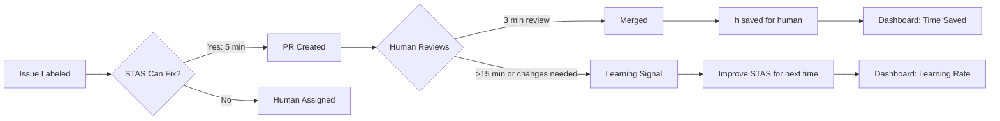

# Control & Transparency Strategy: Preventing Tech Lead Paranoia

## Executive Summary

The single greatest adoption barrier for AI-driven code automation — especially in DACH enterprises and regulated industries — is **control paranoia**: the fear that a black-box bot will write bad code, break production, destroy git history, or gradually erode human expertise. Tech leads who could benefit most from STAS are the ones most threatened by it, because their identity and career security are tied to codebase stewardship.

> **Key Finding**: "Loss of control" — not cost, not accuracy — is the #1 objection we hear from engineering leaders evaluating STAS. Our competitor research confirms this: Devin's enterprise sales motion explicitly addresses it with "observability dashboards" and "human-in-the-loop approval gates." OpenHands avoids it by being fully open-source and self-hosted. STAS must match or exceed these transparency guarantees to win technical trust.

This document defines a comprehensive strategy to **make STAS the most transparent, controllable, and trust-building AI developer tool on the market** — transforming control paranoia from an objection into a competitive advantage.

---

## 1. The Control Paranoia Problem

### 1.1 Why Tech Leads Fear Black-Box Automation

Control paranoia manifests differently across the engineering hierarchy:

| Role | The Fear | The Real Risk | Purchase Veto Power |
|------|----------|---------------|-------------------|
| **Tech Lead** | "Bot will write bad code and I'll have to clean it up" | Time debt from reviewing sloppy AI-generated code | Strong veto |
| **Engineering Manager** | "I won't know what the bot is doing in my repo" | Loss of situational awareness | Moderate veto |
| **VP Engineering** | "We're ceding architectural decisions to a black box" | Long-term code quality degradation | Strong veto |
| **CTO** | "Autonomous agents will introduce security vulnerabilities or compliance violations" | Regulatory risk, IP leakage | Absolute veto |
| **Security Officer** | "An AI has push access to production repos" | Supply chain attack vector | Absolute veto |

### 1.2 The DACH-Specific Amplifier

DACH enterprises amplify these fears due to:

1. **Betriebsrat (Works Council) co-determination** — Any tool that changes how developers work requires formal approval. "An AI writes code" triggers mandatory consultation.
2. **GDPR liability** — If an AI pushes code containing PII or secrets, the company (not the AI) is liable for the GDPR breach.
3. **Regulatory compliance** — Finance (BaFin), automotive (TISAX), and insurance industries require full audit trails on code changes.
4. **Long-tenured engineering teams** — Developers with 10+ years at the same company have stronger ownership instincts and more skepticism toward automation.

### 1.3 The "I Could Have Written It Faster" Objection

This is a variant of control paranoia that specifically targets **personal identity**. When a tech lead sees STAS generate a fix in 5 minutes that would have taken them 2 hours, their identity as "the person who fixes this best" is threatened. The response must address the **emotional** dimension, not just the technical one.

### 1.4 Current Gaps in STAS

Based on the existing codebase and roadmap, STAS has some foundational pieces but lacks several features needed to fully address control paranoia:

| Capability | Current Status | Gap |
|---|---|---|
| Audit trail | ✅ Event-level logging in `src/security/audit.ts` and `src/audit/` | Not exportable, no UI viewer |
| Agent status reporting | ✅ Issue comments during pipeline phases | No real-time streaming view |
| Sandbox isolation | ✅ E2B + Docker with hardening | No "preview mode" for plan review |
| Security controls | ✅ Webhook verification, rate limiting, IP allowlisting | No per-repo file access policies |
| Runaway protection | ✅ Turn limits, cost caps, timeouts | No customer-configurable limits |
| Dashboard | 🔜 Planned (Phase 2 roadmap) | No agent history or diff viewer yet |
| Approval gate | ❌ Not implemented | Competitors (Devin, OpenHands) have this |
| Customer guardrails | ❌ Not implemented | No config for allowed/blocked directories |
| Rollback capability | ❌ Not implemented | No "undo PR" or revert automation |

---

## 2. Transparency Features

> **Principle**: Every STAS action must be visible, explainable, and attributable before it happens, while it happens, and after it happens.

### 2.1 Step-by-Step Agent Reasoning Visibility

```
┌─────────────────────────────────────────────────────────────┐
│                    AGENT REASONING VISIBILITY                │
├─────────────┬──────────────────────┬────────────────────────┤
│   PHASE     │   WHAT THE USER SEES│   DETAIL               │
├─────────────┼──────────────────────┼────────────────────────┤
│ Triage      │ "Classifying issue…" │ Issue type, estimated  │
│             │                      │ difficulty, suggested  │
│             │                      │ files                  │
├─────────────┼──────────────────────┼────────────────────────┤
│ Investigation│ "Exploring codebase…"│ Files read, symbols   │
│             │                      │ found, stack traces    │
│             │                      │ examined               │
├─────────────┼──────────────────────┼────────────────────────┤
│ Hypothesis  │ "Identified cause…" │ Root cause explanation │
│             │                      │ with code references   │
├─────────────┼──────────────────────┼────────────────────────┤
│ Plan        │ "Proposing fix…"    │ Diff preview, files    │
│             │                      │ to change, approach    │
├─────────────┼──────────────────────┼────────────────────────┤
│ Execution   │ "Applying fix…"     │ Line-by-line changes   │
│             │                      │ being made             │
├─────────────┼──────────────────────┼────────────────────────┤
│ Verification│ "Running tests…"    │ Baseline vs. post-fix  │
│             │                      │ test results           │
├─────────────┼──────────────────────┼────────────────────────┤
│ PR Creation │ "Opening PR…"       │ PR summary, confidence │
│             │                      │ level, changed files   │
└─────────────┴──────────────────────┴────────────────────────┘
```

**Implementation approach**:
- **Issue comment stream**: STAS already posts status updates as issue comments (`src/github/messages.ts`). We extend these to include structured phase-level details, not just status.
- **Slack thread updates**: For enterprise customers, broadcast phase transitions to a configurable Slack channel with expandable detail blocks.
- **Shareable run page**: A web view at `stas.dev/runs/<runId>` showing the full agent timeline, expandable reasoning dumps, and final diff. This is the horizontal visibility layer accessible to anyone with the link (including non-GitHub stakeholders).

### 2.2 Plan-Before-Execute Workflow

The single most impactful trust-building feature: **the agent publishes a plan, the human reviews it, and only then does the agent execute**.

```
┌──────────┐    ┌──────────┐    ┌──────────┐
│  Issue   │───▶│  Agent   │───▶│   Plan   │
│  Labeled │    │ Triages  │    │ Proposed │
└──────────┘    └──────────┘    └────┬─────┘
                                     │
                          ┌──────────▼──────────┐
                          │  Human Reviews Plan  │
                          │  (in Issue + Slack)  │
                          └──────────┬──────────┘
                                     │
                    ┌────────────────┼────────────────┐
                    ▼                ▼                ▼
              ┌──────────┐    ┌──────────┐    ┌──────────┐
              │ Approve  │    │  Modify  │    │ Reject   │
              │ Execute  │    │(comment) │    │(close)   │
              └────┬─────┘    └────┬─────┘    └────┬─────┘
                   ▼               ▼               ▼
              ┌──────────┐    ┌──────────┐    ┌──────────┐
              │ Agent    │    │ Agent    │    │ Issue    │
              │ Executes │    │ Revises  │    │ Closed   │
              └────┬─────┘    └────┬─────┘    └──────────┘
                   ▼               ▼
              ┌──────────┐    ┌──────────┐
              │ PR       │    │ PR       │
              │ Created  │    │ Created  │
              └──────────┘    └──────────┘
```

**Implementation approach**:
1. **Plan phase**: After triage and investigation, STAS posts a structured plan comment: files to change, approach, estimated diff size, risk level (low/medium/high).
2. **Wait for signal**: STAS waits for an explicit approval signal — either a GitHub issue comment (`/stas approve`), a Slack reaction (✅), or a dashboard button click.
3. **Configurable timeout**: If no approval within the configured window (default: 4 hours, configurable), STAS posts a reminder. After the hard timeout (default: 24 hours), it gracefully exits — the issue remains open for manual handling.
4. **Plan revision**: If the reviewer comments with `/stas revise "try a different approach"` or `@stas try <suggestion>`, STAS re-plans and posts an updated proposal.
5. **Opt-out**: Repos can configure plan-before-execute as optional, per-label, or mandatory.

### 2.3 Full Audit Trail of All Actions

STAS already has event-level audit logging (`src/security/audit.ts`). We extend this into a **comprehensive, exportable audit trail** suitable for SOC 2, ISO 27001, and DACH regulatory compliance.

| Event Category | Events Captured | Detail Level |
|---|---|---|
| **Webhook reception** | Platform, event type, delivery ID, timestamp, IP | Signature verification pass/fail |
| **Queue lifecycle** | Enqueue, dequeue, retry, DLQ, completion | Queue name, job ID, latency |
| **Agent pipeline** | Phase start/end, duration, model used, token count | Per-phase timing, model version |
| **Sandbox lifecycle** | Create, exec, destroy, resource usage | Sandbox type (E2B/Docker), memory, CPU |
| **File operations** | Files read, files written, diff generated | Path, operation type, byte count |
| **Decision points** | Classification result, confidence level, PR decision | Model output excerpt (sanitized) |
| **PR creation** | PR URL, changed files, confidence, verification result | Diff summary, test results |
| **Human interactions** | Approval given, plan rejected, revision requested | Actor, action, timestamp |
| **Configuration changes** | Guardrail rule changes, policy updates, rate limit changes | Before/after, actor, timestamp |
| **Admin API access** | Endpoint, method, actor, IP, success/failure | Rate limit status, auth method |

**Implementation approach**:
- **Structured log format**: Each audit event is a typed JSON object with schema: `{ id, eventType, timestamp, actor?, resource?, context?, metadata? }`.
- **Dual storage**: Hot storage (PostgreSQL `audit_logs` table, already exists as `DATABASE_ENABLE_AUDIT_PERSISTENCE=true`) for dashboard queries + cold storage (S3/GCS via daily export) for long-term compliance retention.
- **Export formats**: CSV, JSON, and SOC 2-compatible XML — downloadable from the dashboard or via API.
- **Retention policies**: Configurable retention by tier (free: 30 days, pro: 1 year, enterprise: 7 years / indefinite).
- **Integrity**: Audit log entries are cryptographically chained (hash-linked) so tampering is detectable — critical for DACH regulated industries.

---

## 3. Human Approval Gates

> **Principle**: STAS should never feel like it's "pushing changes to my repo without asking." Every action that modifies code should have a human checkpoint.

### 3.1 PR Review Workflow

STAS already supports multiple PR confidence levels (`src/github/actionDispatcher.ts`). We extend this with explicit human-in-the-loop options:

| Mode | Behavior | Best For |
|------|----------|----------|
| **Auto-PR (draft)** | STAS creates a draft PR. Human reviews, marks as ready, merges. | Teams that want full code review but trust STAS to write the first draft |
| **Auto-PR (ready)** | STAS creates a ready-for-review PR. Same workflow as a human teammate's PR. | High-trust teams, low-risk changes |
| **Plan-first** | STAS posts a plan. Human approves the plan. STAS creates a PR. Human reviews the PR. | Regulated industries, sensitive repos |
| **Investigation only** | STAS investigates and posts findings. No code changes. Human implements the fix. | Learning/debugging mode, onboarding phase |
| **Branch-only** | STAS pushes a branch. No PR created. Human creates the PR manually from the branch. | Maximum control, evaluation phase |

**Implementation approach**:
- Configuration via `.github/stas.yml` per-repo or organization-level settings.
- Mode can be set per-label: e.g., `stas:fix` → draft PR, `stas:hotfix` → ready PR, `stas:investigate` → findings only.
- Transition path: new repos default to "branch-only" → graduate to "plan-first" → graduate to "auto-PR" as trust builds.

### 3.2 Change Approval Policies

For regulated DACH enterprises, a single person approving both the AI's plan and the resulting PR may not satisfy compliance. We support multi-stage approval policies:

| Policy | Description | Compliance Use Case |
|--------|-------------|-------------------|
| **Single approver** | Any one authorized user can approve execution | Standard teams |
| **Two-person rule** | Two different authorized users must approve | BaFin-regulated financial code |
| **Senior override** | Plan approval by senior, PR review by anyone | Tiered responsibility |
| **No self-approval** | The person who labeled the issue cannot approve the PR | Separation of duties |
| **Slack reaction approval** | Any of N designated Slack approvers can approve with ✅ | Low-friction enterprise approval |
| **Scheduled approval window** | PRs only created during business hours (9-5 CET) | Change freeze compliance |

**Implementation approach**:
- Approval policies defined in `.github/stas-approval.yml` or organization-level settings.
- Integrates with existing GitHub teams/roles for approver identification.
- Dashboard shows approval status: pending, approved-by, rejected-by, and timestamps.

### 3.3 Rollback Capabilities

Trust requires a safety net. If STAS creates a PR that causes problems, the rollback should be one click:

| Capability | Description | Implementation |
|---|---|---|
| **One-click revert** | Dashboard button to create a revert PR | `git revert <sha>` via GitHub API |
| **Revert with comment** | Revert PR includes explanation from the agent | Auto-generated revert description |
| **Fix-in-place** | Agent re-runs with additional context from the rollback | New investigation with "this fix caused X" knowledge |
| **Git reflog protection** | Prevent force-push over STAS branches | Branch protection rules enforced by the bot |
| **Tiered undo** | Configurable undo window: 1-hour for auto-undo, 24-hour for manual undo | Cron job runs revert eligibility checks |

**Implementation approach**:
- Rollback PRs created via `POST /repos/{owner}/{repo}/pulls` with `base` pointing to the target branch and `head` pointing to the parent commit.
- STAS labels revert PRs with `stas:revert` for clear identification.
- All rollback actions are recorded in the audit trail with reason, actor, and timestamp.

---

## 4. Customer-Configurable Guardrails

> **Principle**: Engineering leaders should be able to define precisely what STAS can and cannot do, down to the directory and file level.

### 4.1 File Access Restrictions

Tech leads fear STAS will modify critical configuration files, CI/CD pipelines, or infrastructure-as-code. We solve this with granular file access policies:

| Restriction Type | Example | Effect |
|---|---|---|
| **Blocked files** | `.env`, `Dockerfile`, `k8s/*`, `terraform/*` | STAS can read but never write these files |
| **Read-only paths** | `docs/`, `LICENSE`, `CONTRIBUTING.md` | STAS can read for context but never modify |
| **Restricted paths** | `src/security/`, `src/auth/` | STAS requires explicit approval for writes to these paths |
| **Allowed paths** | `src/components/`, `src/utils/` | STAS has full read/write access (default) |
| **Max file size** | Files > 500 lines are read-only | Prevents massive file re-writes |

**Implementation approach**:
- Configuration via `.github/stas-guardrails.yml` with glob patterns:

```yaml
# Example .github/stas-guardrails.yml
file_access:
  blocked:
    - ".env*"
    - "Dockerfile*"
    - "k8s/**"
    - "terraform/**"
    - "*.pem"
    - "*.key"
    - "secrets/**"
  read_only:
    - "docs/**"
    - "LICENSE"
    - "CONTRIBUTING.md"
    - "CODE_OF_CONDUCT.md"
    - "CHANGELOG.md"
  restricted:
    - "src/security/**"
    - "src/auth/**"
    - ".github/workflows/**"
    - "docker-compose*.yml"
  max_write_file_lines: 500
```

- Reference implementation: integrate with the existing `validatePath()` method in `src/sandbox/executor.ts` and `src/sandbox/docker.ts`.
- Violations are logged to the audit trail and reported in the PR description/comments.

### 4.2 Branch Policies

| Policy | Description | Use Case |
|--------|-------------|----------|
| **Allowed base branches** | STAS only creates PRs against specific branches (`main`, `develop`) | Prevent accidental PRs to release branches |
| **Blocked branches** | STAS never modifies specified branches (`production`, `release/*`) | Protect prod and release branches |
| **Branch naming convention** | Enforce branch name pattern: `stas/fix/<issue-number>-<kebab-desc>` | Consistent branch naming for automation |
| **PR label enforcement** | STAS adds specific labels (`ai-generated`, `bot`) to all PRs | Clear identification of AI-created changes |
| **Branch protection integration** | STAS respects existing GitHub branch protection rules (required reviews, status checks) | Don't bypass team's existing controls |

### 4.3 Coding Standards Enforcement

STAS must produce code that matches the team's existing style and quality standards:

| Guardrail | Implementation | Configuration |
|---|---|---|
| **Linter compliance** | Run repo's linter (Biome, ESLint, Ruff, etc.) before PR | Inherits from existing config files |
| **TypeScript strict mode** | `tsc --noEmit` must pass | Self-detect from `tsconfig.json` |
| **Test requirements** | New code must include or update tests | Configurable pass/fail threshold |
| **Code coverage** | PR cannot reduce coverage below threshold | `min_coverage: 80` |
| **Commit message format** | Enforce conventional commits (`fix:`, `feat:`, etc.) | `commit_format: conventional` |
| **PR description template** | Auto-populate PR description with standard template | `pr_template: .github/PULL_REQUEST_TEMPLATE.md` |
| **Max LoC per PR** | Reject PRs exceeding line count limit | `max_loc: 500` |
| **No generated code** | Block PRs containing minified/obfuscated code | Detection via entropy analysis |

### 4.4 Allowed/Blocked Directories

Beyond individual files, tech leads need control at the directory and module level:

```yaml
# Example directory guardrails
directory_policies:
  allowed:
    - "src/**"
    - "tests/**"
    - "scripts/**"
  blocked:
    - "vendor/**"
    - "node_modules/**"
    - "dist/**"
    - "build/**"
    - ".next/**"
  require_review:
    - "src/api/**"       # API changes need special review
    - "src/db/migrations/**"  # Schema changes need DB team review
    - "packages/core/**"      # Core library changes need lead review
```

**Implementation approach**:
- Directory policies are checked during the plan phase (Phase 7 — Dispatch) before the PR is created.
- If a change touches a `require_review` directory, the PR confidence is automatically downgraded and a special review label is added.
- Violations of `blocked` directories cause the plan phase to fail with a clear explanation in the issue comment.

---

## 5. Addressing the "I Could Have Written It Faster" Objection

> **Principle**: You can't win on speed alone because the comparison is unfair (human thinking time vs. LLM generation). Win on **total cognitive load reduction** and let time savings be a secondary metric.

### 5.1 Productivity Metrics

The framing matters. Don't compare "STAS fixed it in 5 minutes vs. human would take 2 hours." Instead, frame it as:

| Metric | What It Measures | Why It Resonates |
|--------|-----------------|-----------------|
| **Context-switches avoided** | Number of times STAS handled an issue that would have pulled a developer off their current task | Respects developer focus time |
| **PRs merged without human intervention** | Fully autonomous fixes that went from label → merge with no human touching code | Shows STAS handles the boring stuff |
| **Review burden reduction** | STAS-written PRs that a human reviewed and merged in < 5 minutes | Shows the code quality is review-acceptable |
| **Onboarding issues fixed** | Issues that a new team member couldn't fix but STAS could | Shows tribal knowledge capture |
| **Toil ratio** | % of total fixes that are low-cognitive-load (typos, config, imports, error messages) | Quantifies the drudgery STAS eliminates |

### 5.2 Time-Saved Reporting

The dashboard should show **time saved per developer**, not just "total fixes":



**Dashboard views**:

| View | Content | Audience |
|------|---------|----------|
| **Team summary** | Total time saved, avg review time, fix rate, top repos | Engineering Manager |
| **Individual impact** | "STAS saved you 12 hours this week" — breakdown by category | Individual developer |
| **Trend** | Fix rate over time, regression rate, learning velocity | Tech Lead |
| **Efficiency ratio** | (Total time saved by STAS) / (Total time spent on review) | VP Engineering |

### 5.3 Cognitive Load Reduction

This is the most important metric and the hardest to measure. We proxy it:

| Proxy Metric | How We Measure |
|---|---|
| **Issues auto-fixed before human sees them** | Count of issues where STAS had a PR before the assignee opened the issue |
| **"Trivial" fix rate** | % of total fixes that are < 20 lines changed, 1 file touched |
| **Bug-to-feature ratio** | STAS fixes more bugs → humans have more cognitive bandwidth for features |
| **Context-switch cost saved** | Estimated: each avoided context switch saves ~25 min of focus recovery |
| **On-call relief** | STAS handles hotfix-labeled issues outside business hours |

---

## 6. Visibility Dashboard

> **Principle**: The dashboard is the "glass cockpit" for AI-driven development. It should give every stakeholder — from individual contributor to CTO — the visibility they need.

### 6.1 Real-Time Agent Status

The dashboard includes a live view of currently running agents:

```
┌─────────────────────────────────────────────────────────────────┐
│  ● RUNNING AGENTS  (3 active)                                  │
├─────────────┬──────────┬───────────┬──────────┬────────────────┤
│  Issue      │  Phase   │  Duration │  Status  │  Actions       │
├─────────────┼──────────┼───────────┼──────────┼────────────────┤
│  repo/alpha │  Testing │  4:23     │  ●       │  ◉ View Log    │
│  #237       │          │           │  Running │  ⊗ Cancel      │
├─────────────┼──────────┼───────────┼──────────┼────────────────┤
│  repo/beta  │  Fixing  │  8:15     │  ●       │  ◉ View Log    │
│  #891       │          │           │  Running │  ⊗ Cancel      │
├─────────────┼──────────┼───────────┼──────────┼────────────────┤
│  repo/gamma │  Plan    │  1:02     │  ⏳      │  ◉ View Log    │
│  #156       │  Review  │           │  Waiting │  ☑ Approve     │
├─────────────┼──────────┼───────────┼──────────┼────────────────┤
│  repo/delta │  —       │  —        │  ⏸      │  ◉ Resubmit    │
│  #342       │          │           │  Paused  │                │
└─────────────┴──────────┴───────────┴──────────┴────────────────┘
```

**Features**:
- Phase indicator with estimated time remaining per phase
- "View Log" opens a side panel with streaming log output from the sandbox
- "Cancel" button to kill a runaway agent (belt-and-suspenders with the automatic RunawayGuard)
- "Approve" button for plan-before-execute workflows
- "Resubmit" for failed/paused jobs

### 6.2 History and Logs

| View | Content | Filters |
|------|---------|---------|
| **Run history** | Chronological list of all STAS runs | Date range, repo, status, actor |
| **Run detail** | Full timeline of one run: phases, timestamps, model used, token count | Expandable phase-level logs |
| **Audit log** | All security-relevant events (see §2.3) | Event type, actor, date range |
| **Failure analysis** | Aggregated failure reasons with trending | Reason, model, repo, date |
| **Diff viewer** | Side-by-side diff of the generated PR | File-level expand/collapse |

### 6.3 Code Diff Summaries

For each PR created by STAS, the dashboard provides:

```
┌─────────────────────────────────────────────────────────────────┐
│  PR #237 — Fix null pointer in user serialization              │
├─────────────────────────────────────────────────────────────────┤
│  Files Changed: 3                                              │
│  Lines Added: 24  Lines Removed: 8  Net: +16                   │
│  Risk Level: Low                                               │
│                                                                │
│  ┌─ src/serializers/user.ts ───────────────────────────────┐   │
│  │ @@ -145,7 +145,9 @@ function serializeUser(user) {      │   │
│  │  const serialized = { ...user };                         │   │
│  │ -  if (user.profile) {                                   │   │
│  │ +  if (user.profile && user.profile.name) {             │   │
│  │    serialized.displayName = user.profile.name;           │   │
│  │ + } else {                                              │   │
│  │ +  serialized.displayName = 'Unknown';                   │   │
│  │  }                                                       │   │
│  │  return serialized;                                      │   │
│  └──────────────────────────────────────────────────────────┘   │
│                                                                │
│  ┌─ Impact Analysis ───────────────────────────────────────┐   │
│  │ • No new dependencies added                              │   │
│  │ • No test regressions                                    │   │
│  │ • 3 existing tests now pass that were failing            │   │
│  │ • Code coverage: 87% (no change)                         │   │
│  └──────────────────────────────────────────────────────────┘   │
└─────────────────────────────────────────────────────────────────┘
```

---

## 7. Competitive Analysis

### 7.1 How Competitors Handle Control Concerns

| Feature | Devin | Copilot Workspace | OpenHands | Cursor | STAS (Target) |
|---------|-------|-------------------|-----------|--------|---------------|
| **Plan-before-execute** | ✅ "Run Plan" step | ✅ Workspace plan | ✅ PR + Agent mode | ❌ | 🔲 Planned |
| **Step-by-step reasoning** | ✅ Timeline + screenshots | ✅ Workspace plan | ✅ Browser logs | ✅ Composer trace | 🔲 Planned |
| **Approval gate** | ❌ | ✅ PR required | ❌ | ❌ | 🔲 Planned |
| **Audit trail** | ✅ SOC 2 + logs | ✅ Actions logs | ❌ | ❌ | 🟡 Basic exists |
| **Rollback** | ❌ | ✅ Revert PR | ❌ | ❌ | 🔲 Planned |
| **File access rules** | ❌ | ❌ | ❌ | ❌ | 🔲 Planned |
| **Customer guardrails** | ❌ | ❌ | ❌ | ❌ | 🔲 Planned |
| **Self-host option** | ❌ | ❌ | ✅ MIT license | ❌ | ✅ OSS |
| **Dashboard visibility** | ✅ Gold standard | ✅ Limited | ❌ | ✅ Run history | 🔲 Planned |
| **Open source transparency** | ❌ | ❌ | ✅ Source code | ❌ | ✅ MIT |
| **EU data residency** | ❌ | ✅ EU region | ✅ Self-host | ❌ | 🔲 Planned |
| **SOC 2 / ISO 27001** | ✅ Both | ✅ Both | ❌ | ❌ | 🟡 In progress |

### 7.2 Devin — The Control and Observability Gold Standard

| Strength | Detail |
|----------|--------|
| **Observability** | Full session replay: timeline, screenshots, terminal output, file changes — all timestamped and searchable |
| **Enterprise sales motion** | Control paranoia is addressed in the first sales conversation with a dedicated "security & control" deck |
| **Sandbox transparency** | Every command executed in the sandbox is visible in the logs |
| **CRM integration** | Linear/Jira/Slack visibility without leaving the project management tool |

**Gap STAS can exploit**:
- Devin has **no approval gate** — once configured, the agent just goes. STAS's plan-before-execute is a differentiator for regulated industries.
- Devin has **no file access restrictions** — the agent sees and can modify every file in the repo. STAS's guardrails (blocked files, read-only paths) are a compliance must-have for DACH.
- Devin is **closed source** — enterprises cannot audit the agent's code. STAS's MIT license means the control mechanisms are themselves transparent.

### 7.3 OpenHands — The Open-Source Trust Baseline

| Strength | Detail |
|----------|--------|
| **Full source transparency** | MIT license, 60K+ stars — the community audits the code |
| **Self-hosted** | Enterprises control the entire infrastructure and data |
| **Model-agnostic** | No model lock-in; teams can use their own fine-tuned or on-prem models |
| **Browser-based UI** | Real-time agent output visible in the browser |

**Gap STAS can exploit**:
- OpenHands has **no customer guardrails** — file access, branch policies, coding standards are all absent because OpenHands is designed as a research tool.
- OpenHands has **no approval gate** — the agent writes and pushes code autonomously (though the new "Agent mode + PR mode" split helps).
- OpenHands has **no audit trail suitable for compliance** — structured audit logging for SOC 2/ISO 27001 is not a priority for the project.

### 7.4 GitHub Copilot Workspace — The Platform Incumbent

| Strength | Detail |
|----------|--------|
| **Deepest GitHub integration** | Directly inside the GitHub UI — no context switch |
| **Plan-then-execute** | Workspace creates a plan, user reviews and edits before execution |
| **PR-gated** | Changes always flow through a PR with GitHub's existing review process |
| **Enterprise trust** | Microsoft/GitHub brand carries enterprise credibility |

**Gap STAS can exploit**:
- GitHub-only — no GitLab, Jira, or Linear support. DACH enterprises using self-hosted GitLab have no equivalent.
- No file access restrictions or guardrails — the agent works on the entire repo.
- No DACH-specific features — German output, EU data residency, compliance-friendly audit trails are all absent.

### 7.5 Cursor — The Fast-Feedback Champion

| Strength | Detail |
|----------|--------|
| **Real-time diff preview** | Every change is visible inline before being committed |
| **User-controlled execution** | The developer explicitly accepts or rejects each change |
| **No autonomous mode** | The agent never acts without the developer's awareness |

**Gap STAS can exploit**:
- Cursor is not an async issue-resolution tool. It's an IDE assistant. The comparison is apples-to-oranges for the "autonomous issue fixing" category.
- However, Cursor sets the UX bar for **how visible an AI's actions should be**. STAS's dashboard and diff viewer should be as clear as Cursor's inline diffs.

### 7.6 Strategic Positioning

```
Control Transparency Spectrum:

┌─────────────────────────────────────────────────────────────────┐
│  Less Control        ●───────────●────────●─────────●───────▶   │
│                     Cursor     Copilot  Devin   OpenHands       │
│                     (most       Wksp           (least control)  │
│                     control)                                    │
└─────────────────────────────────────────────────────────────────┘

                    ● STAS Target Position
                    ─────────────────────
                    "Maximum control for
                     regulated enterprises"
                    • Plan-before-execute
                    • Multi-stage approval
                    • File-level guardrails
                    • Full audit trail
                    • Self-hostable
                    • Open source
```

---

## 8. Actionable Recommendations

### 8.1 Immediate (0–30 Days) — Foundation

| Priority | Action | Owner | Dependencies |
|----------|--------|-------|-------------|
| P0 | **Design the `.github/stas.yml` configuration schema** for guardrails, approval mode, and file access policies | Product | None — spec-only |
| P0 | **Extend issue comment phases** to include structured reasoning dumps (not just status transitions) | Engineering | `src/github/messages.ts` exists |
| P1 | **Build the audit trail viewer** in the dashboard — query `audit_logs` table with filters | Full-stack | Dashboard phase-2 build |
| P1 | **Document the "Control & Transparency" page** on stas.dev/docs — answers "What access does STAS have?" before the prospect asks | Docs | None |
| P2 | **Add `/stas plan` and `/stas approve` comment commands** to the GitHub webhook handler | Engineering | Comment command parsing |

### 8.2 Short-Term (30–90 Days) — Core Features

| Priority | Action | Owner | Dependencies |
|----------|--------|-------|-------------|
| P0 | **Implement plan-before-execute workflow** — plan comment, approval wait, fallback timeout | Engineering | Comment commands from 8.1 |
| P1 | **Implement file access guardrails** — blocked, read-only, restricted paths | Engineering | `validatePath` already exists |
| P1 | **Implement branch policy enforcement** — allowed/blocked branches, naming convention | Engineering | Guardrail config schema |
| P1 | **Add per-repo configuration UI** in the dashboard — guardrails, approval mode, policies | Full-stack | Guardrail config schema |
| P2 | **Build the run detail page** — full agent timeline, expandable logs, diff viewer | Full-stack | Dashboard framework |
| P2 | **Implement rollback PR creation** — one-click revert from the dashboard | Engineering | Run detail page |

### 8.3 Medium-Term (90–180 Days) — Enterprise Grade

| Priority | Action | Owner | Dependencies |
|----------|--------|-------|-------------|
| P0 | **Implement multi-stage approval policies** — two-person rule, senior override, separation of duties | Engineering | Plan-before-execute (8.2) |
| P1 | **Add SOC 2-compatible audit export** — CSV/JSON/XML with cryptographic chaining | Engineering | Audit trail (8.1) |
| P1 | **Build the productivity metrics dashboard** — time saved, context switches avoided, toil ratio | Full-stack | Dashboard analytics framework |
| P2 | **Implement coding standards enforcement** — linter compliance, test requirements, commit format | Engineering | Guardrail framework |
| P2 | **Add Slack interactive approval** — approve/reject from Slack message | Full-stack | Slack app integration |
| P3 | **Build "STAS Trust Center" page** — live status, SOC 2 docs, DPA, security white paper | Docs/Marketing | All features above |

### 8.4 Long-Term (180+ Days) — Market Differentiation

| Priority | Action | Owner | Dependencies |
|----------|--------|-------|-------------|
| P1 | **Cryptographic audit trail integrity** — hash-linked log entries for tamper-evident compliance | Engineering | Audit export (8.3) |
| P2 | **Self-hosted enterprise edition** — guardrails, approval gates, and audit trail all work without the cloud dashboard | Engineering | All features above |
| P2 | **Okta/Azure AD/SSO integration** — approval gates respect enterprise identity | Engineering | Multi-stage approval (8.3) |
| P3 | **Scheduled change windows** — STAS only creates PRs during approved maintenance windows | Engineering | Approval policies (8.3) |
| P3 | **Regulatory compliance report generator** — auto-generate PDF reports for BaFin/TISAX/ISO audits | Full-stack | Audit trail (8.1) |

### 8.5 Messaging & Positioning

The control and transparency features are not just engineering work — they require a coordinated messaging strategy:

| Audience | Message | Channel |
|----------|---------|---------|
| **Tech Lead** | "STAS shows you every step. You approve the plan before any code is written. You control which files it touches." | Technical blog post, GitHub README |
| **Engineering Manager** | "Your team spends less time on boilerplate fixes and more time on the work that matters. STAS handles the toil." | Case study, dashboard demo |
| **VP Engineering** | "STAS gives you a full audit trail, granular guardrails, and multi-stage approval. Your compliance team will be happy." | Whitepaper, security review |
| **CTO** | "STAS is open source. You can self-host. You control the data. You control the model. There is no black box." | Executive summary, SOC 2 docs |
| **Security Officer** | "File-level access controls, read-only policies, audit trail with cryptographic integrity — on par with human contributor controls." | Security white paper, third-party audit |
| **Works Council** | "STAS augments developers, it does not replace them. Every change is reviewed and approved by a human. Code ownership does not change." | Betriebsrat briefing document |

### 8.6 Trust Building Playbook

For the first enterprise prospects, we recommend a graduated trust-building process:

```
Week 1:  Investigation Only    → STAS investigates labeled issues, posts findings, writes no code.
Week 2:  Branch Only           → STAS pushes a branch, no PR. Lead reviews the diff manually.
Week 3:  Plan-First, One Repo  → STAS posts plans, lead approves, STAS creates draft PRs — on one low-risk repo.
Week 4:  Plan-First, All Repos → Same workflow, expanded to all repos.
Week 5:  Draft PR Auto         → STAS creates draft PRs directly (no plan approval) — still human-reviews before merge.
Month 2+ Ready PR Auto         → Full trust: STAS creates ready PRs that the team reviews and merges normally.
```

Each stage has a clear **escalation trigger**: if the lead feels loss of control, they can dial back to the previous stage immediately. The dashboard should show the current trust stage for each repo.

---

## 9. Key Metrics

### 9.1 Success Metrics for Control Transparency Features

| Metric | Current Baseline | Target (90 days) | Target (180 days) |
|--------|-----------------|------------------|-------------------|
| **Enterprise prospects citing "control" as top objection** | ~60% (anecdotal) | <30% | <15% |
| **Time from first demo to first PR** | Unknown (no workflow) | <7 days | <3 days |
| **Support tickets about "what did STAS do?"** | ~20% of total | <5% | <2% |
| **Approval gate usage in self-hosted deploys** | N/A (not built) | >50% of enterprise deploys | >80% |
| **Plan approval rate** | N/A (not built) | >70% approved on first plan | >85% |
| **Rollback rate** | N/A (not built) | <5% of PRs rolled back | <2% |
| **NPS from tech leads** | Unknown | >40 | >60 |

### 9.2 Dogfooding: STAS Dogfooding Its Own Control Features

STAS should be its own first customer. The STAS repo itself should use:

1. **Plan-before-execute** on its own issue tracker — every PR to `docs/gtm/` and `src/guardrails/` should start with a human-approved plan.
2. **File access guardrails** — protect CI/CD files, security config, and deployment manifests from the STAS agent running on its own repo.
3. **Audit trail** — the STAS team should be able to query "what did STAS do to STAS this week?" from the dashboard.
4. **Multi-stage approval** — baseline docs changes have a single approver; changes to sandbox hardening require the security lead's explicit approval.

This dogfooding is itself a marketing tool: "We trust STAS so much that STAS runs STAS — with the same controls we're selling to you."

---

## Sources

- [STAS Security Model](../SECURITY.md) — Existing audit trail, sandbox isolation, and security controls
- [STAS Architecture](../ARCHITECTURE.md) — Agent pipeline, action dispatcher, verification gate
- [Runaway Agent Protection](../ops/runway-protection.md) — Timeout, cost cap, and turn limit implementation
- [Common Sense Gate](../platforms/README.md#common-sense-gate) — Existing guardrail validators for hallucination prevention
- [STAS Roadmap](../ROADMAP.md) — Planned dashboard, audit log, and enterprise features
- [Competitor Research](competitor-research.md) — Devin, OpenHands, Copilot, Cursor analysis
- [Germany/EU TaaS Market Analysis](germany-eu-taas-market-analysis.md) — DACH enterprise buying behavior
- [Docker Sandbox Hardening](../ops/sandbox-hardening.md) — Seccomp, AppArmor, capability dropping
- [Devin Dashboard & Observability](https://devin.ai) — Session replay, timeline, screenshots
- [OpenHands Agent Mode](https://github.com/All-Hands-AI/OpenHands) — PR mode vs. Agent mode split
- [GitHub Copilot Workspace](https://github.com/github-copilot/workspace) — Plan-then-execute workflow
- [SOC 2 Control Mapping](../soc2/control-mapping.md) — Existing compliance documentation

---

> **Last updated**: 2026-07-20
> **Status**: Draft for review — AIM-3351
> **Next review**: 2026-08-20
