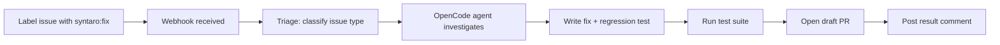

# Onboarding FAQ

> **Common questions about setting up and running SYNTARO for the first time.**

---

## Table of Contents

- [General](#general)
- [Setup](#setup)
- [Configuration](#configuration)
- [Troubleshooting](#troubleshooting)
- [Security](#security)
- [Performance](#performance)
- [Billing & Limits](#billing--limits)

---

## General

### What is SYNTARO?

SYNTARO is an open-source GitHub bot that turns labeled issues into pull requests. When you label an issue with `syntaro:fix`, SYNTARO investigates your codebase, writes a fix, runs your tests, and opens a PR — all autonomously.

### How does it work end-to-end?



Each step is monitored. If any step fails, SYNTARO retries up to 3 times before escalating.

### Do I need to be on a paid plan to try SYNTARO?

**No.** The self-hosted (OSS) version is free and unlimited. The Cloud Free tier gives you 10 fixes per month without hosting anything. Both are great ways to try SYNTARO.

---

## Setup

### I ran `npm run setup` — what did it do?

The setup script:

1. Installs npm dependencies
2. Creates `.env` from `.env.example` if it doesn't exist
3. Seeds the database with a demo user (for dashboard testing)
4. Verifies Node.js version compatibility
5. Checks that required tools (Docker, OpenCode CLI) are available

### I don't have a public URL — how do I receive webhooks locally?

Use a tunneling service. The recommended approach:

```bash
# Install ngrok
npm install -g ngrok

# Expose your local server
ngrok http 3000

# Copy the ngrok URL (https://xxxx.ngrok.io) and set it as your
# GitHub App's Webhook URL
```

### How do I create a GitHub App?

See the [Setup Guide](SETUP.md#1-create-a-github-app) for a walkthrough. The critical steps:

1. Register a new GitHub App in your account settings
2. Set permissions: Issues (read/write), Pull Requests (write), Contents (write)
3. Subscribe to Issues and Issue comment events
4. Generate and download a private key
5. Install the app on a repository

### Can I use a different trigger label?

Yes. Set `SYNTARO_LABEL` in your `.env`:

```bash
SYNTARO_LABEL=ai:fix
# or
SYNTARO_LABEL=🤖:fix
```

### Do I need Docker?

**Only if you want sandbox isolation.** SYNTARO runs fix agents in ephemeral Docker containers to prevent malicious code from affecting your host. If you're testing locally and trust the code, you can disable the sandbox by setting `SANDBOX_ENABLED=false`.

In production, sandbox isolation is strongly recommended.

### What if I don't have Redis?

Docker Compose provisions Redis automatically. If you're running bare metal:

```bash
# macOS
brew install redis && brew services start redis

# Ubuntu/Debian
sudo apt install redis-server && sudo systemctl start redis

# Verify
redis-cli ping
# Expected: PONG
```

---

## Configuration

### What model does SYNTARO use for fixing issues?

The default is `anthropic/claude-sonnet-4-20250514`. You can change it via `OPENCODE_MODEL`:

```bash
OPENCODE_MODEL=openai/gpt-4o
```

SYNTARO supports any model that OpenCode Serve supports — Claude, GPT, DeepSeek, Gemini, and any OpenAI-compatible API.

### How do I add fallback models?

Set `FALLBACK_MODELS` as a comma-separated list:

```bash
FALLBACK_MODELS=openai/gpt-4o,anthropic/claude-haiku-3-20240307
```

If the primary model fails (timeout, rate limit, internal error), SYNTARO tries fallbacks in order.

### Can I customize the PR template?

Yes. Create a `.github/syntaro-pr-template.md` in your repository with the template you want. SYNTARO will use it when creating PR descriptions. See [`docs/CUSTOMIZATION.md`](../CUSTOMIZATION.md#customizing-pr-templates) for details.

### How do I change the sandbox timeout?

```bash
SANDBOX_TIMEOUT=300  # seconds (default: 120)
```

---

## Troubleshooting

### SYNTARO received the webhook but didn't do anything

Check the following:

1. **Is the label correct?** By default SYNTARO looks for `syntaro:fix`. Verify your issue has the exact label.
2. **Is OpenCode running?** Run `curl http://localhost:4096/health` — if it fails, start OpenCode: `opencode serve --port 4096`
3. **Check the logs:**
   ```bash
   # Webhook server logs
   npm run dev | grep -i error

   # OpenCode logs
   opencode serve --port 4096 --verbose
   ```
4. **Simulate a webhook locally:**
   ```bash
   bash plugin/tools/syntaro-webhook-test.sh issues.labeled
   ```

### I see "E2B_API_KEY not configured" errors

This is expected if you're running without a sandbox provider. E2B is the default sandbox backend. For local development without sandbox isolation:

```bash
export SANDBOX_ENABLED=false
```

### OpenCode Serve fails to start

Common causes:

| Issue | Solution |
|---|---|
| Port 4096 already in use | `lsof -i :4096` to find the process, then kill it |
| Model not found | Check `OPENCODE_MODEL` value is correct |
| Insufficient memory | OpenCode needs ~2GB RAM. Close other apps |
| Outdated OpenCode | `npm update -g @opencode/cli` |

### The PR was created but tests fail

SYNTARO writes regression tests alongside fixes. If tests fail in CI:

1. The PR will be marked as draft with a warning
2. Check the PR comments for the test output and evidence report
3. You can fix the tests manually and push to the branch
4. Future iterations will improve test quality

### How do I reset the onboarding state?

```bash
curl -X DELETE http://localhost:3000/api/onboarding/reset \
  -H "Authorization: Bearer <token>"
```

---

## Security

### Can SYNTARO access my private code?

SYNTARO only clones repositories that the GitHub App is installed on. The clone happens in an ephemeral sandbox that is destroyed after each run. Your code is never stored or transmitted anywhere beyond the sandbox.

### Is the sandbox secure?

Yes. SYNTARO uses [E2B](https://e2b.dev) sandboxes with:

- Network isolation (no outbound access except to GitHub/your registry)
- Ephemeral filesystems (destroyed after each run)
- Resource limits (CPU, memory, disk)
- Timeout enforcement

### How is the webhook verified?

Every webhook request includes an HMAC-SHA256 signature in the `X-Hub-Signature-256` header. SYNTARO verifies this signature against the `GITHUB_WEBHOOK_SECRET` before processing. Requests with invalid signatures are rejected with a 400 response.

---

## Performance

### How long does a fix take?

Most fixes complete in **30 seconds to 5 minutes**, depending on:

- Complexity of the issue
- Size of the codebase
- Model response time
- Test suite runtime

### How many concurrent fixes can run?

Default max is 3, controlled by `SYNTARO_MAX_CONCURRENT`. You can increase it, but watch your model API rate limits and infrastructure capacity.

### Will SYNTARO overwhelm my CI?

SYNTARO runs the test suite **before opening the PR**, so CI only runs once. If the test suite takes >10 minutes, consider using the `SYNTARO_TEST_TIMEOUT` setting to limit verification time.

---

## Billing & Limits

### The self-hosted version is free — what's the catch?

There's no catch. The OSS version gives you unlimited fixes without any artificial caps. The tradeoff is you manage the infrastructure yourself. Cloud plans provide managed infrastructure, a dashboard, and support.

### How do Cloud Free vs Cloud Paid compare?

| Feature | Cloud Free | Cloud Paid |
|---|---|---|
| Fixes per month | 10 | 100–500+ |
| Models | Frontier models (claude-sonnet-4) | Frontier models (claude-sonnet-4) |
| Dashboard | Limited | Full |
| Support | Community | Slack + Email |

### Can I use my own API key with the cloud version?

The cloud version uses SYNTARO's own AGI. If you want to use your own model API keys, self-host instead.
