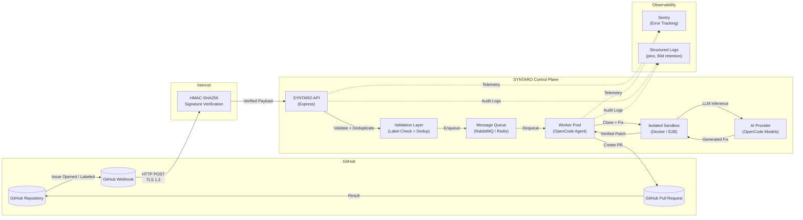

# Security Overview — SYNTARO

> **End-to-end security architecture for the SYNTARO (Solving Tickets As A Service) platform.**
> This document describes data flows, encryption standards, access controls, audit trails, and network security for customers, prospects, and security reviewers.

---

## Architecture Overview

The following diagram shows the end-to-end data flow from a GitHub issue webhook through to the resulting pull request.



### Data Flow Narrative

1. **GitHub webhook delivery**: A user opens or labels an issue on a GitHub repository where SYNTARO is installed. GitHub sends an HTTP POST payload to the SYNTARO API endpoint.

2. **TLS termination and signature verification**: The payload arrives over TLS 1.3. SYNTARO verifies the GitHub webhook secret using constant-time HMAC-SHA256 comparison to prevent forgery.

3. **Validation and deduplication**: The API layer checks that the issue has the required label (e.g., `fix-me`), that it hasn't been processed recently (dedup window), and that the repository is within its rate limits.

4. **Queueing**: Validated jobs are published to a durable message queue (RabbitMQ in production, Redis in development). The queue survives broker restarts and provides at-least-once delivery guarantees.

5. **Worker dispatch**: A worker picks up the job, creates an ephemeral sandbox environment (Docker container or E2B cloud sandbox), checks out the repository, and launches an OpenCode agent.

6. **AI inference**: The agent analyzes the issue, reads relevant source files, generates a fix via an AI model API (OpenCode backend), and applies the patch to the repository clone.

7. **Verification and PR creation**: The worker verifies the fix (syntax check, existing tests), commits the change, and opens a pull request back to the repository using the GitHub App installation token.

### What Data Travels Where

| Data Type | Source | Destination | Protection |
|-----------|--------|-------------|------------|
| GitHub webhook payload | GitHub | SYNTARO API | TLS 1.3 in transit |
| Repository contents | GitHub | Sandbox (ephemeral) | TLS 1.3 clone; deleted after run |
| Issue metadata | GitHub | SYNTARO API → Queue → Worker | TLS + in-memory only |
| AI inference payload | Sandbox | AI Provider (OpenCode) | TLS 1.3; no code stored by provider |
| PR content | Worker | GitHub | TLS 1.3 via GitHub API |
| Logs / telemetry | All services | Sentry + pino logs | TLS 1.2+; encrypted at rest |
| Credentials & tokens | Env vars | In-memory only | Never persisted to disk |

---

## Encryption Standards

### In Transit

| Protocol | Configuration | Scope |
|----------|--------------|-------|
| **TLS 1.3** (preferred) | TLS_AES_128_GCM_SHA256, TLS_AES_256_GCM_SHA384 | All public-facing HTTP endpoints |
| **TLS 1.2** (minimum) | ECDHE-ECDSA-AES128-GCM-SHA256, ECDHE-RSA-AES128-GCM-SHA256 | Internal services, database connections |
| **HSTS** | `max-age=31536000; includeSubDomains; preload` | Production domains |
| **Certificate management** | Let's Encrypt via automated ACME renewal | Public TLS termination |

### At Rest

| Data Store | Encryption Standard | Key Management |
|------------|---------------------|----------------|
| PostgreSQL (database) | AES-256 (cloud provider managed) | Automatic rotation, no customer access |
| PostgreSQL (backups) | AES-256 encrypted | Separate backup encryption key |
| Redis (cache / queue) | Redis AUTH + optional TLS | Environment variable |
| RabbitMQ (message queue) | TLS via AMQPS; messages persisted with AES-256 | Environment variable |
| File system (sandbox) | tmpfs / ephemeral volume; no disk persistence | N/A (data destroyed after run) |
| Log storage | AES-256 (cloud provider) | Cloud provider KMS |

### Key Rotation

- Database encryption keys: rotated automatically by cloud provider (90-day cadence)
- GitHub App private keys: rotated manually on revocation; emergency rotation procedure documented
- API keys (admin, Stripe, Linear, E2B): rotated on employee offboarding or suspected compromise
- All key rotation events logged to immutable audit trail

---

## Access Control

### Authentication

| Method | Mechanism | Scope |
|--------|-----------|-------|
| **GitHub App** | JWT signed with RSA 2048-bit private key; 1-hour installation tokens | Repository-scoped per installation |
| **Webhook verification** | HMAC-SHA256 constant-time comparison | Incoming webhook payloads |
| **Admin API** | Pre-shared `ADMIN_API_KEY` (UUIDv4, 128-bit entropy) | Administrative endpoints |
| **Internal services** | Network-level access control (private subnet) | Inter-service communication |

### Authorization (Principle of Least Privilege)

- **GitHub App tokens**: Scoped to the minimum permissions required (`Contents: write`, `Pull Requests: write`, `Issues: read`, `Metadata: read`). No admin access. No organization-level tokens.
- **Sandbox containers**: `--cap-drop=ALL`, `--security-opt=no-new-privileges`, read-only root filesystem. Network egress restricted to AI provider API endpoints.
- **Database roles**: Separate credentials for API server, worker, and migration roles. Each role has only the permissions it requires (read/write on specific tables, no DDL for application roles).
- **API rate limiting**: Per-installation and per-repository limits prevent abuse. Concurrent run limits prevent resource exhaustion.

### Personnel Access

- No employees have direct access to production databases
- All production access requires break-glass procedure (logged and audited)
- SSH access to production instances: disabled
- Secrets management: environment variables only; never committed to version control

---

## Audit Trail

All actions across the SYNTARO platform are logged with:

- **Timestamps**: ISO 8601 UTC, nanosecond precision where available
- **Actor IDs**: GitHub installation ID, repository ID, issue number, or internal service identifier
- **Action type**: `webhook.received`, `job.enqueued`, `job.started`, `job.completed`, `pr.created`, `error.occurred`
- **Request tracing**: Correlation ID threaded through the entire pipeline for cross-service traceability

### Log Characteristics

| Property | Specification |
|----------|---------------|
| Format | Structured JSON (pino) |
| Retention | 90 days (hot storage), 1 year (cold archive) |
| Immutability | Append-only; no deletion capability for audit logs |
| Access | Restricted to monitoring service; read-only for incident response |
| Integrity | SHA-256 hash chain for critical audit events |

### What Is Logged

- All webhook payloads (headers + body hashes)
- All API requests and responses (excluding secrets and tokens)
- All queue operations (enqueue, dequeue, ack, nack, dead-letter)
- All sandbox lifecycle events (create, execute, destroy)
- All GitHub API calls (rate limit tracking, PR creation)
- All authentication decisions (accept/reject, reason)
- All errors and exceptions with stack traces
- All configuration changes (detected via config hash comparison)

---

## Network Security

```mermaid
flowchart TD
    subgraph "Internet"
        GH[GitHub]
        USER[End Users]
    end

    subgraph "DMZ / Edge"
        LB[Load Balancer<br/>TLS Termination]
        WAF[Web Application Firewall]
    end

    subgraph "Private VPC / Network"
        API[SYNTARO API Server]
        QUEUE[Message Queue<br/>(RabbitMQ)]
        DB[(PostgreSQL<br/>Database)]
        CACHE[(Redis Cache)]
        MON[Metrics / Logging]
    end

    subgraph "Sandbox Network"
        SANDBOX1[Sandbox Worker Pod]
        SANDBOX2[Sandbox Worker Pod]
    end

    subgraph "External Services"
        AI_PROV[AI Provider API]
        GITHUB_API[GitHub API]
    end

    GH -->|"443/tls"| WAF
    USER -->|"443/tls"| WAF
    WAF --> LB
    LB -->|"Private subnet"| API
    API --> QUEUE
    API --> DB
    API --> CACHE
    API --> MON
    QUEUE --> SANDBOX1
    QUEUE --> SANDBOX2
    SANDBOX1 -->|"443/tls (whitelisted)"| AI_PROV
    SANDBOX1 -->|"443/tls (whitelisted)"| GITHUB_API
    SANDBOX2 -->|"443/tls (whitelisted)"| AI_PROV
    SANDBOX2 -->|"443/tls (whitelisted)"| GITHUB_API

    style SANDBOX1 fill:#ffcccc,stroke:#cc0000
    style SANDBOX2 fill:#ffcccc,stroke:#cc0000
```

### Network Security Controls

| Control | Implementation |
|---------|----------------|
| **Firewall rules** | All inbound traffic restricted to load balancer IPs; all outbound blocked except whitelisted endpoints |
| **Private subnets** | API, database, queue, and cache reside in a private VPC with no public IPs |
| **Sandbox isolation** | Workers run in isolated containers with network egress restricted to AI provider and GitHub API only |
| **Web application firewall (WAF)** | Rate limiting, IP reputation, SQL injection / XSS pattern blocking, bot detection |
| **DDoS protection** | Cloud provider edge DDoS mitigation at load balancer level |
| **VPN / Private connectivity** | Optional AWS Direct Connect / Tailscale for self-hosted enterprise deployments |
| **Internal service mesh** | mTLS between API server and queue / database when using Kubernetes deployment |
| **Container network policy** | Kubernetes NetworkPolicy denies all ingress/egress except explicitly allowed paths |

### Self-Hosted Deployments

For enterprise customers self-hosting SYNTARO via Docker Compose or Kubernetes:
- All network controls are configurable via `docker-compose.prod.yml` or Kubernetes manifests
- Recommended: deploy behind a reverse proxy (nginx, Caddy) with TLS termination
- Database should be in a separate private subnet with IP allowlisting
- Sandbox containers run with `--network=sandbox-net` isolated from other services

---

## Compliance and Certifications

| Certification | Status | Target |
|---------------|--------|--------|
| SOC 2 Type I | Planned | Q4 2026 |
| SOC 2 Type II | Planned | Q2 2027 |
| ISO 27001 | Planned | Q2 2027 |
| Penetration testing | Third-party | Q3 2026 |

---

## References

- [SYNTARO Security Model](../../SECURITY.md) — Detailed security controls and implementation
- [SOC 2 Readiness Assessment](../soc2/readiness-assessment.md) — Current readiness gaps
- [Threat Model](threat-model.md) — Documented attack vectors and mitigations
- [Encryption Policy](../soc2/encryption-policy.md) — Encryption standards and key management
- [Access Control Policy](../soc2/access-control-policy.md) — Authentication and authorization controls
- [Incident Response Plan](../soc2/incident-response-plan.md) — Incident classification and response procedures
- [Data Processing Agreement](../policies/data-processing-agreement.md) — Customer data handling commitments
