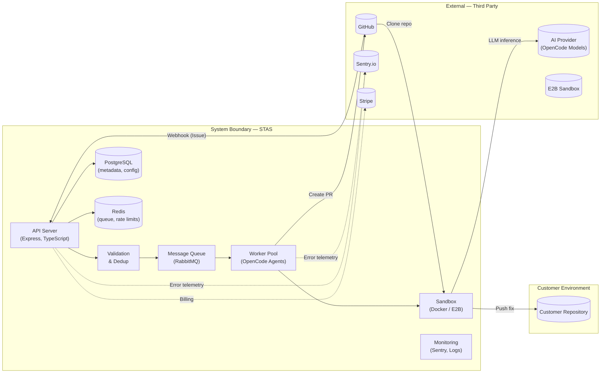

# SOC 2 Architecture and Data Flow — STAS

> **System boundaries, data classification, data flows, storage locations, and third-party data sharing for SOC 2 compliance.**

---

## 1. System Description

STAS (Solving Tickets As A Service) is an AI-powered GitHub bot that automatically investigates, fixes, and opens pull requests for labeled issues. The system consists of:

- **Webhook receiver**: Express.js HTTP server that ingests webhooks from GitHub (and optionally GitLab, Bitbucket, Linear, Jira)
- **Validation layer**: Issue label checking, deduplication, rate limiting
- **Message queue**: RabbitMQ for durable job buffering (Redis in development mode)
- **Worker pool**: OpenCode agent dispatchers that run fix jobs in isolated sandboxes
- **Sandbox execution**: Docker containers (local) or E2B cloud sandboxes with restricted network access
- **GitHub integration**: GitHub App authentication for repository access and PR creation
- **Observability**: Sentry for error tracking, pino structured logging

### System Boundary Diagram



---

## 2. Data Classification

STAS processes the following categories of data:

### 2.1 Code (Customer Confidential)

| Data Type | Examples | Classification | Sensitivity |
|-----------|----------|---------------|-------------|
| Repository source code | Files cloned during fix run | **Customer Confidential** | High |
| Issue descriptions | Bug reports, feature requests | **Customer Confidential** | Medium |
| Pull request diffs | Generated fixes | **Customer Confidential** | Medium |
| Test output | Verification results | **Customer Confidential** | Low |

**Handling**: Ephemeral — cloned into memory-backed tmpfs sandbox, processed during the fix run, then destroyed. Never persisted to disk. Never stored in logs. Never shared with third parties except the AI provider (inference only, no storage).

### 2.2 Credentials and Secrets (Highly Restricted)

| Data Type | Examples | Classification | Sensitivity |
|-----------|----------|---------------|-------------|
| GitHub App private key | RSA 2048-bit JWT signing key | **Critical** | Maximum |
| Installation tokens | 1-hour GitHub API tokens | **Critical** | Maximum |
| API keys | ADMIN_API_KEY, STRIPE_SECRET_KEY, E2B_API_KEY | **Critical** | Maximum |
| Webhook secrets | HMAC-SHA256 shared secrets | **Critical** | Maximum |

**Handling**: Never written to disk. Loaded from environment variables at process start. Never logged. Never transmitted outside the service boundary. Rotated on compromise or employee offboarding.

### 2.3 Personal Data (GDPR / CCPA Relevant)

| Data Type | Examples | Classification | Sensitivity |
|-----------|----------|---------------|-------------|
| GitHub user IDs | Issue author, PR author | **Personal Data** | Medium |
| GitHub usernames | `@mentions`, commit authors | **Personal Data** | Low |
| Email addresses | Commit author emails | **Personal Data** | Medium |
| IP addresses | Webhook source IPs | **Personal Data** | Low |

**Handling**: Stored temporarily in API logs (90-day retention). Not used for profiling or marketing. Not shared with third parties except Sentry (error context, IP address). Not sold or monetized.

### 2.4 Metadata (Internal)

| Data Type | Examples | Classification | Sensitivity |
|-----------|----------|---------------|-------------|
| Job status | enqueued, running, completed, failed | **Internal** | Low |
| Run duration | Execution time | **Internal** | Low |
| Error counts | Failure rates | **Internal** | Low |
| Rate limit state | Remaining requests | **Internal** | Low |

**Handling**: Stored in PostgreSQL for operational monitoring. Retained for 90 days. Aggregated metrics may be kept indefinitely (no PII in aggregates).

---

## 3. Data Flow Between Components

### 3.1 Ingress Flow (Webhook → Queue)

```
GitHub ──TLS 1.3──> Load Balancer ──TLS 1.2──> API Server ──AMQPS──> RabbitMQ
```

| Hop | Data | Encryption | Storage |
|-----|------|------------|---------|
| GitHub → Load Balancer | Webhook payload (issue content, metadata) | TLS 1.3 | In transit only |
| Load Balancer → API Server | Decrypted payload | TLS 1.2 (internal) | In transit only |
| API Server → RabbitMQ | Serialized job (issue ID, repo, metadata) | AMQPS (TLS) | Durable queue, AES-256 at rest |

### 3.2 Processing Flow (Queue → Worker → Sandbox → AI)

```
RabbitMQ ──AMQPS──> Worker ──TLS 1.3──> Sandbox ──TLS 1.3──> AI Provider
                                   │
                                   └──TLS 1.3──> GitHub (clone)
```

| Hop | Data | Encryption | Storage |
|-----|------|------------|---------|
| RabbitMQ → Worker | Job payload | AMQPS (TLS) | Ephemeral (worker memory) |
| Worker → Sandbox | Job config (repo URL, issue ID, token) | Local IPC / TLS | Ephemeral (tmpfs) |
| Sandbox → AI Provider | Source code context, issue description, prompt | TLS 1.3 | Not stored by AI provider |
| AI Provider → Sandbox | Generated fix, analysis | TLS 1.3 | Ephemeral (tmpfs) |
| Sandbox → GitHub (clone) | Repository content | TLS 1.3 | Ephemeral (tmpfs) |

### 3.3 Egress Flow (Worker → GitHub PR)

```
Worker ──TLS 1.3──> GitHub API ──> Customer Repository
```

| Hop | Data | Encryption | Storage |
|-----|------|------------|---------|
| Worker → GitHub API | Committed patch, PR title/body | TLS 1.3 via GitHub API | GitHub's infrastructure |
| GitHub API → Repository | PR with fix | N/A (internal to GitHub) | Customer's repository |

### 3.4 Observability Flow

```
API Server ──TLS 1.2──> Sentry.io
Worker ──TLS 1.2──> Sentry.io
All services ──> pino structured logs ──TLS──> Log storage (90-day retention)
```

| Hop | Data | Encryption |
|-----|------|------------|
| Services → Sentry | Error context, stack traces, IP addresses | TLS 1.2 |
| Services → Log storage | Structured JSON logs | TLS + AES-256 at rest |

---

## 4. Data Storage Locations

| Component | Location | Data Stored | Encryption | Retention |
|-----------|----------|-------------|------------|-----------|
| PostgreSQL | Cloud provider (AWS / Fly.io / Railway) | Job metadata, rate limit state, config | AES-256 at rest, TLS in transit | 90 days |
| Redis | Cloud provider / co-located | Queue items, rate limit counters | Optional Redis TLS | Ephemeral (TTL-based) |
| RabbitMQ | Cloud provider / co-located | Pending jobs (persistent queues) | AES-256 at rest, TLS in transit | Until acknowledged |
| Log storage | Cloud provider | Structured log files | AES-256 at rest, TLS in transit | 90 days hot, 1 year cold |
| Sentry | Sentry.io (US region) | Error events, stack traces | Sentry-managed encryption | 90 days |
| Sandbox tmpfs | Worker host | Repository clone, generated fix | Memory-backed (no disk) | Ephemeral — destroyed after run |

### Data Residency

- **Customer data** (code, issues, PR content): Processed in the region where the worker runs. For cloud-hosted STAS, this is currently US regions (AWS us-east-1 / us-west-2). For self-hosted deployments, data remains in the customer's chosen infrastructure.
- **Metadata** (job status, timestamps): Stored in the same region as the control plane.
- **Logs and telemetry**: Sentry processes data in US regions. Self-hosted customers can configure Sentry self-hosting or alternative logging.

---

## 5. Third-Party Data Sharing

### 5.1 Subprocessor Table

| Subprocessor | Service | Data Shared | Data Role | Location | Contractual Safeguards |
|-------------|---------|-------------|-----------|----------|----------------------|
| **GitHub** (Microsoft) | Repository hosting, API, webhooks | Issue content, code, PRs | Processor | Global (US-hosted API) | DPA via GitHub Terms, SOC 2 reports available |
| **OpenCode** (AI provider) | LLM inference for fix generation | Source code snippets, issue text | Processor | US | No training on customer data, data deleted after inference |
| **Anthropic / OpenAI** (via OpenCode) | Base model inference | Prompt context (code + issue) | Sub-processor | US | Enterprise API terms: no training, no storage |
| **RabbitMQ** (CloudAMQP / self-hosted) | Message queue broker | Job payloads (issue IDs, repo URLs) | Processor | US (configurable) | Standard DPA, encryption in transit and at rest |
| **E2B** | Cloud sandbox execution | Repository clone (ephemeral) | Processor | US | SOC 2 certified, ephemeral sandboxes, no data persistence |
| **Sentry** (Functional Software) | Error tracking, performance monitoring | Error context, IP addresses | Processor | US | DPA in place, SOC 2 Type II, data retention 90 days |
| **Stripe** | Payment processing | Billing metadata (no PII in transit) | Processor | US | PCI DSS Level 1, SOC 2 Type II |
| **Supabase** (optional) | Database hosting | Job metadata | Processor | US (configurable) | SOC 2 Type II, encryption at rest |
| **Vercel** (optional) | Marketing site hosting | None (no customer data) | N/A | Global CDN | DPA available |

### 5.2 Data Sharing Principles

- STAS **never sells** customer data
- STAS **never trains models** on customer code or issues
- STAS **never stores** customer code outside the ephemeral sandbox
- All subprocessors are contractually bound to process data only for the specific service provided
- No customer data is shared with advertising networks, analytics providers, or data brokers
- Data sharing is limited to what is strictly necessary to provide the fix service

### 5.3 Subprocessor Due Diligence

Before engaging a new subprocessor:
1. **Security review**: SOC 2 report or equivalent certification obtained and reviewed
2. **DPA executed**: Signed data processing agreement with standard contractual clauses
3. **Penetration testing**: Recent pen test results reviewed (where available)
4. **Data classification**: Mapping of what data will be shared and for what purpose
5. **Customer disclosure**: Updated on the subprocessor list with 30-day notice (where contractually required)

---

## 6. Compliance Controls Mapping

| SOC 2 Trust Criteria | Relevant Section | Control Description |
|----------------------|-----------------|---------------------|
| CC1 — Control Environment | Sections 2–5 | Documented data classification, subprocessor oversight |
| CC2 — Communication | Section 5.3 | Subprocessor disclosure, DPA execution |
| CC3 — Risk Assessment | Section 5.3 | Vendor risk assessment for each subprocessor |
| CC5 — Control Activities | Sections 3–4 | Encryption in transit and at rest for all data flows |
| CC6 — Logical and Physical Access | Section 2.2 | Credential handling, access controls |
| CC7 — System Operations | Section 3.4 | Monitoring, logging, alerting |
| CC8 — Change Management | Throughout | CI/CD pipeline, configuration management |
| CC9 — Risk Mitigation | Section 1 | System boundary definition, data flow mapping |
| A1 — Availability | Section 4 | Data redundancy, backup procedures |
| C1 — Confidentiality | Sections 2, 5 | Data classification, subprocessor controls, encryption |

---

## References

- [Security Overview](../security/security-overview.md) — End-to-end security architecture
- [Control Mapping](control-mapping.md) — Detailed SOC 2 control-to-implementation mapping
- [Data Retention and Deletion Policy](../policies/data-retention-deletion.md) — Retention schedules and deletion procedures
- [Data Processing Agreement](../policies/data-processing-agreement.md) — Customer DPA
- [Encryption Policy](encryption-policy.md) — Cryptographic standards
- [Access Control Policy](access-control-policy.md) — Authentication and authorization
- [Incident Response Plan](incident-response-plan.md) — Security incident procedures
