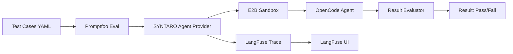

# Evaluation Pipeline

SYNTARO includes a comprehensive evaluation pipeline built on [Promptfoo](https://promptfoo.dev/) with [LangFuse](https://langfuse.com/) observability.

## Architecture



## Quick Start

### One-command (Docker Compose)

```bash
export E2B_API_KEY="your-key"
export LANGFUSE_PUBLIC_KEY="your-key"
export LANGFUSE_SECRET_KEY="your-key"

docker compose -f docker-compose.eval.yml up
```

LangFuse UI: http://localhost:3000
SYNTARO Eval API: http://localhost:3001

### Local (without Docker)

```bash
# Install dependencies
npm ci

# Run a single eval
npx promptfoo eval --tests eval/test-cases/smoke.txt

# View results
npx promptfoo view
```

## Test Case Anatomy

Test cases are YAML files in `eval/test-cases/`. Each defines:

```yaml
# eval/test-cases/example/README.md
issueTitle: "Fix broken login redirect"
issueDescription: |
  The login endpoint returns 500 when email contains special characters.
repo: "owner/repo-name"
expectedOutcome: "pr_created"
expectedFiles: ["src/auth/login.ts", "src/auth/validation.ts"]
timeoutMs: 300000
```

## CI Tiers

| Tier | Trigger | Tests | Duration | Purpose |
|------|---------|-------|----------|---------|
| Smoke | Every push | 3 critical | 2-5 min | Fast feedback |
| Standard | PR / MR | Full suite | 10-20 min | Regression check |
| Full + Red Team | Nightly | 30+ tests + security | 30-60 min | Deep coverage |

## LangFuse Trace Viewer

After running eval, open LangFuse UI at http://localhost:3000:

1. Navigate to **Traces** tab
2. Filter by `name: "syntaro-eval"`
3. Each eval run creates one trace with spans:
   - `sandbox.create` — E2B sandbox provisioning
   - `agent.run` — SYNTARO agent execution
   - `artifact.collection` — Result gathering
   - `evaluation` — Pass/fail determination

## Adding a New Test Case

1. Create a new directory under `eval/test-cases/`:
   ```bash
   mkdir eval/test-cases/my-new-test/
   ```
2. Create `README.md` with YAML frontmatter (see anatomy above)
3. Add repo fixture or URL pointing to the target repo
4. Add the test to one of the test lists:
   ```bash
   echo "eval/test-cases/my-new-test/README.md" >> eval/test-cases/smoke.txt
   ```
5. Run and verify:
   ```bash
   npx promptfoo eval --tests eval/test-cases/my-new-test/README.md
   ```

## Troubleshooting

| Symptom | Likely Cause | Fix |
|---------|-------------|-----|
| Sandbox timeout | E2B API key expired | Refresh `E2B_API_KEY` |
| LangFuse trace missing | Wrong keys | Check `LANGFUSE_PUBLIC_KEY` / `LANGFUSE_SECRET_KEY` |
| Promptfoo not found | Dependencies not installed | Run `npm ci` |
| Docker Compose connection refused | Postgres not ready | Wait for healthcheck, check `docker compose logs` |
| All tests fail with same error | Config issue | Check `.env` variables, ensure OpenCode serve is running |

## Contribution Checklist

- [ ] Does your change pass `npx promptfoo eval --tests eval/test-cases/smoke.txt`?
- [ ] Have you added or updated test cases for your change?
- [ ] Have you run LangFuse trace verification?
- [ ] Have you documented new environment variables?
- [ ] Have you updated CI config if adding a new eval tier?
